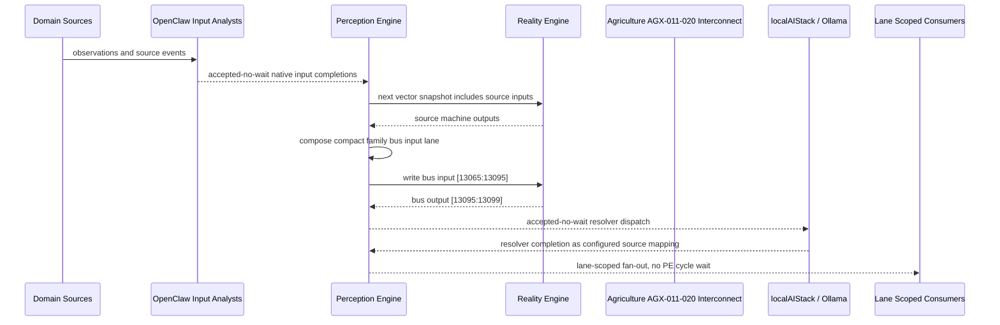

# Agriculture AGX-011-020 Interconnect Narrative

This narrative applies the PE-owned published-bus pattern to `Agriculture AGX-011-020` in the
`agriculture` domain. OpenClaw and localAIStack/Ollama remain PE-side translators
and resolvers. RE evaluates only ordinary vector state.

Focus: Agriculture AGX-011-020.

## Published Bus

```text
agriculture.agx-011-020
published-bus-agriculture-agx-011-020
```

Input lane: `[13065:13095]`

```text
[0] Agriculture Aquaculture Quarantine Biosecurity active output[0] bit
[1] Agriculture Aquaculture Quarantine Biosecurity active output[1] bit
[2] Agriculture Aquaculture Quarantine Biosecurity active output[2] bit
[3] Agriculture Aquaculture Hatchery Nursery Transition active output[0] bit
[4] Agriculture Aquaculture Hatchery Nursery Transition active output[1] bit
[5] Agriculture Aquaculture Hatchery Nursery Transition active output[2] bit
[6] Agriculture Aquaculture Algae Culture Balance active output[0] bit
[7] Agriculture Aquaculture Algae Culture Balance active output[1] bit
[8] Agriculture Aquaculture Algae Culture Balance active output[2] bit
[9] Agriculture Aquaculture Shellfish Nursery Flow active output[0] bit
[10] Agriculture Aquaculture Shellfish Nursery Flow active output[1] bit
[11] Agriculture Aquaculture Shellfish Nursery Flow active output[2] bit
[12] Agriculture Aquaculture Effluent Compliance active output[0] bit
[13] Agriculture Aquaculture Effluent Compliance active output[1] bit
[14] Agriculture Aquaculture Effluent Compliance active output[2] bit
[15] Agriculture Aquaculture Energy Backup Readiness active output[0] bit
[16] Agriculture Aquaculture Energy Backup Readiness active output[1] bit
[17] Agriculture Aquaculture Energy Backup Readiness active output[2] bit
[18] Agriculture Aquaculture Harvest Readiness active output[0] bit
[19] Agriculture Aquaculture Harvest Readiness active output[1] bit
[20] Agriculture Aquaculture Harvest Readiness active output[2] bit
[21] Agriculture Aquaculture RAS Thermal Management active output[0] bit
[22] Agriculture Aquaculture RAS Thermal Management active output[1] bit
[23] Agriculture Aquaculture RAS Thermal Management active output[2] bit
[24] Agriculture Aquaculture Salinity Osmotic Balance active output[0] bit
[25] Agriculture Aquaculture Salinity Osmotic Balance active output[1] bit
[26] Agriculture Aquaculture Salinity Osmotic Balance active output[2] bit
[27] Agriculture Aquaculture Animal Welfare Response active output[0] bit
[28] Agriculture Aquaculture Animal Welfare Response active output[1] bit
[29] Agriculture Aquaculture Animal Welfare Response active output[2] bit
```

Output lane: `[13095:13099]`

```text
[0] domain family review bit
[1] domain family optimization bit
[2] domain family monitoring bit
[3] domain family stable bit
```

Source machines publish active output lanes into this family bus. Stable source
states remain represented by no active PE-composed bits.

## Example Workflow: Agriculture AGX-011-020 domain family review

PE composes:

```text
Agriculture AGX-011-020 Interconnect[13065:13095]
= [1, 0, 0, 0, 0, 0, 0, 0, 0, 1, 0, 0, 0, 0, 0, 0, 0, 0, 1, 0, 0, 0, 0, 0, 0, 0, 0, 0, 0, 0]
```

RE emits:

```text
Agriculture AGX-011-020 Interconnect[13095:13099]
= [1, 0, 0, 0]
```

## Example Workflow: Agriculture AGX-011-020 domain family optimization

PE composes:

```text
Agriculture AGX-011-020 Interconnect[13065:13095]
= [0, 1, 0, 0, 0, 0, 0, 0, 0, 0, 1, 0, 0, 0, 0, 0, 0, 0, 0, 1, 0, 0, 0, 0, 0, 0, 0, 0, 0, 0]
```

RE emits:

```text
Agriculture AGX-011-020 Interconnect[13095:13099]
= [0, 1, 0, 0]
```

## Example Workflow: Agriculture AGX-011-020 domain family monitoring

PE composes:

```text
Agriculture AGX-011-020 Interconnect[13065:13095]
= [0, 0, 1, 0, 0, 0, 0, 0, 0, 0, 0, 1, 0, 0, 0, 0, 0, 0, 0, 0, 1, 0, 0, 0, 0, 0, 0, 0, 0, 0]
```

RE emits:

```text
Agriculture AGX-011-020 Interconnect[13095:13099]
= [0, 0, 1, 0]
```

## Message Flow



## Problems And Extensions

1. This pass records an explicit family-level published-bus contract for every
   source machine in this remaining-domain family.

2. RE visibility remains limited to compact vector lanes. PE owns source
   provenance, transformation, resolver dispatch, and completion ingestion.

3. Future growth can add domain super-buses that consume family bridge outputs
   rather than reading every source machine directly.

## Safety Boundary

The PE-visible workflow carries normalized status bits only. Raw regulated data
and provider-specific records stay upstream. Resolver completions return through
PE as configured source mappings.
