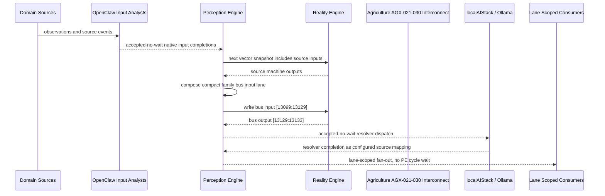

# Agriculture AGX-021-030 Interconnect Narrative

This narrative applies the PE-owned published-bus pattern to `Agriculture AGX-021-030` in the
`agriculture` domain. OpenClaw and localAIStack/Ollama remain PE-side translators
and resolvers. RE evaluates only ordinary vector state.

Focus: Agriculture AGX-021-030.

## Published Bus

```text
agriculture.agx-021-030
published-bus-agriculture-agx-021-030
```

Input lane: `[13099:13129]`

```text
[0] Agriculture Aquaculture Probiotic Treatment Tracking active output[0] bit
[1] Agriculture Aquaculture Probiotic Treatment Tracking active output[1] bit
[2] Agriculture Aquaculture Probiotic Treatment Tracking active output[2] bit
[3] Agriculture Aquaculture Pond Turnover Prevention active output[0] bit
[4] Agriculture Aquaculture Pond Turnover Prevention active output[1] bit
[5] Agriculture Aquaculture Pond Turnover Prevention active output[2] bit
[6] Agriculture Aquaculture Predator Exclusion active output[0] bit
[7] Agriculture Aquaculture Predator Exclusion active output[1] bit
[8] Agriculture Aquaculture Predator Exclusion active output[2] bit
[9] Agriculture Aquaculture Larval Survival Optimization active output[0] bit
[10] Agriculture Aquaculture Larval Survival Optimization active output[1] bit
[11] Agriculture Aquaculture Larval Survival Optimization active output[2] bit
[12] Agriculture Aquaculture Aquaponic Nutrient Coupling active output[0] bit
[13] Agriculture Aquaculture Aquaponic Nutrient Coupling active output[1] bit
[14] Agriculture Aquaculture Aquaponic Nutrient Coupling active output[2] bit
[15] Agriculture Indoor Grow House VPD Climate Management active output[0] bit
[16] Agriculture Indoor Grow House VPD Climate Management active output[1] bit
[17] Agriculture Indoor Grow House VPD Climate Management active output[2] bit
[18] Agriculture Indoor Grow House Lighting Schedule Integrity active output[0] bit
[19] Agriculture Indoor Grow House Lighting Schedule Integrity active output[1] bit
[20] Agriculture Indoor Grow House Lighting Schedule Integrity active output[2] bit
[21] Agriculture Indoor Grow House Nutrient Reservoir Balance active output[0] bit
[22] Agriculture Indoor Grow House Nutrient Reservoir Balance active output[1] bit
[23] Agriculture Indoor Grow House Nutrient Reservoir Balance active output[2] bit
[24] Agriculture Indoor Grow House Irrigation Line Maintenance active output[0] bit
[25] Agriculture Indoor Grow House Irrigation Line Maintenance active output[1] bit
[26] Agriculture Indoor Grow House Irrigation Line Maintenance active output[2] bit
[27] Agriculture Indoor Grow House Integrated Pest Management active output[0] bit
[28] Agriculture Indoor Grow House Integrated Pest Management active output[1] bit
[29] Agriculture Indoor Grow House Integrated Pest Management active output[2] bit
```

Output lane: `[13129:13133]`

```text
[0] domain family review bit
[1] domain family optimization bit
[2] domain family monitoring bit
[3] domain family stable bit
```

Source machines publish active output lanes into this family bus. Stable source
states remain represented by no active PE-composed bits.

## Example Workflow: Agriculture AGX-021-030 domain family review

PE composes:

```text
Agriculture AGX-021-030 Interconnect[13099:13129]
= [1, 0, 0, 0, 0, 0, 0, 0, 0, 1, 0, 0, 0, 0, 0, 0, 0, 0, 1, 0, 0, 0, 0, 0, 0, 0, 0, 0, 0, 0]
```

RE emits:

```text
Agriculture AGX-021-030 Interconnect[13129:13133]
= [1, 0, 0, 0]
```

## Example Workflow: Agriculture AGX-021-030 domain family optimization

PE composes:

```text
Agriculture AGX-021-030 Interconnect[13099:13129]
= [0, 1, 0, 0, 0, 0, 0, 0, 0, 0, 1, 0, 0, 0, 0, 0, 0, 0, 0, 1, 0, 0, 0, 0, 0, 0, 0, 0, 0, 0]
```

RE emits:

```text
Agriculture AGX-021-030 Interconnect[13129:13133]
= [0, 1, 0, 0]
```

## Example Workflow: Agriculture AGX-021-030 domain family monitoring

PE composes:

```text
Agriculture AGX-021-030 Interconnect[13099:13129]
= [0, 0, 1, 0, 0, 0, 0, 0, 0, 0, 0, 1, 0, 0, 0, 0, 0, 0, 0, 0, 1, 0, 0, 0, 0, 0, 0, 0, 0, 0]
```

RE emits:

```text
Agriculture AGX-021-030 Interconnect[13129:13133]
= [0, 0, 1, 0]
```

## Message Flow



## Problems And Extensions

1. This pass records an explicit family-level published-bus contract for every
   source machine in this remaining-domain family.

2. RE visibility remains limited to compact vector lanes. PE owns source
   provenance, transformation, resolver dispatch, and completion ingestion.

3. Future growth can add domain super-buses that consume family bridge outputs
   rather than reading every source machine directly.

## Safety Boundary

The PE-visible workflow carries normalized status bits only. Raw regulated data
and provider-specific records stay upstream. Resolver completions return through
PE as configured source mappings.
