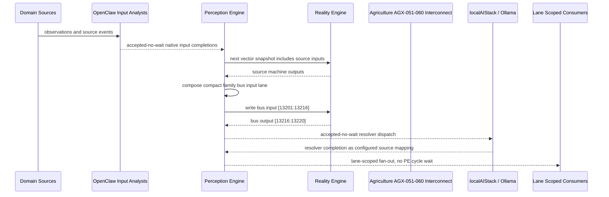

# Agriculture AGX-051-060 Interconnect Narrative

This narrative applies the PE-owned published-bus pattern to `Agriculture AGX-051-060` in the
`agriculture` domain. OpenClaw and localAIStack/Ollama remain PE-side translators
and resolvers. RE evaluates only ordinary vector state.

Focus: Agriculture AGX-051-060.

## Published Bus

```text
agriculture.agx-051-060
published-bus-agriculture-agx-051-060
```

Input lane: `[13201:13216]`

```text
[0] Agriculture Yuma Aqua Maintenance Forecaster active output[0] bit
[1] Agriculture Yuma Aqua Maintenance Forecaster active output[1] bit
[2] Agriculture Yuma Aqua Maintenance Forecaster active output[2] bit
[3] Agriculture Yuma DO Probe Reliability Tracker active output[0] bit
[4] Agriculture Yuma DO Probe Reliability Tracker active output[1] bit
[5] Agriculture Yuma DO Probe Reliability Tracker active output[2] bit
[6] Agriculture Yuma VPD HVAC Service Planner active output[0] bit
[7] Agriculture Yuma VPD HVAC Service Planner active output[1] bit
[8] Agriculture Yuma VPD HVAC Service Planner active output[2] bit
[9] Agriculture Yuma CO2 Safety Compliance Officer active output[0] bit
[10] Agriculture Yuma CO2 Safety Compliance Officer active output[1] bit
[11] Agriculture Yuma CO2 Safety Compliance Officer active output[2] bit
[12] Agriculture Yuma Facility AI Synthesis Bridge active output[0] bit
[13] Agriculture Yuma Facility AI Synthesis Bridge active output[1] bit
[14] Agriculture Yuma Facility AI Synthesis Bridge active output[2] bit
```

Output lane: `[13216:13220]`

```text
[0] domain family review bit
[1] domain family optimization bit
[2] domain family monitoring bit
[3] domain family stable bit
```

Source machines publish active output lanes into this family bus. Stable source
states remain represented by no active PE-composed bits.

## Example Workflow: Agriculture AGX-051-060 domain family review

PE composes:

```text
Agriculture AGX-051-060 Interconnect[13201:13216]
= [1, 0, 0, 1, 0, 0, 1, 0, 0, 0, 0, 0, 0, 0, 0]
```

RE emits:

```text
Agriculture AGX-051-060 Interconnect[13216:13220]
= [1, 0, 0, 0]
```

## Example Workflow: Agriculture AGX-051-060 domain family optimization

PE composes:

```text
Agriculture AGX-051-060 Interconnect[13201:13216]
= [0, 1, 0, 0, 1, 0, 0, 1, 0, 0, 0, 0, 0, 0, 0]
```

RE emits:

```text
Agriculture AGX-051-060 Interconnect[13216:13220]
= [0, 1, 0, 0]
```

## Example Workflow: Agriculture AGX-051-060 domain family monitoring

PE composes:

```text
Agriculture AGX-051-060 Interconnect[13201:13216]
= [0, 0, 1, 0, 0, 1, 0, 0, 1, 0, 0, 0, 0, 0, 0]
```

RE emits:

```text
Agriculture AGX-051-060 Interconnect[13216:13220]
= [0, 0, 1, 0]
```

## Message Flow



## Problems And Extensions

1. This pass records an explicit family-level published-bus contract for every
   source machine in this remaining-domain family.

2. RE visibility remains limited to compact vector lanes. PE owns source
   provenance, transformation, resolver dispatch, and completion ingestion.

3. Future growth can add domain super-buses that consume family bridge outputs
   rather than reading every source machine directly.

## Safety Boundary

The PE-visible workflow carries normalized status bits only. Raw regulated data
and provider-specific records stay upstream. Resolver completions return through
PE as configured source mappings.
