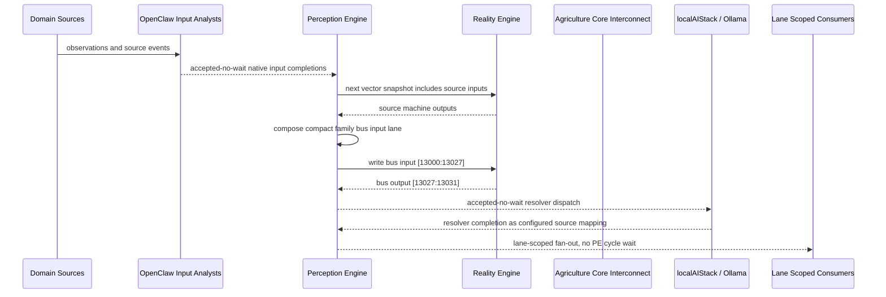

# Agriculture Core Interconnect Narrative

This narrative applies the PE-owned published-bus pattern to `Agriculture Core` in the
`agriculture` domain. OpenClaw and localAIStack/Ollama remain PE-side translators
and resolvers. RE evaluates only ordinary vector state.

Focus: Agriculture Core.

## Published Bus

```text
agriculture.agriculture-core
published-bus-agriculture-agriculture-core
```

Input lane: `[13000:13027]`

```text
[0] Ag Atmospheric Controller active output[0] bit
[1] Ag Atmospheric Controller active output[1] bit
[2] Ag Atmospheric Controller active output[2] bit
[3] Ag Harvest Readiness Assessor active output[0] bit
[4] Ag Harvest Readiness Assessor active output[1] bit
[5] Ag Harvest Readiness Assessor active output[2] bit
[6] Ag IPM Pest Alert Monitor active output[0] bit
[7] Ag IPM Pest Alert Monitor active output[1] bit
[8] Ag IPM Pest Alert Monitor active output[2] bit
[9] Ag Irrigation Flow Controller active output[0] bit
[10] Ag Irrigation Flow Controller active output[1] bit
[11] Ag Irrigation Flow Controller active output[2] bit
[12] Ag Nutrient Cycle Optimizer active output[0] bit
[13] Ag Nutrient Cycle Optimizer active output[1] bit
[14] Ag Nutrient Cycle Optimizer active output[2] bit
[15] Ag Nutrient Solution Monitor active output[0] bit
[16] Ag Nutrient Solution Monitor active output[1] bit
[17] Ag Nutrient Solution Monitor active output[2] bit
[18] Ag Photo Period Lighting Controller active output[0] bit
[19] Ag Photo Period Lighting Controller active output[1] bit
[20] Ag Photo Period Lighting Controller active output[2] bit
[21] Ag Plant Growth Cycle Monitor active output[0] bit
[22] Ag Plant Growth Cycle Monitor active output[1] bit
[23] Ag Plant Growth Cycle Monitor active output[2] bit
[24] Ag Zone Temperature Controller active output[0] bit
[25] Ag Zone Temperature Controller active output[1] bit
[26] Ag Zone Temperature Controller active output[2] bit
```

Output lane: `[13027:13031]`

```text
[0] domain family review bit
[1] domain family optimization bit
[2] domain family monitoring bit
[3] domain family stable bit
```

Source machines publish active output lanes into this family bus. Stable source
states remain represented by no active PE-composed bits.

## Example Workflow: Agriculture Core domain family review

PE composes:

```text
Agriculture Core Interconnect[13000:13027]
= [1, 0, 0, 0, 0, 0, 0, 0, 0, 1, 0, 0, 0, 0, 0, 0, 0, 0, 1, 0, 0, 0, 0, 0, 0, 0, 0]
```

RE emits:

```text
Agriculture Core Interconnect[13027:13031]
= [1, 0, 0, 0]
```

## Example Workflow: Agriculture Core domain family optimization

PE composes:

```text
Agriculture Core Interconnect[13000:13027]
= [0, 1, 0, 0, 0, 0, 0, 0, 0, 0, 1, 0, 0, 0, 0, 0, 0, 0, 0, 1, 0, 0, 0, 0, 0, 0, 0]
```

RE emits:

```text
Agriculture Core Interconnect[13027:13031]
= [0, 1, 0, 0]
```

## Example Workflow: Agriculture Core domain family monitoring

PE composes:

```text
Agriculture Core Interconnect[13000:13027]
= [0, 0, 1, 0, 0, 0, 0, 0, 0, 0, 0, 1, 0, 0, 0, 0, 0, 0, 0, 0, 1, 0, 0, 0, 0, 0, 0]
```

RE emits:

```text
Agriculture Core Interconnect[13027:13031]
= [0, 0, 1, 0]
```

## Message Flow



## Problems And Extensions

1. This pass records an explicit family-level published-bus contract for every
   source machine in this remaining-domain family.

2. RE visibility remains limited to compact vector lanes. PE owns source
   provenance, transformation, resolver dispatch, and completion ingestion.

3. Future growth can add domain super-buses that consume family bridge outputs
   rather than reading every source machine directly.

## Safety Boundary

The PE-visible workflow carries normalized status bits only. Raw regulated data
and provider-specific records stay upstream. Resolver completions return through
PE as configured source mappings.
