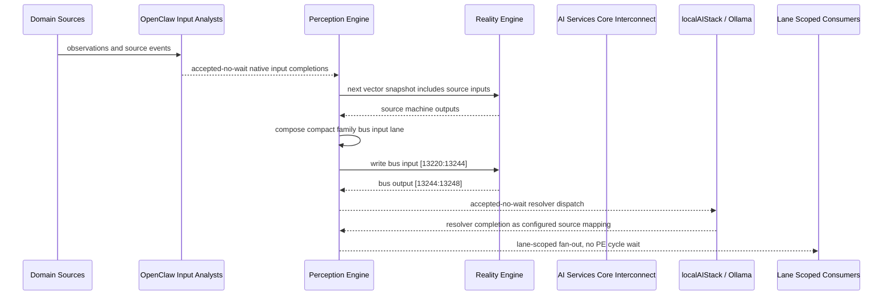

# AI Services Core Interconnect Narrative

This narrative applies the PE-owned published-bus pattern to `AI Services Core` in the
`ai-services` domain. OpenClaw and localAIStack/Ollama remain PE-side translators
and resolvers. RE evaluates only ordinary vector state.

Focus: AI Services Core.

## Published Bus

```text
ai-services.ai-services-core
published-bus-ai-services-ai-services-core
```

Input lane: `[13220:13244]`

```text
[0] AI Capacity Throttler active output[0] bit
[1] AI Capacity Throttler active output[1] bit
[2] AI Capacity Throttler active output[2] bit
[3] AI Cooling Regulator active output[0] bit
[4] AI Cooling Regulator active output[1] bit
[5] AI Cooling Regulator active output[2] bit
[6] AI Hardware Resilience Monitor active output[0] bit
[7] AI Hardware Resilience Monitor active output[1] bit
[8] AI Hardware Resilience Monitor active output[2] bit
[9] AI Model Wellness Monitor active output[0] bit
[10] AI Model Wellness Monitor active output[1] bit
[11] AI Model Wellness Monitor active output[2] bit
[12] AI Power Efficiency Monitor active output[0] bit
[13] AI Power Efficiency Monitor active output[1] bit
[14] AI Power Efficiency Monitor active output[2] bit
[15] AI Security Monitor active output[0] bit
[16] AI Security Monitor active output[1] bit
[17] AI Security Monitor active output[2] bit
[18] AI Wellness Coach active output[0] bit
[19] AI Wellness Coach active output[1] bit
[20] AI Wellness Coach active output[2] bit
[21] Ag Yield Optimization AI active output[0] bit
[22] Ag Yield Optimization AI active output[1] bit
[23] Ag Yield Optimization AI active output[2] bit
```

Output lane: `[13244:13248]`

```text
[0] domain family review bit
[1] domain family optimization bit
[2] domain family monitoring bit
[3] domain family stable bit
```

Source machines publish active output lanes into this family bus. Stable source
states remain represented by no active PE-composed bits.

## Example Workflow: AI Services Core domain family review

PE composes:

```text
AI Services Core Interconnect[13220:13244]
= [1, 0, 0, 0, 0, 0, 1, 0, 0, 0, 0, 0, 1, 0, 0, 0, 0, 0, 0, 0, 0, 0, 0, 0]
```

RE emits:

```text
AI Services Core Interconnect[13244:13248]
= [1, 0, 0, 0]
```

## Example Workflow: AI Services Core domain family optimization

PE composes:

```text
AI Services Core Interconnect[13220:13244]
= [0, 1, 0, 0, 0, 0, 0, 1, 0, 0, 0, 0, 0, 1, 0, 0, 0, 0, 0, 0, 0, 0, 0, 0]
```

RE emits:

```text
AI Services Core Interconnect[13244:13248]
= [0, 1, 0, 0]
```

## Example Workflow: AI Services Core domain family monitoring

PE composes:

```text
AI Services Core Interconnect[13220:13244]
= [0, 0, 1, 0, 0, 0, 0, 0, 1, 0, 0, 0, 0, 0, 1, 0, 0, 0, 0, 0, 0, 0, 0, 0]
```

RE emits:

```text
AI Services Core Interconnect[13244:13248]
= [0, 0, 1, 0]
```

## Message Flow



## Problems And Extensions

1. This pass records an explicit family-level published-bus contract for every
   source machine in this remaining-domain family.

2. RE visibility remains limited to compact vector lanes. PE owns source
   provenance, transformation, resolver dispatch, and completion ingestion.

3. Future growth can add domain super-buses that consume family bridge outputs
   rather than reading every source machine directly.

## Safety Boundary

The PE-visible workflow carries normalized status bits only. Raw regulated data
and provider-specific records stay upstream. Resolver completions return through
PE as configured source mappings.
