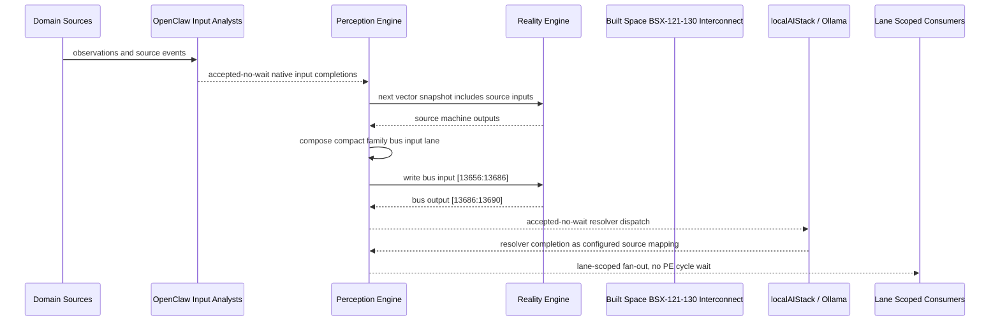

# Built Space BSX-121-130 Interconnect Narrative

This narrative applies the PE-owned published-bus pattern to `Built Space BSX-121-130` in the
`built-space` domain. OpenClaw and localAIStack/Ollama remain PE-side translators
and resolvers. RE evaluates only ordinary vector state.

Focus: Built Space BSX-121-130.

## Published Bus

```text
built-space.bsx-121-130
published-bus-built-space-bsx-121-130
```

Input lane: `[13656:13686]`

```text
[0] Built Space WELL Occupant Feedback Annual IEQ Survey Launch active output[0] bit
[1] Built Space WELL Occupant Feedback Annual IEQ Survey Launch active output[1] bit
[2] Built Space WELL Occupant Feedback Annual IEQ Survey Launch active output[2] bit
[3] Built Space WELL Occupant Feedback Thirty Percent Response Monitor active output[0] bit
[4] Built Space WELL Occupant Feedback Thirty Percent Response Monitor active output[1] bit
[5] Built Space WELL Occupant Feedback Thirty Percent Response Monitor active output[2] bit
[6] Built Space WELL Occupant Feedback Acoustics Feedback Analyzer active output[0] bit
[7] Built Space WELL Occupant Feedback Acoustics Feedback Analyzer active output[1] bit
[8] Built Space WELL Occupant Feedback Acoustics Feedback Analyzer active output[2] bit
[9] Built Space WELL Occupant Feedback Thermal Feedback Analyzer active output[0] bit
[10] Built Space WELL Occupant Feedback Thermal Feedback Analyzer active output[1] bit
[11] Built Space WELL Occupant Feedback Thermal Feedback Analyzer active output[2] bit
[12] Built Space WELL Occupant Feedback Lighting Feedback Analyzer active output[0] bit
[13] Built Space WELL Occupant Feedback Lighting Feedback Analyzer active output[1] bit
[14] Built Space WELL Occupant Feedback Lighting Feedback Analyzer active output[2] bit
[15] Built Space WELL Occupant Feedback Odor Cleanliness Feedback active output[0] bit
[16] Built Space WELL Occupant Feedback Odor Cleanliness Feedback active output[1] bit
[17] Built Space WELL Occupant Feedback Odor Cleanliness Feedback active output[2] bit
[18] Built Space WELL Occupant Feedback Furnishings Feedback Analyzer active output[0] bit
[19] Built Space WELL Occupant Feedback Furnishings Feedback Analyzer active output[1] bit
[20] Built Space WELL Occupant Feedback Furnishings Feedback Analyzer active output[2] bit
[21] Built Space WELL Occupant Feedback Survey Reporting Deadline active output[0] bit
[22] Built Space WELL Occupant Feedback Survey Reporting Deadline active output[1] bit
[23] Built Space WELL Occupant Feedback Survey Reporting Deadline active output[2] bit
[24] Built Space WELL Occupant Feedback Feedback Corrective Action Loop active output[0] bit
[25] Built Space WELL Occupant Feedback Feedback Corrective Action Loop active output[1] bit
[26] Built Space WELL Occupant Feedback Feedback Corrective Action Loop active output[2] bit
[27] Built Space WELL Occupant Feedback Feedback Executive Pulse active output[0] bit
[28] Built Space WELL Occupant Feedback Feedback Executive Pulse active output[1] bit
[29] Built Space WELL Occupant Feedback Feedback Executive Pulse active output[2] bit
```

Output lane: `[13686:13690]`

```text
[0] domain family review bit
[1] domain family optimization bit
[2] domain family monitoring bit
[3] domain family stable bit
```

Source machines publish active output lanes into this family bus. Stable source
states remain represented by no active PE-composed bits.

## Example Workflow: Built Space BSX-121-130 domain family review

PE composes:

```text
Built Space BSX-121-130 Interconnect[13656:13686]
= [1, 0, 0, 0, 0, 0, 0, 0, 0, 1, 0, 0, 0, 0, 0, 0, 0, 0, 1, 0, 0, 0, 0, 0, 0, 0, 0, 0, 0, 0]
```

RE emits:

```text
Built Space BSX-121-130 Interconnect[13686:13690]
= [1, 0, 0, 0]
```

## Example Workflow: Built Space BSX-121-130 domain family optimization

PE composes:

```text
Built Space BSX-121-130 Interconnect[13656:13686]
= [0, 1, 0, 0, 0, 0, 0, 0, 0, 0, 1, 0, 0, 0, 0, 0, 0, 0, 0, 1, 0, 0, 0, 0, 0, 0, 0, 0, 0, 0]
```

RE emits:

```text
Built Space BSX-121-130 Interconnect[13686:13690]
= [0, 1, 0, 0]
```

## Example Workflow: Built Space BSX-121-130 domain family monitoring

PE composes:

```text
Built Space BSX-121-130 Interconnect[13656:13686]
= [0, 0, 1, 0, 0, 0, 0, 0, 0, 0, 0, 1, 0, 0, 0, 0, 0, 0, 0, 0, 1, 0, 0, 0, 0, 0, 0, 0, 0, 0]
```

RE emits:

```text
Built Space BSX-121-130 Interconnect[13686:13690]
= [0, 0, 1, 0]
```

## Message Flow



## Problems And Extensions

1. This pass records an explicit family-level published-bus contract for every
   source machine in this remaining-domain family.

2. RE visibility remains limited to compact vector lanes. PE owns source
   provenance, transformation, resolver dispatch, and completion ingestion.

3. Future growth can add domain super-buses that consume family bridge outputs
   rather than reading every source machine directly.

## Safety Boundary

The PE-visible workflow carries normalized status bits only. Raw regulated data
and provider-specific records stay upstream. Resolver completions return through
PE as configured source mappings.
