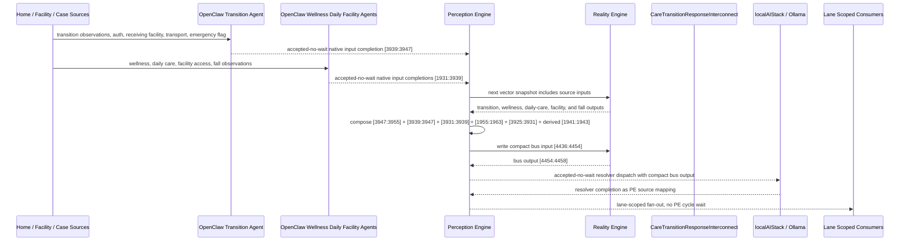

# Care Transition Response Interconnect Narrative

This narrative applies the PE-owned published-bus pattern to the Personal Health
`CareTransitionWorkflow` workflow. The goal is to deepen the interaction between
care-transition readiness, wellness deterioration, daily-care safety, facility
accessibility, and fall criticality without making RE aware of bridge services,
OpenClaw behavior, or localAIStack details.

RE continues to evaluate ordinary machine vector state. PE owns source
composition, startup configuration, asynchronous dispatch, fan-out selection, and
completion ingestion.

## Machines Involved

- `CareTransitionWorkflow.json`
  - role: evaluates hospital transfer, rehab transfer, assisted-living transfer,
    blocked transition, and emergency escalation.
  - input: `[3939:3947]`
  - output: `[3947:3955]`

- `WellnessAnalytics.json`
  - role: routes wellness deterioration into transition review, escalation,
    urgent transition, or improving status.
  - input: `[3931:3939]`
  - output: `[3939:3947]`

- `PatientWellness.json`
  - role: evaluates the resident wellness level and publishes alert or critical
    acuity into the transition context.
  - input: `[1955:1963]`
  - output: `[3931:3939]`

- `DailyPatientCare.json`
  - role: reports daily care completion, fall response, unresponsive fall,
    medication miss, bathroom alert, and wandering signals.
  - input: `[3923:3931]`
  - output: `[1955:1963]`

- `FacilitiesMaintenance.json`
  - role: reports hygiene, safety, wellness, and inaccessibility concerns that
    can block or redirect a transition.
  - input: `[1931:1939]`
  - output: `[3925:3931]`

- `FallDetection.json`
  - role: evaluates fall tier and confidence. PE derives the compact
    high-confidence red-fall bit for the transition bus.
  - input: `[3813:3815]`
  - output: `[1941:1943]`

- `CareTransitionResponseInterconnect.json`
  - role: publishes the `health-personal` care transition response bus.
  - input: `[4436:4454]`
  - output: `[4454:4458]`

## OpenClaw Native Input Projection

OpenClaw agents are input analysts for the source machines. They do not decide
final workflow state. They map observations into each machine's native input
space, write back through PE, and RE evaluates the CES deterministically.

`CareTransitionWorkflow` projection:

```text
clinical_criterion_met_bit
administrative_authorization_obtained_or_waived_bit
receiving_facility_ready_bit
family_or_proxy_notified_bit
care_documents_ready_bit
transport_arranged_bit
transition_barrier_active_bit
emergency_mode_active_bit
```

`WellnessAnalytics` projection:

```text
wellness_optimal_bit
wellness_good_bit
wellness_alert_bit
wellness_critical_bit
reserved_4
reserved_5
reserved_6
reserved_7
```

`PatientWellness` projection:

```text
morning_complete_bit
evening_complete_bit
fall_confirmed_bit
unresponsive_fall_bit
bathroom_alert_bit
medication_missed_bit
wandering_alert_bit
reserved_7
```

`DailyPatientCare` projection:

```text
morning_care_complete_bit
evening_care_complete_bit
fall_observed_bit
unresponsive_after_fall_bit
bathroom_nonuse_alert_bit
medication_missed_bit
night_wandering_bit
reserved_7
```

`FacilitiesMaintenance` projection:

```text
daily_routine_complete_bit
weekly_deep_clean_complete_bit
hygiene_concern_bit
safety_concern_bit
wellness_concern_bit
resident_inaccessible_bit
reserved_6
reserved_7
```

`FallDetection` projection:

```text
motion_progression_ordinal
stillness_progression_ordinal
```

The normal path is deterministic PE composition from source outputs. OpenClaw is
reserved for machine-native projection from external observations that bypass a
normal upstream source.

## Published Bus

The published domain bus is:

```text
health-personal.care-transition-response
published-bus-health-personal-care-transition-response
```

Input lane:

```text
[0] care transition hospital transfer bit
[1] care transition rehab transfer bit
[2] care transition assisted living transfer bit
[3] care transition transfer blocked bit
[4] care transition emergency escalation bit
[5] wellness transition review bit
[6] wellness transition escalation bit
[7] wellness transition urgent bit
[8] wellness improving bit
[9] patient wellness alert bit
[10] patient wellness critical bit
[11] daily care fall confirmed bit
[12] daily care unresponsive fall bit
[13] daily care medication missed bit
[14] facilities safety alert bit
[15] facilities wellness concern bit
[16] facilities inaccessibility alert bit
[17] fall red high confidence bit
```

Output lane:

```text
[0] urgent transfer response
[1] transition barrier resolution
[2] post-acute placement review
[3] stable transition monitoring
```

The bridge machine is a normal RE machine. It receives the compact PE-composed
input vector at `[4436:4454]` and emits `[4454:4458]`.

## Example Workflow: Urgent Transfer

A home-to-hospital or facility-to-hospital episode is active. Wellness analytics
has marked the transition urgent, PatientWellness is critical, DailyPatientCare
has an unresponsive fall signal, FacilitiesMaintenance reports a safety alert,
and FallDetection emits RED tier with high confidence.

PE composes the upstream outputs into:

```text
CareTransitionResponseInterconnect[4436:4454]
= [1, 0, 0, 0, 1, 0, 0, 1, 0, 0, 1, 0, 1, 0, 1, 0, 0, 1]
```

RE evaluates the interconnect and emits:

```text
CareTransitionResponseInterconnect[4454:4458]
= [1, 0, 0, 0]
```

That output is `URGENT_TRANSFER_RESPONSE`.

PE then performs lane-scoped fan-out without waiting inside a PE cycle:

```text
HSPH131 care coordination signal monitor
HSPH132 care coordination resource router
HSPH137 care coordination agent dispatcher
HSPH138 care coordination governance escalator
CSX009 crisis benefit intake
LBL005 risk safety review
```

## Example Workflow: Barrier Resolution

A planned transfer is blocked. WellnessAnalytics indicates transition review and
escalation, PatientWellness is alert, DailyPatientCare reports a medication miss,
and FacilitiesMaintenance reports that the resident is inaccessible.

PE composes:

```text
CareTransitionResponseInterconnect[4436:4454]
= [0, 0, 0, 1, 0, 1, 1, 0, 0, 1, 0, 0, 0, 1, 0, 0, 1, 0]
```

RE emits:

```text
CareTransitionResponseInterconnect[4454:4458]
= [0, 1, 0, 0]
```

That output is `TRANSITION_BARRIER_RESOLUTION`.

The barrier lane fans out to care coordination, referral optimization,
disability accommodation routing, crisis benefit intake when needed, medication
visit preparation, and whole-person risk review.

## Fan-Out Opportunities

- Emergency transfer episodes should fan out narrowly to urgent care
  coordination, governance escalation, crisis intake, and risk safety review.

- Blocked discharge or placement should fan out to payer/facility referral
  optimization, disability accommodation routing, medication/visit preparation,
  and social-service intake.

- Post-acute placement review should fan out to functional impairment mapping,
  care preference alignment, referral optimization, and human-services intake.

- Stable transition monitoring should fan out only to follow-up and preference
  alignment lanes. It should not dispatch urgent agents.

## Message Flow



## Problems And Extensions

1. Several upstream machines still have generic `inputSemantics`. This pass adds
   `metadata.openClawProjection` contracts so OpenClaw templates can perform the
   ordinal or binary native mapping before PE writes source state.

2. CareTransitionWorkflow currently encodes multiple scenarios that can share
   terminal vector shape. The bus therefore consumes the deterministic output
   lane, not raw scenario text, and keeps the scenario-specific interpretation in
   the source machine and OpenClaw template behavior.

3. FacilitiesMaintenance output begins at `[3925:3931]`, which overlaps part of
   the DailyPatientCare input lane `[3923:3931]` in the existing corpus. This
   narrative treats FacilitiesMaintenance as a source output already accepted by
   the current corpus. A future lane-allocation cleanup should remove overlapping
   historical regions without changing the PE-bus contract.

4. The localAIStack/Ollama resolver should return acknowledgements or selected
   service-resolution status through `/api/integrations/completions` as PE source
   state. PE should not wait inside the cycle that dispatched the resolver.

5. The transition-response bus should become a reusable domain-level input to
   future discharge planning, home services, transportation, medication
   reconciliation, and family-support workflows.

## Development Notes

1. Source machines now declare `metadata.interconnections` for the published
   bus, including target file, input lane, output lane, PE ownership, async
   dispatch mode, and privacy boundary.

2. Source machines now expose concrete `metadata.openClawProjection` contracts
   where native machine inputs were generic or where an OpenClaw agent may bypass
   deterministic upstream source output.

3. `CareTransitionResponseInterconnect` defines lane-scoped downstream fan-out
   and a `publishedDomainBus.localAIResolver` contract for localAIStack/Ollama.

4. The resolver metadata intentionally does not create `metadata.agentBinding`.
   The bridge is not an `agent-dispatcher`; PE consumes the resolver contract at
   startup while RE sees only ordinary vector state.

5. Test sequences for urgent transfer and barrier resolution are embedded in the
   bridge machine's `inputSequences`.

## Safety Boundary

The PE-visible workflow carries normalized status bits only. Raw clinical notes,
case-management details, facility records, payer authorizations, transport
payloads, and other PHI-bearing source records stay in upstream ledgers or
provider systems. The final localAIStack/Ollama handoff returns completion
through PE as a configured source mapping.
