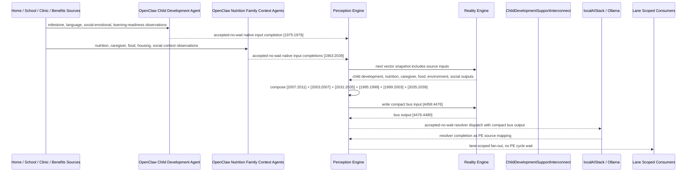

# Child Development Support Interconnect Narrative

This narrative applies the PE-owned published-bus pattern to the Personal Health
`ChildDevelopmentMonitor` workflow. The goal is to deepen the interaction between
child developmental status, pediatric nutrition, caregiver capacity, food access,
home environment safety, and household social context without making RE aware of
bridge services, OpenClaw behavior, or localAIStack details.

RE continues to evaluate ordinary machine vector state. PE owns source
composition, startup configuration, asynchronous dispatch, fan-out selection, and
completion ingestion.

## Machines Involved

- `ChildDevelopmentMonitor.json`
  - role: evaluates developmental referral need, social-developmental concern,
    learning concern, or development OK.
  - input: `[1975:1979]`
  - output: `[2007:2011]`

- `PediatricNutritionMonitor.json`
  - role: evaluates growth alert, nutrition deficit, micronutrient concern, or
    nutrition OK.
  - input: `[1971:1975]`
  - output: `[2003:2007]`

- `HomeCaregiverBurdenMonitor.json`
  - role: deterministically consumes pediatric nutrition and child development
    outputs, then evaluates caregiver burnout, high burden, moderate burden, or
    caregiver coping.
  - input: `[2003:2011]`
  - output: `[2031:2035]`

- `HomeFoodSecurityMonitor.json`
  - role: contributes household food crisis, food insecurity, assistance need,
    or food secure status.
  - input: `[1963:1967]`
  - output: `[1995:1999]`

- `HomeEnvironmentSafetyMonitor.json`
  - role: contributes unsafe housing, utility failure, environmental health risk,
    or safe environment status.
  - input: `[1967:1971]`
  - output: `[1999:2003]`

- `HomeSocialIsolationMonitor.json`
  - role: contributes household access and social isolation context.
  - input: `[2011:2019]`
  - output: `[2035:2039]`

- `ChildDevelopmentSupportInterconnect.json`
  - role: publishes the `health-personal` child development support bus.
  - input: `[4458:4476]`
  - output: `[4476:4480]`

## OpenClaw Native Input Projection

OpenClaw agents are input analysts for the source machines. They do not decide
final workflow state. They map observations into each machine's native input
space, write back through PE, and RE evaluates the CES deterministically.

`ChildDevelopmentMonitor` projection:

```text
milestone_progress_norm
social_emotional_engagement_norm
language_acquisition_norm
learning_readiness_norm
```

`PediatricNutritionMonitor` projection:

```text
growth_trajectory_norm
caloric_adequacy_norm
micronutrient_status_norm
dietary_diversity_norm
```

`HomeCaregiverBurdenMonitor` projection:

```text
growth_alert_bit
nutrition_deficit_bit
micronutrient_concern_bit
nutrition_ok_bit
development_referral_needed_bit
social_developmental_concern_bit
learning_concern_bit
development_ok_bit
```

The normal `HomeCaregiverBurdenMonitor` path is deterministic PE composition from
`PediatricNutritionMonitor[2003:2007]` and `ChildDevelopmentMonitor[2007:2011]`.
OpenClaw may populate the same native lane only when an external caregiver
assessment bypasses those source machines.

`HomeFoodSecurityMonitor`, `HomeEnvironmentSafetyMonitor`, and
`HomeSocialIsolationMonitor` follow the same pattern: OpenClaw maps observations
to each machine's native input vector; PE writes source state; RE evaluates the
source machine; PE composes deterministic outputs into the published bus.

## Published Bus

The published domain bus is:

```text
health-personal.child-development-support
published-bus-health-personal-child-development-support
```

Input lane:

```text
[0] child development referral needed bit
[1] child social developmental concern bit
[2] child learning concern bit
[3] child development ok bit
[4] pediatric growth alert bit
[5] pediatric nutrition deficit bit
[6] pediatric micronutrient concern bit
[7] pediatric nutrition ok bit
[8] caregiver burnout bit
[9] caregiver high burden bit
[10] caregiver moderate burden bit
[11] caregiver coping bit
[12] household food crisis bit
[13] household food insecure or assistance needed bit
[14] unsafe housing bit
[15] utility failure or health hazard bit
[16] household severe isolation or isolation risk bit
[17] household socially connected bit
```

Output lane:

```text
[0] early intervention referral
[1] family stabilization support
[2] developmental monitoring review
[3] stable development support
```

The bridge machine is a normal RE machine. It receives the compact PE-composed
input vector at `[4458:4476]` and emits `[4476:4480]`.

## Example Workflow: Early Intervention Referral

A child has crossed into `REFERRAL_NEEDED`. Pediatric nutrition shows growth and
nutrition stress, caregiver burden has escalated to burnout, and the household
has food and housing instability. OpenClaw projected the observations into each
source machine's native input lane; PE accepted those completions without waiting
inside a PE cycle; RE evaluated the source machines.

PE composes the upstream outputs into:

```text
ChildDevelopmentSupportInterconnect[4458:4476]
= [1, 0, 0, 0, 1, 1, 0, 0, 1, 0, 0, 0, 1, 0, 1, 0, 0, 0]
```

RE evaluates the interconnect and emits:

```text
ChildDevelopmentSupportInterconnect[4476:4480]
= [1, 0, 0, 0]
```

That output is `EARLY_INTERVENTION_REFERRAL`.

PE then performs lane-scoped fan-out without waiting inside a PE cycle:

```text
HSPH151 maternal-child-family health signal monitor
HSPH152 maternal-child-family health resource router
HSPH155 maternal-child-family health referral optimizer
HSPH157 maternal-child-family health agent dispatcher
HSPH158 maternal-child-family health governance escalator
CSX010 human-services intake executive
CSX017 document readiness monitor
LBL007 functional impairment map
LBL067 school accommodation tracker
```

## Example Workflow: Family Stabilization

A child has a social-developmental concern, caregiver burden is high, food access
is unstable, utility stress is present, and household isolation risk is active.

PE composes:

```text
ChildDevelopmentSupportInterconnect[4458:4476]
= [0, 1, 0, 0, 0, 0, 1, 0, 0, 1, 0, 0, 0, 1, 0, 1, 1, 0]
```

RE emits:

```text
ChildDevelopmentSupportInterconnect[4476:4480]
= [0, 1, 0, 0]
```

That output is `FAMILY_STABILIZATION_SUPPORT`.

The family-stabilization lane fans out to maternal-child resource routing,
family stabilization intake, benefits/document readiness, rental assistance when
housing instability is implicated, and family-routine alignment.

## Fan-Out Opportunities

- Early intervention referral should fan out to maternal-child-family health,
  referral optimization, governance escalation, functional support mapping, and
  document readiness.

- Family stabilization support should fan out to family-stabilization intake,
  benefits readiness, rental assistance, and family-routine alignment.

- Developmental monitoring review should fan out to referral optimization,
  school accommodation tracking, and maternal-child learning-loop consumers.

- Stable development support should fan out only to routine follow-up and family
  routine support. It should not dispatch urgent agents.

## Message Flow



## Problems And Extensions

1. `ChildDevelopmentMonitor`, `PediatricNutritionMonitor`,
   `HomeCaregiverBurdenMonitor`, and `HomeEnvironmentSafetyMonitor` had generic
   input semantics. This pass adds `metadata.openClawProjection` contracts so
   OpenClaw templates can perform the native scalar or binary mapping before PE
   writes source state.

2. The existing `HomeCaregiverBurdenMonitor` already composes pediatric nutrition
   and child development outputs. The new bus does not replace that chain; it
   consumes the caregiver-burden output as a higher-order source.

3. Household context is intentionally compact. Food, housing, and social access
   are represented as normalized status bits only; raw benefits documents,
   school records, case notes, and pediatric clinical observations remain in the
   upstream source ledger or system of record.

4. `HomeSocialIsolationMonitor.json` contains historical duplicate
   `interconnections` keys on `origin/main`. This pass merges them so normal JSON
   parsing preserves both existing bus declarations and the new child-development
   support declaration.

5. Future growth should add explicit child-care access, early-learning placement,
   well-child visit adherence, immunization, and school-readiness machines. Those
   should become additional PE source producers instead of widening RE knowledge
   of external services.

## Development Notes

1. Source machines now declare `metadata.interconnections` for the published
   bus, including target file, input lane, output lane, PE ownership, async
   dispatch mode, and privacy boundary.

2. Source machines now expose concrete `metadata.openClawProjection` contracts
   where native machine inputs were generic or where an OpenClaw agent may bypass
   deterministic upstream source output.

3. `ChildDevelopmentSupportInterconnect` defines lane-scoped downstream fan-out
   and a `publishedDomainBus.localAIResolver` contract for localAIStack/Ollama.

4. The resolver metadata intentionally does not create `metadata.agentBinding`.
   The bridge is not an `agent-dispatcher`; PE consumes the resolver contract at
   startup while RE sees only ordinary vector state.

5. Test sequences for early intervention and family stabilization are embedded
   in the bridge machine's `inputSequences`.

## Safety Boundary

The PE-visible workflow carries normalized status bits only. Raw pediatric
records, school observations, developmental screening tools, household benefit
records, home-visit notes, and other PHI-bearing or sensitive source records stay
in upstream ledgers or provider systems. The final localAIStack/Ollama handoff
returns completion through PE as a configured source mapping.
