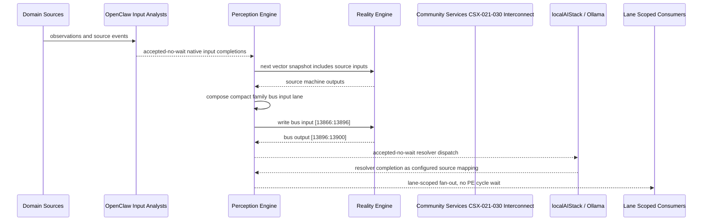

# Community Services CSX-021-030 Interconnect Narrative

This narrative applies the PE-owned published-bus pattern to `Community Services CSX-021-030` in the
`community-services` domain. OpenClaw and localAIStack/Ollama remain PE-side translators
and resolvers. RE evaluates only ordinary vector state.

Focus: Community Services CSX-021-030.

## Published Bus

```text
community-services.csx-021-030
published-bus-community-services-csx-021-030
```

Input lane: `[13866:13896]`

```text
[0] Community Services Behavioral Health And Crisis 988 Warm Handoff Router active output[0] bit
[1] Community Services Behavioral Health And Crisis 988 Warm Handoff Router active output[1] bit
[2] Community Services Behavioral Health And Crisis 988 Warm Handoff Router active output[2] bit
[3] Community Services Behavioral Health And Crisis Mobile Crisis Co Response active output[0] bit
[4] Community Services Behavioral Health And Crisis Mobile Crisis Co Response active output[1] bit
[5] Community Services Behavioral Health And Crisis Mobile Crisis Co Response active output[2] bit
[6] Community Services Behavioral Health And Crisis Substance Use Outreach active output[0] bit
[7] Community Services Behavioral Health And Crisis Substance Use Outreach active output[1] bit
[8] Community Services Behavioral Health And Crisis Substance Use Outreach active output[2] bit
[9] Community Services Behavioral Health And Crisis Mental Health Shelter Referral active output[0] bit
[10] Community Services Behavioral Health And Crisis Mental Health Shelter Referral active output[1] bit
[11] Community Services Behavioral Health And Crisis Mental Health Shelter Referral active output[2] bit
[12] Community Services Behavioral Health And Crisis Youth Crisis Pathway active output[0] bit
[13] Community Services Behavioral Health And Crisis Youth Crisis Pathway active output[1] bit
[14] Community Services Behavioral Health And Crisis Youth Crisis Pathway active output[2] bit
[15] Community Services Behavioral Health And Crisis Post Crisis Follow Up active output[0] bit
[16] Community Services Behavioral Health And Crisis Post Crisis Follow Up active output[1] bit
[17] Community Services Behavioral Health And Crisis Post Crisis Follow Up active output[2] bit
[18] Community Services Behavioral Health And Crisis Naloxone Supply Monitor active output[0] bit
[19] Community Services Behavioral Health And Crisis Naloxone Supply Monitor active output[1] bit
[20] Community Services Behavioral Health And Crisis Naloxone Supply Monitor active output[2] bit
[21] Community Services Behavioral Health And Crisis Community Violence Trauma Support active output[0] bit
[22] Community Services Behavioral Health And Crisis Community Violence Trauma Support active output[1] bit
[23] Community Services Behavioral Health And Crisis Community Violence Trauma Support active output[2] bit
[24] Community Services Behavioral Health And Crisis Behavioral Health Data Sharing active output[0] bit
[25] Community Services Behavioral Health And Crisis Behavioral Health Data Sharing active output[1] bit
[26] Community Services Behavioral Health And Crisis Behavioral Health Data Sharing active output[2] bit
[27] Community Services Behavioral Health And Crisis Behavioral Crisis Executive active output[0] bit
[28] Community Services Behavioral Health And Crisis Behavioral Crisis Executive active output[1] bit
[29] Community Services Behavioral Health And Crisis Behavioral Crisis Executive active output[2] bit
```

Output lane: `[13896:13900]`

```text
[0] domain family review bit
[1] domain family optimization bit
[2] domain family monitoring bit
[3] domain family stable bit
```

Source machines publish active output lanes into this family bus. Stable source
states remain represented by no active PE-composed bits.

## Example Workflow: Community Services CSX-021-030 domain family review

PE composes:

```text
Community Services CSX-021-030 Interconnect[13866:13896]
= [1, 0, 0, 0, 0, 0, 0, 0, 0, 1, 0, 0, 0, 0, 0, 0, 0, 0, 1, 0, 0, 0, 0, 0, 0, 0, 0, 0, 0, 0]
```

RE emits:

```text
Community Services CSX-021-030 Interconnect[13896:13900]
= [1, 0, 0, 0]
```

## Example Workflow: Community Services CSX-021-030 domain family optimization

PE composes:

```text
Community Services CSX-021-030 Interconnect[13866:13896]
= [0, 1, 0, 0, 0, 0, 0, 0, 0, 0, 1, 0, 0, 0, 0, 0, 0, 0, 0, 1, 0, 0, 0, 0, 0, 0, 0, 0, 0, 0]
```

RE emits:

```text
Community Services CSX-021-030 Interconnect[13896:13900]
= [0, 1, 0, 0]
```

## Example Workflow: Community Services CSX-021-030 domain family monitoring

PE composes:

```text
Community Services CSX-021-030 Interconnect[13866:13896]
= [0, 0, 1, 0, 0, 0, 0, 0, 0, 0, 0, 1, 0, 0, 0, 0, 0, 0, 0, 0, 1, 0, 0, 0, 0, 0, 0, 0, 0, 0]
```

RE emits:

```text
Community Services CSX-021-030 Interconnect[13896:13900]
= [0, 0, 1, 0]
```

## Message Flow



## Problems And Extensions

1. This pass records an explicit family-level published-bus contract for every
   source machine in this remaining-domain family.

2. RE visibility remains limited to compact vector lanes. PE owns source
   provenance, transformation, resolver dispatch, and completion ingestion.

3. Future growth can add domain super-buses that consume family bridge outputs
   rather than reading every source machine directly.

## Safety Boundary

The PE-visible workflow carries normalized status bits only. Raw regulated data
and provider-specific records stay upstream. Resolver completions return through
PE as configured source mappings.
