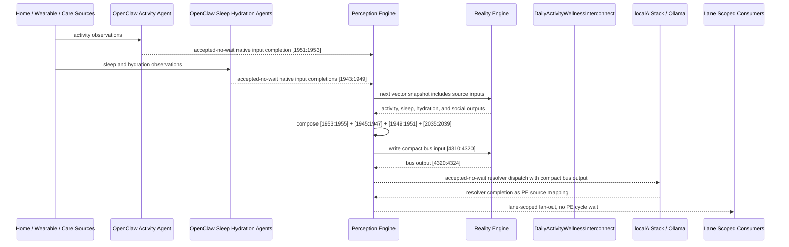

# Daily Activity Wellness Interconnect Narrative

This narrative applies the same PE-owned published-bus pattern to the Personal
Health `DailyActivityMonitor` workflow. The goal is to deepen the interaction
between in-home activity, sleep, hydration, and social context without making RE
aware of bridge services, OpenClaw behavior, or localAIStack details.

RE continues to evaluate ordinary machine vector state. PE owns source
composition, startup configuration, asynchronous dispatch, fan-out selection, and
completion ingestion.

## Machines Involved

- `DailyActivityMonitor.json`
  - role: evaluates whether the resident is active, sedentary, or in a prolonged
    inactivity streak.
  - input: `[1951:1953]`
  - output: `[1953:1955]`

- `SleepQualityMonitor.json`
  - role: evaluates restful, disturbed, or poor sleep.
  - input: `[1943:1945]`
  - output: `[1945:1947]`

- `HydrationMonitor.json`
  - role: evaluates adequate, low, or critical intake.
  - input: `[1947:1949]`
  - output: `[1949:1951]`

- `HomeSocialIsolationMonitor.json`
  - role: evaluates severe isolation, isolation risk, or social connection.
  - input: `[2011:2019]`
  - output: `[2035:2039]`

- `DailyActivityWellnessInterconnect.json`
  - role: publishes the `health-personal` daily activity wellness bus.
  - input: `[4310:4320]`
  - output: `[4320:4324]`

## OpenClaw Native Input Projection

OpenClaw agents are input analysts for the source machines. They do not decide
final workflow state. They map observations into each machine's native input
space, write back through PE, and RE evaluates the CES deterministically.

`DailyActivityMonitor` projection:

```text
below_baseline_today_bit
sedentary_streak_active_bit
```

`SleepQualityMonitor` projection:

```text
adequate_sleep_duration_bit
fragmented_sleep_bit
```

`HydrationMonitor` projection:

```text
below_half_daily_intake_target_bit
below_quarter_daily_intake_target_bit
```

`HomeSocialIsolationMonitor` projection:

```text
medication-adherence-crisis-bit
medication-cost-barrier-active-bit
medication-access-risk-bit
medication-managed-bit
transport-critical-access-failure-bit
transport-appointment-barrier-bit
transport-dependent-risk-bit
transportation-adequate-bit
```

The normal path is deterministic PE composition from source outputs. OpenClaw is
reserved for machine-native projection from external observations that bypass a
normal upstream source.

## Published Bus

The published domain bus is:

```text
health-personal.daily-activity-wellness
published-bus-health-personal-daily-activity-wellness
```

Input lane:

```text
[0] below baseline today bit
[1] sedentary streak active bit
[2] short or poor sleep bit
[3] disturbed or fragmented sleep bit
[4] below half hydration target bit
[5] below quarter hydration target bit
[6] severe isolation bit
[7] social withdrawal bit
[8] isolation risk bit
[9] socially connected bit
```

Output lane:

```text
[0] urgent wellness check
[1] activity support needed
[2] hydration sleep recovery
[3] stable routine
```

The bridge machine is a normal RE machine. It receives the compact PE-composed
input vector at `[4310:4320]` and emits `[4320:4324]`.

## Example Workflow

A high-risk day begins when daily activity remains below baseline and the
sedentary streak bit is active. Sleep is poor, hydration is critical, and social
isolation is severe.

PE composes the upstream outputs into:

```text
DailyActivityWellnessInterconnect[4310:4320]
= [1, 1, 1, 1, 1, 1, 1, 0, 0, 0]
```

RE evaluates the interconnect and emits:

```text
DailyActivityWellnessInterconnect[4320:4324]
= [1, 0, 0, 0]
```

That output is `URGENT_WELLNESS_CHECK`.

PE then performs lane-scoped fan-out without waiting inside a PE cycle:

```text
HSPH131 care coordination signal monitor
HSPH132 care coordination resource router
HSPH137 care coordination agent dispatcher
HSPH138 care coordination governance escalator
LBL015 hydration electrolyte monitor
```

Stable or lower-acuity lanes fan out to a different set of consumers. The bus is
not broadcast indiscriminately.

## Message Flow



## Development Notes

1. Source machines now expose concrete `metadata.openClawProjection` contracts.

2. Source machines now declare `metadata.interconnections` for the published bus,
   including target file, input lane, output lane, PE ownership, and privacy
   boundary.

3. `DailyActivityWellnessInterconnect` defines lane-scoped downstream fan-out and
   a `publishedDomainBus.localAIResolver` contract for localAIStack/Ollama.

4. The resolver metadata intentionally does not create `metadata.agentBinding`.
   The bridge is not an `agent-dispatcher`; PE consumes the resolver contract at
   startup while RE sees only vector state.

5. The test sequence for urgent fan-out is embedded in the bridge machine's
   `inputSequences` under `daily-activity-wellness-urgent-fanout`.

## Safety Boundary

The PE-visible workflow carries normalized status bits only. Raw activity traces,
sleep records, hydration events, social-contact details, and clinical notes stay
in upstream source ledgers or provider systems. The final localAIStack/Ollama
handoff returns completion through PE as a configured source mapping.
