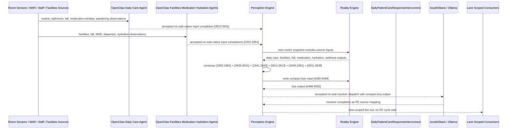

# Daily Patient Care Response Interconnect Narrative

This narrative applies the PE-owned published-bus pattern to the Personal Health
`DailyPatientCare` workflow. The goal is to deepen the interaction between daily
care completion, fall response, bathroom non-use, missed medication, nighttime
wandering, facilities observations, hydration, medication adherence, and patient
wellness without making RE aware of bridge services, OpenClaw behavior, or
localAIStack details.

RE continues to evaluate ordinary machine vector state. PE owns source
composition, startup configuration, asynchronous dispatch, fan-out selection, and
completion ingestion.

## Machines Involved

- `DailyPatientCare.json`
  - role: evaluates morning/evening routine completion, fall response,
    unresponsive fall, bathroom alert, medication miss, and wandering alert.
  - input: `[3923:3931]`
  - output: `[1955:1963]`

- `FacilitiesMaintenance.json`
  - role: contributes hygiene, safety, wellness, and inaccessibility observations
    that can precede or confirm daily-care anomalies.
  - input: `[1931:1939]`
  - output: `[3925:3931]`

- `FallDetection.json`
  - role: contributes fall tier and confidence. PE derives a compact red
    high-confidence fall bit for the response bus.
  - input: `[3813:3815]`
  - output: `[1941:1943]`

- `MedicationAdherenceMonitor.json`
  - role: contributes delayed and missed dose status from MAR, dispenser, or
    caregiver medication observations.
  - input: `[1939:1941]`
  - output: `[3811:3813]`

- `HydrationMonitor.json`
  - role: contributes low and critical hydration status.
  - input: `[1947:1949]`
  - output: `[1949:1951]`

- `PatientWellness.json`
  - role: consumes DailyPatientCare output as native input and emits wellness
    alert or critical acuity.
  - input: `[1955:1963]`
  - output: `[3931:3939]`

- `DailyPatientCareResponseInterconnect.json`
  - role: publishes the `health-personal` daily patient care response bus.
  - input: `[4480:4498]`
  - output: `[4498:4502]`

## OpenClaw Native Input Projection

OpenClaw agents are input analysts for the source machines. They do not decide
final workflow state. They map observations into each machine's native input
space, write back through PE, and RE evaluates the CES deterministically.

`DailyPatientCare` projection:

```text
ambulatory_or_moving_bit
bathroom_use_bit
meal_context_bit
medication_confirmed_bit
evening_meal_context_bit
alert_active_bit
fall_event_bit
night_monitoring_bit
```

`FacilitiesMaintenance` projection:

```text
visit_active_bit
unit_accessible_bit
hygiene_normal_bit
space_safe_bit
nutrition_normal_bit
patient_observed_normal_bit
deep_clean_done_bit
concern_or_alert_active_bit
```

`MedicationAdherenceMonitor` projection:

```text
dose_pending_or_delayed_bit
dose_missed_past_grace_bit
```

`FallDetection` projection:

```text
motion_progression_ordinal
stillness_progression_ordinal
```

The normal `PatientWellness` path is deterministic PE composition from
`DailyPatientCare[1955:1963]`. OpenClaw may populate the same native lane only
when an external wellness assessment bypasses DailyPatientCare.

## Published Bus

The published domain bus is:

```text
health-personal.daily-patient-care-response
published-bus-health-personal-daily-patient-care-response
```

Input lane:

```text
[0] daily care morning complete bit
[1] daily care evening complete bit
[2] daily care fall confirmed bit
[3] daily care unresponsive fall bit
[4] daily care bathroom alert bit
[5] daily care medication missed bit
[6] daily care wandering alert bit
[7] facilities hygiene alert bit
[8] facilities safety alert bit
[9] facilities wellness concern bit
[10] facilities inaccessibility alert bit
[11] fall red high confidence bit
[12] medication adherence delayed bit
[13] medication adherence missed bit
[14] hydration low bit
[15] hydration critical bit
[16] patient wellness alert bit
[17] patient wellness critical bit
```

Output lane:

```text
[0] urgent safety response
[1] care routine recovery
[2] medication hydration review
[3] stable daily care
```

The bridge machine is a normal RE machine. It receives the compact PE-composed
input vector at `[4480:4498]` and emits `[4498:4502]`.

## Example Workflow: Urgent Safety Response

A resident has an unresponsive fall. Facilities context indicates a safety or
inaccessibility concern, FallDetection reports RED high-confidence fall state,
and PatientWellness is critical. OpenClaw projected the observations into each
source machine's native input lane; PE accepted those completions without waiting
inside a PE cycle; RE evaluated the source machines.

PE composes the upstream outputs into:

```text
DailyPatientCareResponseInterconnect[4480:4498]
= [0, 0, 0, 1, 0, 0, 0, 0, 1, 0, 1, 1, 0, 0, 0, 0, 0, 1]
```

RE evaluates the interconnect and emits:

```text
DailyPatientCareResponseInterconnect[4498:4502]
= [1, 0, 0, 0]
```

That output is `URGENT_SAFETY_RESPONSE`.

PE then performs lane-scoped fan-out without waiting inside a PE cycle:

```text
HSPH131 care coordination signal monitor
HSPH132 care coordination resource router
HSPH137 care coordination agent dispatcher
HSPH138 care coordination governance escalator
LBL005 whole-person risk safety review
LBL031 movement baseline
LBL076 wearable sleep activity intake
```

## Example Workflow: Medication Hydration Review

DailyPatientCare reports a missed medication. MedicationAdherenceMonitor confirms
the dose is delayed and missed, HydrationMonitor reports critical hydration, and
PatientWellness is alert.

PE composes:

```text
DailyPatientCareResponseInterconnect[4480:4498]
= [0, 0, 0, 0, 0, 1, 0, 0, 0, 0, 0, 0, 1, 1, 1, 1, 1, 0]
```

RE emits:

```text
DailyPatientCareResponseInterconnect[4498:4502]
= [0, 0, 1, 0]
```

That output is `MEDICATION_HYDRATION_REVIEW`.

The medication-hydration lane fans out to care coordination, medication response
tracking, care visit preparation, and wearable/intake monitoring.

## Fan-Out Opportunities

- Urgent safety response should fan out to care coordination, governance
  escalation, movement safety review, and wearable monitoring.

- Care routine recovery should fan out to nursing review, movement baseline,
  sleep routine stabilization, care visit preparation, and monitoring feedback.

- Medication hydration review should fan out to medication response tracking,
  hydration/intake review, care coordination, and care visit preparation.

- Stable daily care should fan out only to routine monitoring and baseline
  confirmation. It should not dispatch urgent agents.

## Message Flow



## Problems And Extensions

1. `DailyPatientCare`, `FacilitiesMaintenance`, `MedicationAdherenceMonitor`, and
   `PatientWellness` had generic input semantics. This pass adds
   `metadata.openClawProjection` contracts so OpenClaw templates can perform the
   native scalar, binary, or ordinal mapping before PE writes source state.

2. DailyPatientCare already feeds PatientWellness. The new bus does not replace
   that chain; it consumes PatientWellness as higher-order acuity after the
   deterministic DailyPatientCare output has been evaluated.

3. Medication and hydration are included as explicit source producers so PE can
   distinguish a DailyPatientCare medication miss from an independently confirmed
   medication-adherence miss and hydration risk.

4. Sleep quality and social isolation are not first-class inputs in this compact
   bus. Night wandering is represented through DailyPatientCare. A future growth
   pass should add explicit sleep-quality and social-context producers if the
   fan-out requires finer overnight behavioral context.

5. `HomeSocialIsolationMonitor.json` contains historical duplicate
   `interconnections` keys on `origin/main`. This pass merges them so normal JSON
   parsing preserves existing patient-safety and daily-activity bus declarations.

## Development Notes

1. Source machines now declare `metadata.interconnections` for the published
   bus, including target file, input lane, output lane, PE ownership, async
   dispatch mode, and privacy boundary.

2. Source machines now expose concrete `metadata.openClawProjection` contracts
   where native machine inputs were generic or where an OpenClaw agent may bypass
   deterministic upstream source output.

3. `DailyPatientCareResponseInterconnect` defines lane-scoped downstream fan-out
   and a `publishedDomainBus.localAIResolver` contract for localAIStack/Ollama.

4. The resolver metadata intentionally does not create `metadata.agentBinding`.
   The bridge is not an `agent-dispatcher`; PE consumes the resolver contract at
   startup while RE sees only ordinary vector state.

5. Test sequences for urgent safety response and medication hydration review are
   embedded in the bridge machine's `inputSequences`.

## Safety Boundary

The PE-visible workflow carries normalized status bits only. Raw room-sensor
streams, MAR records, fall sensor data, hydration events, staff notes, facilities
logs, and other PHI-bearing source records stay in upstream ledgers or provider
systems. The final localAIStack/Ollama handoff returns completion through PE as a
configured source mapping.
