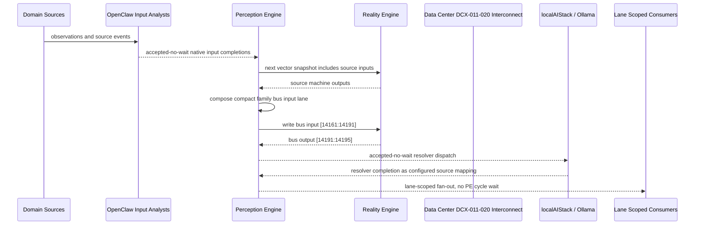

# Data Center DCX-011-020 Interconnect Narrative

This narrative applies the PE-owned published-bus pattern to `Data Center DCX-011-020` in the
`data-center` domain. OpenClaw and localAIStack/Ollama remain PE-side translators
and resolvers. RE evaluates only ordinary vector state.

Focus: Data Center DCX-011-020.

## Published Bus

```text
data-center.dcx-011-020
published-bus-data-center-dcx-011-020
```

Input lane: `[14161:14191]`

```text
[0] Data Center Video Surveillance Coverage Monitor active output[0] bit
[1] Data Center Video Surveillance Coverage Monitor active output[1] bit
[2] Data Center Video Surveillance Coverage Monitor active output[2] bit
[3] Data Center Network Core Redundancy Monitor active output[0] bit
[4] Data Center Network Core Redundancy Monitor active output[1] bit
[5] Data Center Network Core Redundancy Monitor active output[2] bit
[6] Data Center WAN Provider Diversity Monitor active output[0] bit
[7] Data Center WAN Provider Diversity Monitor active output[1] bit
[8] Data Center WAN Provider Diversity Monitor active output[2] bit
[9] Data Center Top Of Rack Switch Lifecycle active output[0] bit
[10] Data Center Top Of Rack Switch Lifecycle active output[1] bit
[11] Data Center Top Of Rack Switch Lifecycle active output[2] bit
[12] Data Center Fiber Plant Integrity Monitor active output[0] bit
[13] Data Center Fiber Plant Integrity Monitor active output[1] bit
[14] Data Center Fiber Plant Integrity Monitor active output[2] bit
[15] Data Center Server Fleet Health Monitor active output[0] bit
[16] Data Center Server Fleet Health Monitor active output[1] bit
[17] Data Center Server Fleet Health Monitor active output[2] bit
[18] Data Center Firmware Baseline Compliance active output[0] bit
[19] Data Center Firmware Baseline Compliance active output[1] bit
[20] Data Center Firmware Baseline Compliance active output[2] bit
[21] Data Center Patch Window Orchestrator active output[0] bit
[22] Data Center Patch Window Orchestrator active output[1] bit
[23] Data Center Patch Window Orchestrator active output[2] bit
[24] Data Center Cluster Capacity Forecast active output[0] bit
[25] Data Center Cluster Capacity Forecast active output[1] bit
[26] Data Center Cluster Capacity Forecast active output[2] bit
[27] Data Center Virtualization HA Readiness active output[0] bit
[28] Data Center Virtualization HA Readiness active output[1] bit
[29] Data Center Virtualization HA Readiness active output[2] bit
```

Output lane: `[14191:14195]`

```text
[0] domain family review bit
[1] domain family optimization bit
[2] domain family monitoring bit
[3] domain family stable bit
```

Source machines publish active output lanes into this family bus. Stable source
states remain represented by no active PE-composed bits.

## Example Workflow: Data Center DCX-011-020 domain family review

PE composes:

```text
Data Center DCX-011-020 Interconnect[14161:14191]
= [1, 0, 0, 0, 0, 0, 0, 0, 0, 1, 0, 0, 0, 0, 0, 0, 0, 0, 1, 0, 0, 0, 0, 0, 0, 0, 0, 0, 0, 0]
```

RE emits:

```text
Data Center DCX-011-020 Interconnect[14191:14195]
= [1, 0, 0, 0]
```

## Example Workflow: Data Center DCX-011-020 domain family optimization

PE composes:

```text
Data Center DCX-011-020 Interconnect[14161:14191]
= [0, 1, 0, 0, 0, 0, 0, 0, 0, 0, 1, 0, 0, 0, 0, 0, 0, 0, 0, 1, 0, 0, 0, 0, 0, 0, 0, 0, 0, 0]
```

RE emits:

```text
Data Center DCX-011-020 Interconnect[14191:14195]
= [0, 1, 0, 0]
```

## Example Workflow: Data Center DCX-011-020 domain family monitoring

PE composes:

```text
Data Center DCX-011-020 Interconnect[14161:14191]
= [0, 0, 1, 0, 0, 0, 0, 0, 0, 0, 0, 1, 0, 0, 0, 0, 0, 0, 0, 0, 1, 0, 0, 0, 0, 0, 0, 0, 0, 0]
```

RE emits:

```text
Data Center DCX-011-020 Interconnect[14191:14195]
= [0, 0, 1, 0]
```

## Message Flow



## Problems And Extensions

1. This pass records an explicit family-level published-bus contract for every
   source machine in this remaining-domain family.

2. RE visibility remains limited to compact vector lanes. PE owns source
   provenance, transformation, resolver dispatch, and completion ingestion.

3. Future growth can add domain super-buses that consume family bridge outputs
   rather than reading every source machine directly.

## Safety Boundary

The PE-visible workflow carries normalized status bits only. Raw regulated data
and provider-specific records stay upstream. Resolver completions return through
PE as configured source mappings.
