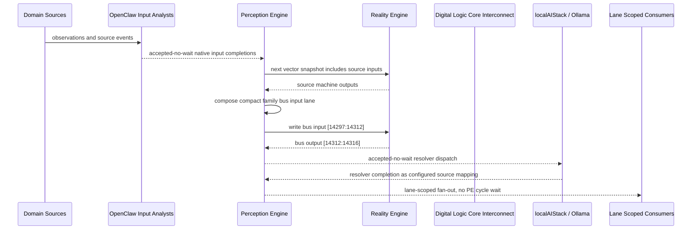

# Digital Logic Core Interconnect Narrative

This narrative applies the PE-owned published-bus pattern to `Digital Logic Core` in the
`digital-logic` domain. OpenClaw and localAIStack/Ollama remain PE-side translators
and resolvers. RE evaluates only ordinary vector state.

Focus: Digital Logic Core.

## Published Bus

```text
digital-logic.digital-logic-core
published-bus-digital-logic-digital-logic-core
```

Input lane: `[14297:14312]`

```text
[0] Kleene Star Operator active output[0] bit
[1] Kleene Star Operator active output[1] bit
[2] Multi-Step State Machine active output[0] bit
[3] Multi-Step State Machine active output[1] bit
[4] OpenClaw Completion E2E active output[0] bit
[5] OpenClaw Completion E2E active output[1] bit
[6] OpenClaw Completion E2E active output[2] bit
[7] RS2 active output[0] bit
[8] RS2 active output[1] bit
[9] RS Flip Flop active output[0] bit
[10] RS Flip Flop active output[1] bit
[11] RS Flip Flop (deprecated demo) active output[0] bit
[12] RS Flip Flop (deprecated demo) active output[1] bit
[13] RS Flipflop Trigger active output[0] bit
[14] RS Flipflop Trigger active output[1] bit
```

Output lane: `[14312:14316]`

```text
[0] domain family review bit
[1] domain family optimization bit
[2] domain family monitoring bit
[3] domain family stable bit
```

Source machines publish active output lanes into this family bus. Stable source
states remain represented by no active PE-composed bits.

## Example Workflow: Digital Logic Core domain family review

PE composes:

```text
Digital Logic Core Interconnect[14297:14312]
= [1, 0, 0, 0, 1, 0, 0, 0, 0, 1, 0, 0, 0, 0, 0]
```

RE emits:

```text
Digital Logic Core Interconnect[14312:14316]
= [1, 0, 0, 0]
```

## Example Workflow: Digital Logic Core domain family optimization

PE composes:

```text
Digital Logic Core Interconnect[14297:14312]
= [0, 1, 0, 0, 0, 1, 0, 0, 0, 0, 1, 0, 0, 0, 0]
```

RE emits:

```text
Digital Logic Core Interconnect[14312:14316]
= [0, 1, 0, 0]
```

## Example Workflow: Digital Logic Core domain family monitoring

PE composes:

```text
Digital Logic Core Interconnect[14297:14312]
= [0, 1, 0, 0, 0, 0, 1, 0, 0, 0, 1, 0, 0, 0, 0]
```

RE emits:

```text
Digital Logic Core Interconnect[14312:14316]
= [0, 0, 1, 0]
```

## Message Flow



## Problems And Extensions

1. This pass records an explicit family-level published-bus contract for every
   source machine in this remaining-domain family.

2. RE visibility remains limited to compact vector lanes. PE owns source
   provenance, transformation, resolver dispatch, and completion ingestion.

3. Future growth can add domain super-buses that consume family bridge outputs
   rather than reading every source machine directly.

## Safety Boundary

The PE-visible workflow carries normalized status bits only. Raw regulated data
and provider-specific records stay upstream. Resolver completions return through
PE as configured source mappings.
