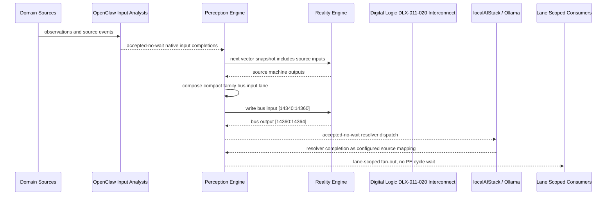

# Digital Logic DLX-011-020 Interconnect Narrative

This narrative applies the PE-owned published-bus pattern to `Digital Logic DLX-011-020` in the
`digital-logic` domain. OpenClaw and localAIStack/Ollama remain PE-side translators
and resolvers. RE evaluates only ordinary vector state.

Focus: Digital Logic DLX-011-020.

## Published Bus

```text
digital-logic.dlx-011-020
published-bus-digital-logic-dlx-011-020
```

Input lane: `[14340:14360]`

```text
[0] Logical Infrastructure Req Ack Handshake active output[0] bit
[1] Logical Infrastructure Req Ack Handshake active output[1] bit
[2] Logical Infrastructure Req Hold Ack active output[0] bit
[3] Logical Infrastructure Req Hold Ack active output[1] bit
[4] Logical Infrastructure Req Ack Done active output[0] bit
[5] Logical Infrastructure Req Ack Done active output[1] bit
[6] Logical Infrastructure Valid Ready Transfer active output[0] bit
[7] Logical Infrastructure Valid Ready Transfer active output[1] bit
[8] Logical Infrastructure Valid Before Ready active output[0] bit
[9] Logical Infrastructure Valid Before Ready active output[1] bit
[10] Logical Infrastructure Ready Before Valid active output[0] bit
[11] Logical Infrastructure Ready Before Valid active output[1] bit
[12] Logical Infrastructure Start Busy Done active output[0] bit
[13] Logical Infrastructure Start Busy Done active output[1] bit
[14] Logical Infrastructure Start Done No Busy active output[0] bit
[15] Logical Infrastructure Start Done No Busy active output[1] bit
[16] Logical Infrastructure Reset Assert Release active output[0] bit
[17] Logical Infrastructure Reset Assert Release active output[1] bit
[18] Logical Infrastructure Reset Sync Two Stage active output[0] bit
[19] Logical Infrastructure Reset Sync Two Stage active output[1] bit
```

Output lane: `[14360:14364]`

```text
[0] domain family review bit
[1] domain family optimization bit
[2] domain family monitoring bit
[3] domain family stable bit
```

Source machines publish active output lanes into this family bus. Stable source
states remain represented by no active PE-composed bits.

## Example Workflow: Digital Logic DLX-011-020 domain family review

PE composes:

```text
Digital Logic DLX-011-020 Interconnect[14340:14360]
= [1, 0, 0, 0, 0, 0, 1, 0, 0, 0, 0, 0, 1, 0, 0, 0, 0, 0, 0, 0]
```

RE emits:

```text
Digital Logic DLX-011-020 Interconnect[14360:14364]
= [1, 0, 0, 0]
```

## Example Workflow: Digital Logic DLX-011-020 domain family optimization

PE composes:

```text
Digital Logic DLX-011-020 Interconnect[14340:14360]
= [0, 1, 0, 0, 0, 0, 0, 1, 0, 0, 0, 0, 0, 1, 0, 0, 0, 0, 0, 0]
```

RE emits:

```text
Digital Logic DLX-011-020 Interconnect[14360:14364]
= [0, 1, 0, 0]
```

## Example Workflow: Digital Logic DLX-011-020 domain family monitoring

PE composes:

```text
Digital Logic DLX-011-020 Interconnect[14340:14360]
= [0, 1, 0, 0, 0, 0, 0, 1, 0, 0, 0, 0, 0, 1, 0, 0, 0, 0, 0, 0]
```

RE emits:

```text
Digital Logic DLX-011-020 Interconnect[14360:14364]
= [0, 0, 1, 0]
```

## Message Flow



## Problems And Extensions

1. This pass records an explicit family-level published-bus contract for every
   source machine in this remaining-domain family.

2. RE visibility remains limited to compact vector lanes. PE owns source
   provenance, transformation, resolver dispatch, and completion ingestion.

3. Future growth can add domain super-buses that consume family bridge outputs
   rather than reading every source machine directly.

## Safety Boundary

The PE-visible workflow carries normalized status bits only. Raw regulated data
and provider-specific records stay upstream. Resolver completions return through
PE as configured source mappings.
