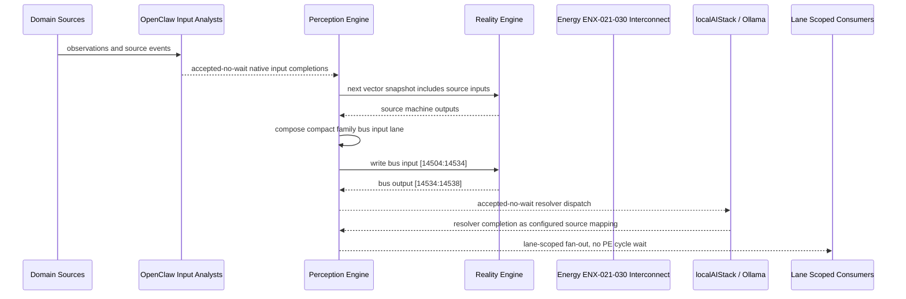

# Energy ENX-021-030 Interconnect Narrative

This narrative applies the PE-owned published-bus pattern to `Energy ENX-021-030` in the
`energy` domain. OpenClaw and localAIStack/Ollama remain PE-side translators
and resolvers. RE evaluates only ordinary vector state.

Focus: Energy ENX-021-030.

## Published Bus

```text
energy.enx-021-030
published-bus-energy-enx-021-030
```

Input lane: `[14504:14534]`

```text
[0] Community Microgrid Cluster Community Center Solar Power Quality Guardian active output[0] bit
[1] Community Microgrid Cluster Community Center Solar Power Quality Guardian active output[1] bit
[2] Community Microgrid Cluster Community Center Solar Power Quality Guardian active output[2] bit
[3] Community Microgrid Cluster Community Center Solar Resilience Mode Router active output[0] bit
[4] Community Microgrid Cluster Community Center Solar Resilience Mode Router active output[1] bit
[5] Community Microgrid Cluster Community Center Solar Resilience Mode Router active output[2] bit
[6] Community Microgrid Cluster Community Center Solar Optimization Planner active output[0] bit
[7] Community Microgrid Cluster Community Center Solar Optimization Planner active output[1] bit
[8] Community Microgrid Cluster Community Center Solar Optimization Planner active output[2] bit
[9] Community Microgrid Cluster Community Center Solar Safety Compliance Checker active output[0] bit
[10] Community Microgrid Cluster Community Center Solar Safety Compliance Checker active output[1] bit
[11] Community Microgrid Cluster Community Center Solar Safety Compliance Checker active output[2] bit
[12] Community Microgrid Cluster School Campus Solar Availability Monitor active output[0] bit
[13] Community Microgrid Cluster School Campus Solar Availability Monitor active output[1] bit
[14] Community Microgrid Cluster School Campus Solar Availability Monitor active output[2] bit
[15] Community Microgrid Cluster School Campus Solar Dispatch Controller active output[0] bit
[16] Community Microgrid Cluster School Campus Solar Dispatch Controller active output[1] bit
[17] Community Microgrid Cluster School Campus Solar Dispatch Controller active output[2] bit
[18] Community Microgrid Cluster School Campus Solar Forecast Gatekeeper active output[0] bit
[19] Community Microgrid Cluster School Campus Solar Forecast Gatekeeper active output[1] bit
[20] Community Microgrid Cluster School Campus Solar Forecast Gatekeeper active output[2] bit
[21] Community Microgrid Cluster School Campus Solar Maintenance Scheduler active output[0] bit
[22] Community Microgrid Cluster School Campus Solar Maintenance Scheduler active output[1] bit
[23] Community Microgrid Cluster School Campus Solar Maintenance Scheduler active output[2] bit
[24] Community Microgrid Cluster School Campus Solar Power Quality Guardian active output[0] bit
[25] Community Microgrid Cluster School Campus Solar Power Quality Guardian active output[1] bit
[26] Community Microgrid Cluster School Campus Solar Power Quality Guardian active output[2] bit
[27] Community Microgrid Cluster School Campus Solar Resilience Mode Router active output[0] bit
[28] Community Microgrid Cluster School Campus Solar Resilience Mode Router active output[1] bit
[29] Community Microgrid Cluster School Campus Solar Resilience Mode Router active output[2] bit
```

Output lane: `[14534:14538]`

```text
[0] domain family review bit
[1] domain family optimization bit
[2] domain family monitoring bit
[3] domain family stable bit
```

Source machines publish active output lanes into this family bus. Stable source
states remain represented by no active PE-composed bits.

## Example Workflow: Energy ENX-021-030 domain family review

PE composes:

```text
Energy ENX-021-030 Interconnect[14504:14534]
= [1, 0, 0, 0, 0, 0, 0, 0, 0, 1, 0, 0, 0, 0, 0, 0, 0, 0, 1, 0, 0, 0, 0, 0, 0, 0, 0, 0, 0, 0]
```

RE emits:

```text
Energy ENX-021-030 Interconnect[14534:14538]
= [1, 0, 0, 0]
```

## Example Workflow: Energy ENX-021-030 domain family optimization

PE composes:

```text
Energy ENX-021-030 Interconnect[14504:14534]
= [0, 1, 0, 0, 0, 0, 0, 0, 0, 0, 1, 0, 0, 0, 0, 0, 0, 0, 0, 1, 0, 0, 0, 0, 0, 0, 0, 0, 0, 0]
```

RE emits:

```text
Energy ENX-021-030 Interconnect[14534:14538]
= [0, 1, 0, 0]
```

## Example Workflow: Energy ENX-021-030 domain family monitoring

PE composes:

```text
Energy ENX-021-030 Interconnect[14504:14534]
= [0, 0, 1, 0, 0, 0, 0, 0, 0, 0, 0, 1, 0, 0, 0, 0, 0, 0, 0, 0, 1, 0, 0, 0, 0, 0, 0, 0, 0, 0]
```

RE emits:

```text
Energy ENX-021-030 Interconnect[14534:14538]
= [0, 0, 1, 0]
```

## Message Flow



## Problems And Extensions

1. This pass records an explicit family-level published-bus contract for every
   source machine in this remaining-domain family.

2. RE visibility remains limited to compact vector lanes. PE owns source
   provenance, transformation, resolver dispatch, and completion ingestion.

3. Future growth can add domain super-buses that consume family bridge outputs
   rather than reading every source machine directly.

## Safety Boundary

The PE-visible workflow carries normalized status bits only. Raw regulated data
and provider-specific records stay upstream. Resolver completions return through
PE as configured source mappings.
