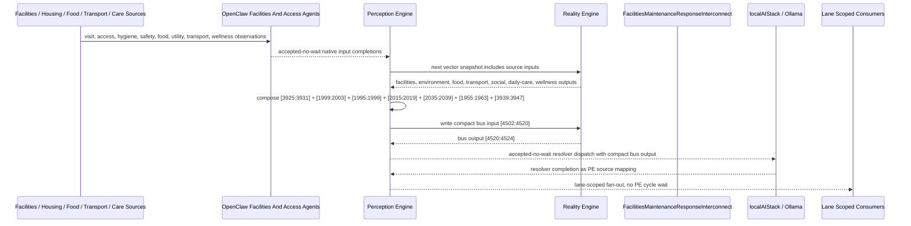

# Facilities Maintenance Response Interconnect Narrative

This narrative applies the PE-owned published-bus pattern to the Personal Health
`FacilitiesMaintenance` workflow. The goal is to deepen the interaction between
routine facilities visits, hygiene findings, safety hazards, access failures,
food and transportation barriers, social isolation, daily-care anomalies, and
wellness escalation without making RE aware of bridge services, OpenClaw behavior,
or localAIStack details.

RE continues to evaluate ordinary machine vector state. PE owns source
composition, startup configuration, asynchronous dispatch, fan-out selection, and
completion ingestion.

## Machines Involved

- `FacilitiesMaintenance.json`
  - role: evaluates daily/weekly maintenance completion, hygiene alert, safety
    alert, wellness concern, and inaccessibility alert.
  - input: `[1931:1939]`
  - output: `[3925:3931]`

- `HomeEnvironmentSafetyMonitor.json`
  - role: contributes unsafe housing, utility failure, and environmental health
    hazard context observed during or around facilities visits.
  - input: `[1967:1971]`
  - output: `[1999:2003]`

- `HomeFoodSecurityMonitor.json`
  - role: contributes food crisis, food insecurity, and assistance-needed status
    when facilities observations expose missing food, unsafe storage, or depleted
    meal support.
  - input: `[1963:1967]`
  - output: `[1995:1999]`

- `HomeTransportationBarrierMonitor.json`
  - role: contributes critical access failure and appointment barrier context
    when remediation or care follow-up cannot be completed without transport.
  - input: `[1983:1987]`
  - output: `[2015:2019]`

- `HomeSocialIsolationMonitor.json`
  - role: contributes severe isolation context when access failures and missed
    care interactions suggest self-neglect risk.
  - input: `[2011:2019]`
  - output: `[2035:2039]`

- `DailyPatientCare.json`
  - role: contributes unresponsive fall and bathroom alert confirmation for
    facilities safety, hygiene, or inaccessibility findings.
  - input: `[3923:3931]`
  - output: `[1955:1963]`

- `WellnessAnalytics.json`
  - role: contributes transition escalation or urgent transition context after
    wellness deterioration is evaluated.
  - input: `[3931:3939]`
  - output: `[3939:3947]`

- `FacilitiesMaintenanceResponseInterconnect.json`
  - role: publishes the `health-personal` facilities maintenance response bus.
  - input: `[4502:4520]`
  - output: `[4520:4524]`

## OpenClaw Native Input Projection

OpenClaw agents are input analysts for source machines. They do not decide final
workflow state. They map observations into each machine's native input space,
write back through PE, and RE evaluates the CES deterministically.

`FacilitiesMaintenance` projection:

```text
visit_active_bit
unit_accessible_bit
hygiene_normal_bit
space_safe_bit
nutrition_normal_bit
patient_observed_normal_bit
tasks_complete_bit
concern_active_bit
```

`HomeEnvironmentSafetyMonitor` projection:

```text
housing_quality_norm
utility_stability_norm
environmental_health_norm
remediation_support_norm
```

`HomeTransportationBarrierMonitor` projection:

```text
critical_appointment_access_norm
transport_reliability_norm
transit_dependency_norm
transport_support_norm
```

`DailyPatientCare` projection:

```text
ambulatory_or_moving_bit
bathroom_use_bit
meal_context_bit
medication_confirmed_bit
evening_meal_context_bit
alert_active_bit
fall_event_bit
night_monitoring_bit
```

`HomeFoodSecurityMonitor` and `HomeSocialIsolationMonitor` already expose native
projection contracts on the branch base. Those projections remain intact.

## Published Bus

The published domain bus is:

```text
health-personal.facilities-maintenance-response
published-bus-health-personal-facilities-maintenance-response
```

Input lane:

```text
[0] facilities daily complete bit
[1] facilities weekly complete bit
[2] facilities hygiene alert bit
[3] facilities safety alert bit
[4] facilities wellness concern bit
[5] facilities inaccessibility alert bit
[6] environment unsafe housing bit
[7] environment utility failure bit
[8] environment health hazard risk bit
[9] food crisis bit
[10] food insecure bit
[11] food assistance needed bit
[12] transport critical access failure bit
[13] transport appointment barrier bit
[14] severe social isolation bit
[15] daily care unresponsive fall bit
[16] daily care bathroom alert bit
[17] wellness transition urgent or escalated bit
```

Output lane:

```text
[0] immediate welfare check
[1] environment remediation response
[2] service access stabilization
[3] routine maintenance complete
```

The bridge machine is a normal RE machine. It receives the compact PE-composed
input vector at `[4502:4520]` and emits `[4520:4524]`.

## Example Workflow: Immediate Welfare Check

Facilities staff cannot access the unit and have already reported a safety and
wellness concern. Transportation access is critical, social isolation is severe,
DailyPatientCare confirms an unresponsive-fall signal, and WellnessAnalytics has
transition escalation or urgent transition context. OpenClaw projected the
observations into each source machine's native input lane; PE accepted those
completions without waiting inside a PE cycle; RE evaluated the source machines.

PE composes the upstream outputs into:

```text
FacilitiesMaintenanceResponseInterconnect[4502:4520]
= [0, 0, 0, 1, 1, 1, 0, 0, 0, 0, 0, 0, 1, 0, 1, 1, 0, 1]
```

RE evaluates the interconnect and emits:

```text
FacilitiesMaintenanceResponseInterconnect[4520:4524]
= [1, 0, 0, 0]
```

That output is `IMMEDIATE_WELFARE_CHECK`.

PE then performs lane-scoped fan-out without waiting inside a PE cycle:

```text
HSPH131 care coordination signal monitor
HSPH132 care coordination resource router
HSPH137 care coordination agent dispatcher
HSPH138 care coordination governance escalator
LBL005 whole-person risk safety review
LBL076 wearable sleep activity intake
```

## Example Workflow: Environment Remediation Response

Facilities staff complete a weekly visit but report hygiene and safety alerts.
The home environment machine reports unsafe housing, utility failure, and health
hazard risk. DailyPatientCare also reports a bathroom alert, confirming that the
facility observation has resident-care impact.

PE composes:

```text
FacilitiesMaintenanceResponseInterconnect[4502:4520]
= [0, 1, 1, 1, 0, 0, 1, 1, 1, 0, 0, 0, 0, 0, 0, 0, 1, 0]
```

RE emits:

```text
FacilitiesMaintenanceResponseInterconnect[4520:4524]
= [0, 1, 0, 0]
```

That output is `ENVIRONMENT_REMEDIATION_RESPONSE`.

The lane fans out to care coordination, referral optimization, whole-person
safety review, care visit preparation, utility assistance, rental assistance,
311 intake, sanitation dispatch, and accessibility work-order routing.

## Example Workflow: Service Access Stabilization

Facilities staff report a hygiene concern and wellness concern. Food security
outputs show food crisis, food insecurity, and assistance needed; transportation
shows an appointment barrier; social isolation is severe. The issue is not an
immediate inaccessibility emergency, but the combined status indicates that the
resident may be unable to stabilize without service support.

PE composes:

```text
FacilitiesMaintenanceResponseInterconnect[4502:4520]
= [0, 0, 1, 0, 1, 0, 0, 0, 0, 1, 1, 1, 0, 1, 1, 0, 0, 0]
```

RE emits:

```text
FacilitiesMaintenanceResponseInterconnect[4520:4524]
= [0, 0, 1, 0]
```

That output is `SERVICE_ACCESS_STABILIZATION`.

The lane fans out to care coordination, food and meal outreach, transportation
work-order review, care visit preparation, and monitoring cadence adjustment.

## Fan-Out Opportunities

- Immediate welfare check should fan out to care coordination, agent dispatch,
  governance escalation, whole-person safety review, and increased monitoring.

- Environment remediation should fan out to housing, utility, sanitation, 311,
  accessibility work orders, whole-person safety review, and care visit
  preparation.

- Service access stabilization should fan out to nutrition assistance,
  transportation support, social connection review, care coordination, and care
  visit preparation.

- Routine maintenance complete should update baseline maintenance state without
  urgent agent dispatch.

## Message Flow



## Problems And Extensions

1. `FacilitiesMaintenance`, `HomeEnvironmentSafetyMonitor`,
   `HomeTransportationBarrierMonitor`, and `DailyPatientCare` had generic input
   semantics on the branch base. This pass adds `metadata.openClawProjection`
   contracts so OpenClaw templates can perform native scalar or binary mapping
   before PE writes source state.

2. `FacilitiesMaintenance` metadata contains older absolute interconnect notes
   that reference historical offsets. The new published bus records the current
   PE lane explicitly and should be treated as the scalable integration pattern.

3. `HomeSocialIsolationMonitor.json` contains historical duplicate
   `interconnections` keys on `origin/main`. This pass merges them while adding
   the facilities response declaration so normal JSON parsing preserves every bus
   declaration.

4. Wellness escalation is intentionally represented as a PE-derived bit from
   `WellnessAnalytics` output. That prevents RE from knowing resolver details and
   keeps the interconnect compact.

5. A future growth pass can add explicit maintenance work-order completion and
   external facilities ticket-state sources. Those should also enter through PE
   source mappings rather than RE-visible bridge services.

## Development Notes

1. Source machines now declare `metadata.interconnections` for the published
   bus, including target file, input lane, output lane, PE ownership, async
   dispatch mode, and privacy boundary.

2. Source machines now expose concrete `metadata.openClawProjection` contracts
   where native machine inputs were generic and external observations may arrive
   from staff notes, work-order systems, or local OpenClaw templates.

3. `FacilitiesMaintenanceResponseInterconnect` defines lane-scoped downstream
   fan-out and a `publishedDomainBus.localAIResolver` contract for
   localAIStack/Ollama.

4. The resolver metadata intentionally does not create `metadata.agentBinding`.
   The bridge is not an `agent-dispatcher`; PE consumes the resolver contract at
   startup while RE sees only ordinary vector state.

5. Test sequences for immediate welfare check, environment remediation, and
   service access stabilization are embedded in the bridge machine's
   `inputSequences`.

## Safety Boundary

The PE-visible workflow carries normalized status bits only. Raw facilities work
orders, staff notes, household records, utility account details, transportation
records, food-assistance records, and other PHI-bearing source records stay in
upstream ledgers or provider systems. The final localAIStack/Ollama handoff
returns completion through PE as a configured source mapping.
