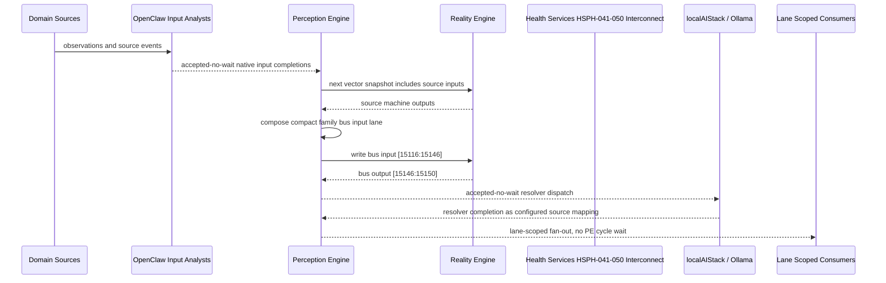

# Health Services HSPH-041-050 Interconnect Narrative

This narrative applies the PE-owned published-bus pattern to `Health Services HSPH-041-050` in the
`health-services` domain. OpenClaw and localAIStack/Ollama remain PE-side translators
and resolvers. RE evaluates only ordinary vector state.

Focus: Health Services HSPH-041-050.

## Published Bus

```text
health-services.hsph-041-050
published-bus-health-services-hsph-041-050
```

Input lane: `[15116:15146]`

```text
[0] Health Services Governance Modernization Signal Monitor active output[0] bit
[1] Health Services Governance Modernization Signal Monitor active output[1] bit
[2] Health Services Governance Modernization Signal Monitor active output[2] bit
[3] Health Services Governance Modernization Resource Router active output[0] bit
[4] Health Services Governance Modernization Resource Router active output[1] bit
[5] Health Services Governance Modernization Resource Router active output[2] bit
[6] Health Services Governance Modernization Equity Guardrail active output[0] bit
[7] Health Services Governance Modernization Equity Guardrail active output[1] bit
[8] Health Services Governance Modernization Equity Guardrail active output[2] bit
[9] Health Services Governance Modernization Capacity Balancer active output[0] bit
[10] Health Services Governance Modernization Capacity Balancer active output[1] bit
[11] Health Services Governance Modernization Capacity Balancer active output[2] bit
[12] Health Services Governance Modernization Referral Optimizer active output[0] bit
[13] Health Services Governance Modernization Referral Optimizer active output[1] bit
[14] Health Services Governance Modernization Referral Optimizer active output[2] bit
[15] Health Services Governance Modernization Measure Tracker active output[0] bit
[16] Health Services Governance Modernization Measure Tracker active output[1] bit
[17] Health Services Governance Modernization Measure Tracker active output[2] bit
[18] Health Services Governance Modernization Agent Dispatcher active output[0] bit
[19] Health Services Governance Modernization Agent Dispatcher active output[1] bit
[20] Health Services Governance Modernization Agent Dispatcher active output[2] bit
[21] Health Services Governance Modernization Governance Escalator active output[0] bit
[22] Health Services Governance Modernization Governance Escalator active output[1] bit
[23] Health Services Governance Modernization Governance Escalator active output[2] bit
[24] Health Services Governance Modernization Learning Loop active output[0] bit
[25] Health Services Governance Modernization Learning Loop active output[1] bit
[26] Health Services Governance Modernization Learning Loop active output[2] bit
[27] Health Services Governance Modernization Outcome Stabilizer active output[0] bit
[28] Health Services Governance Modernization Outcome Stabilizer active output[1] bit
[29] Health Services Governance Modernization Outcome Stabilizer active output[2] bit
```

Output lane: `[15146:15150]`

```text
[0] domain family review bit
[1] domain family optimization bit
[2] domain family monitoring bit
[3] domain family stable bit
```

Source machines publish active output lanes into this family bus. Stable source
states remain represented by no active PE-composed bits.

## Example Workflow: Health Services HSPH-041-050 domain family review

PE composes:

```text
Health Services HSPH-041-050 Interconnect[15116:15146]
= [1, 0, 0, 0, 0, 0, 0, 0, 0, 1, 0, 0, 0, 0, 0, 0, 0, 0, 1, 0, 0, 0, 0, 0, 0, 0, 0, 0, 0, 0]
```

RE emits:

```text
Health Services HSPH-041-050 Interconnect[15146:15150]
= [1, 0, 0, 0]
```

## Example Workflow: Health Services HSPH-041-050 domain family optimization

PE composes:

```text
Health Services HSPH-041-050 Interconnect[15116:15146]
= [0, 1, 0, 0, 0, 0, 0, 0, 0, 0, 1, 0, 0, 0, 0, 0, 0, 0, 0, 1, 0, 0, 0, 0, 0, 0, 0, 0, 0, 0]
```

RE emits:

```text
Health Services HSPH-041-050 Interconnect[15146:15150]
= [0, 1, 0, 0]
```

## Example Workflow: Health Services HSPH-041-050 domain family monitoring

PE composes:

```text
Health Services HSPH-041-050 Interconnect[15116:15146]
= [0, 0, 1, 0, 0, 0, 0, 0, 0, 0, 0, 1, 0, 0, 0, 0, 0, 0, 0, 0, 1, 0, 0, 0, 0, 0, 0, 0, 0, 0]
```

RE emits:

```text
Health Services HSPH-041-050 Interconnect[15146:15150]
= [0, 0, 1, 0]
```

## Message Flow



## Problems And Extensions

1. This pass records an explicit family-level published-bus contract for every
   source machine in this remaining-domain family.

2. RE visibility remains limited to compact vector lanes. PE owns source
   provenance, transformation, resolver dispatch, and completion ingestion.

3. Future growth can add domain super-buses that consume family bridge outputs
   rather than reading every source machine directly.

## Safety Boundary

The PE-visible workflow carries normalized status bits only. Raw regulated data
and provider-specific records stay upstream. Resolver completions return through
PE as configured source mappings.
