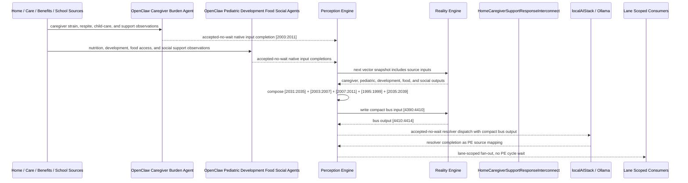

# Home Caregiver Support Response Interconnect Narrative

This narrative applies the PE-owned published-bus pattern to the Personal Health
`HomeCaregiverBurdenMonitor` workflow. It follows the same style as the fall
detection, chronic pain, daily activity, hydration, food-security, and chronic
disease examples: source machines remain ordinary deterministic RE machines,
OpenClaw agents perform native input projection where observations are not
already machine-ready, and PE owns composition, asynchronous dispatch, fan-out,
and completion ingestion.

The workflow starts from caregiver burden. The key extension is that caregiver
stress should not fan out as one generic family-support event. PE should separate
urgent respite crisis, family resource support, child development/nutrition
follow-up, and stable monitoring.

RE continues to evaluate ordinary machine vector state. PE owns source
composition, startup configuration, asynchronous dispatch, fan-out selection, and
completion ingestion.

## Machines Involved

- `HomeCaregiverBurdenMonitor.json`
  - role: evaluates caregiver burden from pediatric nutrition and child
    development outputs.
  - input: `[2003:2011]`
  - output: `[2031:2035]`

- `PediatricNutritionMonitor.json`
  - role: adds child growth, nutrition deficit, micronutrient, and stable
    nutrition context.
  - input: `[1971:1975]`
  - output: `[2003:2007]`

- `ChildDevelopmentMonitor.json`
  - role: adds developmental referral, social-developmental, learning, and
    stable development context.
  - input: `[1975:1979]`
  - output: `[2007:2011]`

- `HomeFoodSecurityMonitor.json`
  - role: adds household food access context that can intensify caregiver load.
  - input: `[1963:1967]`
  - output: `[1995:1999]`

- `HomeSocialIsolationMonitor.json`
  - role: adds social support and isolation context for respite planning.
  - input: `[2011:2019]`
  - output: `[2035:2039]`

- `HomeCaregiverSupportResponseInterconnect.json`
  - role: publishes the `health-personal` caregiver support response bus.
  - input: `[4390:4410]`
  - output: `[4410:4414]`

## OpenClaw Native Input Projection

OpenClaw agents are input analysts for source machines. They do not decide final
workflow state. They map observations into each machine's native input space,
write back through PE, and RE evaluates the CES deterministically.

`HomeCaregiverBurdenMonitor` projection:

```text
pediatric-growth-alert-bit
pediatric-nutrition-deficit-bit
pediatric-micronutrient-concern-bit
pediatric-nutrition-ok-bit
child-referral-needed-bit
child-social-developmental-concern-bit
child-learning-concern-bit
child-development-ok-bit
```

`PediatricNutritionMonitor` projection:

```text
pediatric_growth_percentile_norm
pediatric_caloric_adequacy_norm
pediatric_micronutrient_status_norm
pediatric_dietary_diversity_norm
```

`ChildDevelopmentMonitor` projection:

```text
developmental_milestone_progress_norm
social_emotional_engagement_norm
language_acquisition_norm
learning_readiness_norm
```

`HomeFoodSecurityMonitor` projection:

```text
meal_frequency_norm
food_quality_norm
pantry_days_norm
food_assistance_norm
```

`HomeSocialIsolationMonitor` projection:

```text
medication-adherence-crisis-bit
medication-cost-barrier-active-bit
medication-access-risk-bit
medication-managed-bit
transport-critical-access-failure-bit
transport-appointment-barrier-bit
transport-dependent-risk-bit
transportation-adequate-bit
```

The normal path is deterministic PE composition from source outputs. OpenClaw is
reserved for machine-native projection from external observations that bypass a
normal upstream source. This keeps ordinal mapping in agent template behavior and
keeps the corpus machines as stable vector contracts.

## Published Bus

The published domain bus is:

```text
health-personal.caregiver-support-response
published-bus-health-personal-caregiver-support-response
```

Input lane:

```text
[0] caregiver burnout bit
[1] high caregiver burden bit
[2] moderate caregiver burden bit
[3] caregiver coping bit
[4] pediatric growth alert bit
[5] pediatric nutrition deficit bit
[6] pediatric micronutrient concern bit
[7] pediatric nutrition ok bit
[8] child referral needed bit
[9] child social developmental concern bit
[10] child learning concern bit
[11] child development ok bit
[12] food crisis bit
[13] food insecure bit
[14] food assistance needed bit
[15] food secure bit
[16] severe isolation bit
[17] social withdrawal bit
[18] isolation risk bit
[19] socially connected bit
```

Output lane:

```text
[0] caregiver respite crisis
[1] family resource support
[2] child development nutrition follow-up
[3] caregiver stable monitoring
```

The bridge machine is a normal RE machine. It receives the compact PE-composed
input vector at `[4390:4410]` and emits `[4410:4414]`.

## Fan-Out Analysis

The main fan-out opportunities are intentionally separated by lane.

`caregiver_respite_crisis` should fan out to:

```text
HSPH131 care coordination signal monitor
HSPH132 care coordination resource router
HSPH137 care coordination agent dispatcher
HSPH138 care coordination governance escalator
HSPH151 maternal child family health signal monitor
HSPH152 maternal child family health resource router
HSPH157 maternal child family health agent dispatcher
HSPH158 maternal child family health governance escalator
CSX005 family stabilization intake
CSX006 aging services / caregiver respite intake
CSX009 crisis benefit intake
LBL066 parent coaching plan
```

This path is for caregiver burnout with child health/development and household
co-risk. It keeps PE dispatch asynchronous and routes urgent respite, family
stabilization, and governance consumers without blocking PE cycles.

`family_resource_support` should fan out to:

```text
HSPH131 care coordination signal monitor
HSPH132 care coordination resource router
HSPH135 care coordination referral optimizer
HSPH137 care coordination agent dispatcher
HSPH151 maternal child family health signal monitor
HSPH152 maternal child family health resource router
HSPH153 maternal child family health equity guardrail
HSPH154 maternal child family health capacity balancer
HSPH155 maternal child family health referral optimizer
HSPH157 maternal child family health agent dispatcher
CSX005 family stabilization intake
CSX006 aging services / caregiver respite intake
CSX012 SNAP eligibility monitor
CSX014 WIC referral coordinator
CSX017 document readiness monitor
CSX019 enrollment completion monitor
LBL011 meal pattern stability
LBL018 family food environment
LBL062 family routine alignment
LBL066 parent coaching plan
```

This path is for high caregiver burden with resource barriers such as food,
benefits, social withdrawal, or limited support. It emphasizes resource routing
and family stabilization rather than crisis escalation.

`child_development_nutrition_followup` should fan out to:

```text
HSPH131 care coordination signal monitor
HSPH132 care coordination resource router
HSPH135 care coordination referral optimizer
HSPH151 maternal child family health signal monitor
HSPH152 maternal child family health resource router
HSPH153 maternal child family health equity guardrail
HSPH155 maternal child family health referral optimizer
HSPH156 maternal child family health measure tracker
HSPH159 maternal child family health learning loop
CSX014 WIC referral coordinator
LBL011 meal pattern stability
LBL017 micronutrient risk screen
LBL018 family food environment
LBL019 nutrition plan adherence
LBL062 family routine alignment
LBL066 parent coaching plan
LBL067 school accommodation tracker
```

This path is for child nutrition or development follow-up when caregiver strain is
not yet a respite crisis. It activates pediatric, nutrition, family routine, and
school-support consumers.

`caregiver_stable_monitoring` should fan out only to lightweight monitoring
consumers:

```text
HSPH156 maternal child family health measure tracker
HSPH159 maternal child family health learning loop
LBL011 meal pattern stability
LBL018 family food environment
LBL019 nutrition plan adherence
LBL062 family routine alignment
```

Stable caregiver support should not create benefits, crisis, or care-coordination
work.

## Example Workflow

A high-risk day begins when caregiver burnout, pediatric growth alert, child
development referral need, food crisis, and severe isolation are all active. PE
composes:

```text
HomeCaregiverSupportResponseInterconnect[4390:4410]
= [1, 0, 0, 0, 1, 0, 0, 0, 1, 0, 0, 0, 1, 0, 0, 0, 1, 0, 0, 0]
```

RE evaluates the interconnect and emits:

```text
HomeCaregiverSupportResponseInterconnect[4410:4414]
= [1, 0, 0, 0]
```

That output is `CAREGIVER_RESPITE_CRISIS`.

PE then performs lane-scoped fan-out without waiting inside a PE cycle. The
agent/localAI work is accepted-no-wait; completions return later as PE source
mappings.

## Family Resource Support Example

If caregiver burden is high and the dominant context is food-assistance need,
social withdrawal, and non-urgent child support concerns, PE composes:

```text
HomeCaregiverSupportResponseInterconnect[4390:4410]
= [0, 1, 0, 0, 0, 1, 0, 0, 0, 1, 0, 0, 0, 0, 1, 0, 0, 1, 0, 0]
```

RE emits:

```text
HomeCaregiverSupportResponseInterconnect[4410:4414]
= [0, 1, 0, 0]
```

That output is `FAMILY_RESOURCE_SUPPORT`, so PE routes to family stabilization,
benefits, WIC/SNAP, resource routing, and parent-coaching consumers rather than a
generic respite crisis.

## Child Follow-Up Example

If caregiver burden is moderate, the child has micronutrient and learning
concerns, food access is stable, and social support is present, PE composes:

```text
HomeCaregiverSupportResponseInterconnect[4390:4410]
= [0, 0, 1, 0, 0, 0, 1, 0, 0, 0, 1, 0, 0, 0, 0, 1, 0, 0, 1, 0]
```

RE emits:

```text
HomeCaregiverSupportResponseInterconnect[4410:4414]
= [0, 0, 1, 0]
```

That output is `CHILD_DEVELOPMENT_NUTRITION_FOLLOWUP`, so PE routes to pediatric
nutrition, developmental follow-up, school accommodation, family routine, and
maternal-child family health consumers.

## Message Flow



## Problems and Extensions Identified

1. `HomeCaregiverBurdenMonitor.json`, `PediatricNutritionMonitor.json`, and
   `ChildDevelopmentMonitor.json` had generic input semantics and no OpenClaw
   native input projection metadata. This pass adds explicit projection contracts
   so PE can ingest agent-resolved native inputs without exposing raw bridge
   activity to RE.

2. Several source machines declare output lanes that need fuller authored
   sequence coverage: caregiver `MODERATE_BURDEN`, pediatric
   `NUTRITION_DEFICIT`, child `LEARNING_CONCERN`, food `FOOD_INSECURE`, and
   social `SOCIAL_WITHDRAWAL`. The bus consumes those lanes as valid vector
   contract bits, but future passes should add the missing native sequences.

3. Some stable source lanes are currently marked as warning-level trigger states
   in their native machines. The new bus emits `CAREGIVER_STABLE_MONITORING` as
   green/info, but the source machines should be normalized in a follow-up so
   stable trigger traffic does not look like operational warning traffic.

4. `HomeSocialIsolationMonitor.json` contained duplicate `interconnections` keys
   on `origin/main`; JSON parsers retained only the later value. This pass merges
   those declarations while adding the caregiver-support bus producer so existing
   patient-safety and daily-activity declarations remain visible.

5. The interconnect intentionally stores the localAI resolver as bus metadata,
   not as a machine-level `agentBinding`. This preserves the established
   boundary: RE evaluates the vector; PE decides whether to dispatch localAI and
   how to ingest completion outputs.

6. Future work can add consumer-specific downstream input transforms for care
   coordination, maternal-child family health, benefits, and Life Balance
   consumers. The current bus publishes the source-of-truth response lanes and
   expected fan-out set; downstream machines can later declare exact lane-to-input
   adapters where their CES inputs require richer local mapping.
