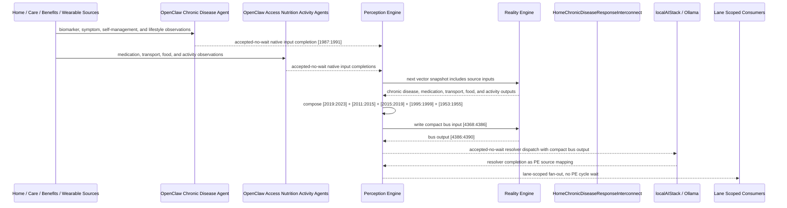

# Home Chronic Disease Response Interconnect Narrative

This narrative applies the PE-owned published-bus pattern to the Personal Health
`HomeChronicDiseaseMonitor` workflow. It uses the same style as the fall
detection, chronic pain, daily activity, hydration, and food-security examples:
source machines remain ordinary deterministic RE machines, OpenClaw agents
perform native input projection where observations are not already
machine-ready, and PE owns composition, asynchronous dispatch, fan-out, and
completion ingestion.

The workflow starts from chronic disease control. The key extension is that poor
control should not fan out as one generic chronic-care event. PE should separate
acute exacerbation, medication/access-driven poor control, preventive
intensification, and stable monitoring.

RE continues to evaluate ordinary machine vector state. PE owns source
composition, startup configuration, asynchronous dispatch, fan-out selection, and
completion ingestion.

## Machines Involved

- `HomeChronicDiseaseMonitor.json`
  - role: evaluates biomarker control, symptom burden, self-management capacity,
    and lifestyle adherence.
  - input: `[1987:1991]`
  - output: `[2019:2023]`

- `HomeMedicationCostBarrierMonitor.json`
  - role: adds medication affordability, refill continuity, dose rationing, and
    benefit-access context.
  - input: `[1979:1983]`
  - output: `[2011:2015]`

- `HomeTransportationBarrierMonitor.json`
  - role: adds appointment transportation and care-access context.
  - input: `[1983:1987]`
  - output: `[2015:2019]`

- `HomeFoodSecurityMonitor.json`
  - role: adds nutrition and food-access context that can drive chronic disease
    control loss.
  - input: `[1963:1967]`
  - output: `[1995:1999]`

- `DailyActivityMonitor.json`
  - role: adds activity tolerance and sedentary-streak context.
  - input: `[1951:1953]`
  - output: `[1953:1955]`

- `HomeChronicDiseaseResponseInterconnect.json`
  - role: publishes the `health-personal` chronic disease response bus.
  - input: `[4368:4386]`
  - output: `[4386:4390]`

## OpenClaw Native Input Projection

OpenClaw agents are input analysts for source machines. They do not decide final
workflow state. They map observations into each machine's native input space,
write back through PE, and RE evaluates the CES deterministically.

`HomeChronicDiseaseMonitor` projection:

```text
biomarker_control_norm
symptom_burden_norm
self_management_norm
lifestyle_adherence_norm
```

`HomeMedicationCostBarrierMonitor` projection:

```text
medication_affordability_norm
refill_continuity_norm
dose_rationing_norm
benefit_access_norm
```

`HomeTransportationBarrierMonitor` projection:

```text
appointment_transport_confirmed_norm
vehicle_or_transit_reliability_norm
ride_support_availability_norm
mobility_access_norm
```

`HomeFoodSecurityMonitor` projection:

```text
meal_frequency_norm
food_quality_norm
pantry_days_norm
food_assistance_norm
```

`DailyActivityMonitor` projection:

```text
below_baseline_today_bit
sedentary_streak_active_bit
```

The normal path is deterministic PE composition from source outputs. OpenClaw is
reserved for machine-native projection from external observations that bypass a
normal upstream source. This keeps ordinal mapping in agent template behavior and
keeps the corpus machines as stable vector contracts.

## Published Bus

The published domain bus is:

```text
health-personal.chronic-disease-response
published-bus-health-personal-chronic-disease-response
```

Input lane:

```text
[0] disease exacerbation bit
[1] poor chronic disease control bit
[2] borderline chronic disease control bit
[3] disease controlled bit
[4] medication adherence crisis bit
[5] medication cost barrier active bit
[6] partial medication adherence bit
[7] medication managed bit
[8] critical transportation access failure bit
[9] appointment transportation barrier bit
[10] transit dependent risk bit
[11] transportation adequate bit
[12] food crisis bit
[13] food insecure bit
[14] food assistance needed bit
[15] food secure bit
[16] below baseline activity bit
[17] sedentary streak active bit
```

Output lane:

```text
[0] urgent disease response
[1] access adherence support
[2] preventive intensification
[3] stable chronic disease monitoring
```

The bridge machine is a normal RE machine. It receives the compact PE-composed
input vector at `[4368:4386]` and emits `[4386:4390]`.

## Fan-Out Analysis

The main fan-out opportunities are intentionally separated by lane.

`urgent_disease_response` should fan out to:

```text
HSPH131 care coordination signal monitor
HSPH132 care coordination resource router
HSPH137 care coordination agent dispatcher
HSPH138 care coordination governance escalator
HSPH161 chronic disease prevention signal monitor
HSPH167 chronic disease prevention agent dispatcher
HSPH168 chronic disease prevention governance escalator
CSX009 crisis benefit intake
CSX011 Medicaid renewal watch
LBL015 hydration electrolyte monitor
LBL016 weight metabolic trend
```

This path is for acute exacerbation or crisis-level co-risk. It keeps PE dispatch
asynchronous and lets care coordination, benefits continuity, and chronic disease
prevention consumers react without blocking PE cycles.

`access_adherence_support` should fan out to:

```text
HSPH131 care coordination signal monitor
HSPH132 care coordination resource router
HSPH135 care coordination referral optimizer
HSPH137 care coordination agent dispatcher
HSPH162 chronic disease prevention resource router
HSPH163 chronic disease prevention equity guardrail
HSPH165 chronic disease prevention referral optimizer
HSPH167 chronic disease prevention agent dispatcher
CSX011 Medicaid renewal watch
CSX012 SNAP eligibility monitor
CSX017 document readiness monitor
CSX019 enrollment completion monitor
LBL011 meal pattern stability
LBL019 nutrition plan adherence
LBL037 medication movement effects
```

This path is for poor control driven by medication cost, refill gaps,
transportation failure, or food-access burden. It emphasizes resource routing and
adherence support rather than immediate clinical escalation.

`preventive_intensification` should fan out to:

```text
HSPH131 care coordination signal monitor
HSPH132 care coordination resource router
HSPH135 care coordination referral optimizer
HSPH161 chronic disease prevention signal monitor
HSPH162 chronic disease prevention resource router
HSPH163 chronic disease prevention equity guardrail
HSPH164 chronic disease prevention capacity balancer
HSPH165 chronic disease prevention referral optimizer
HSPH166 chronic disease prevention measure tracker
HSPH169 chronic disease prevention learning loop
HSPH170 chronic disease prevention outcome stabilizer
LBL011 meal pattern stability
LBL012 carbohydrate tolerance watch
LBL015 hydration electrolyte monitor
LBL016 weight metabolic trend
LBL019 nutrition plan adherence
LBL031 movement baseline
LBL035 mobility pain constraint
LBL037 medication movement effects
```

This path is for near-miss control or early deterioration. It should activate
prevention and Life Balance support before the patient reaches an acute event.

`stable_chronic_disease_monitoring` should fan out only to lightweight monitoring
consumers:

```text
HSPH166 chronic disease prevention measure tracker
HSPH169 chronic disease prevention learning loop
HSPH170 chronic disease prevention outcome stabilizer
LBL011 meal pattern stability
LBL012 carbohydrate tolerance watch
LBL016 weight metabolic trend
LBL019 nutrition plan adherence
LBL031 movement baseline
```

Stable chronic disease should not create benefits, crisis, or care-coordination
work.

## Example Workflow

A high-risk day begins when chronic disease enters acute exacerbation,
medication adherence collapses, appointment transportation fails, food access is
in crisis, and activity is below baseline with a sedentary streak. PE composes:

```text
HomeChronicDiseaseResponseInterconnect[4368:4386]
= [1, 0, 0, 0, 1, 0, 0, 0, 1, 0, 0, 0, 1, 0, 0, 0, 1, 1]
```

RE evaluates the interconnect and emits:

```text
HomeChronicDiseaseResponseInterconnect[4386:4390]
= [1, 0, 0, 0]
```

That output is `URGENT_DISEASE_RESPONSE`.

PE then performs lane-scoped fan-out without waiting inside a PE cycle. The
agent/localAI work is accepted-no-wait; completions return later as PE source
mappings.

## Access and Adherence Example

If disease control is poor but not yet in acute exacerbation, and the dominant
context is medication cost, appointment transportation, and food-assistance need,
PE composes:

```text
HomeChronicDiseaseResponseInterconnect[4368:4386]
= [0, 1, 0, 0, 0, 1, 0, 0, 0, 1, 0, 0, 0, 0, 1, 0, 1, 0]
```

RE emits:

```text
HomeChronicDiseaseResponseInterconnect[4386:4390]
= [0, 1, 0, 0]
```

That output is `ACCESS_ADHERENCE_SUPPORT`, so PE routes to benefits continuity,
resource routing, medication support, transportation support, and nutrition plan
consumers rather than a generic urgent disease escalation.

## Preventive Intensification Example

If disease control is borderline, medication adherence is partial, transit risk
is present, food insecurity is present, and activity has dropped below baseline,
PE composes:

```text
HomeChronicDiseaseResponseInterconnect[4368:4386]
= [0, 0, 1, 0, 0, 0, 1, 0, 0, 0, 1, 0, 0, 1, 0, 0, 1, 0]
```

RE emits:

```text
HomeChronicDiseaseResponseInterconnect[4386:4390]
= [0, 0, 1, 0]
```

That output is `PREVENTIVE_INTENSIFICATION`, so PE routes to chronic disease
prevention, measure tracking, nutrition, hydration, and movement consumers.

## Message Flow



## Problems and Extensions Identified

1. `HomeMedicationCostBarrierMonitor.json` and
   `HomeTransportationBarrierMonitor.json` had generic input semantics and no
   OpenClaw native input projection metadata. This pass adds explicit projection
   contracts so PE can ingest agent-resolved native inputs without exposing raw
   bridge activity to RE.

2. Several source machines declare output lanes that still need fuller authored
   sequence coverage: medication `PARTIAL_ADHERENCE`, transportation
   `APPOINTMENT_BARRIER`, and food-security `FOOD_INSECURE`. The bus consumes
   those lanes as valid vector contract bits, but future passes should add the
   missing native sequences where they are not already addressed by adjacent
   workflow branches.

3. Some stable source lanes are currently marked as warning-level trigger states
   in their native machines. The new bus emits `STABLE_CHRONIC_DISEASE_MONITORING`
   as green/info, but the source machines should be normalized in a follow-up so
   stable trigger traffic does not look like operational warning traffic.

4. The interconnect intentionally stores the localAI resolver as bus metadata,
   not as a machine-level `agentBinding`. This preserves the established
   boundary: RE evaluates the vector; PE decides whether to dispatch localAI and
   how to ingest completion outputs.

5. Future work can add consumer-specific downstream input transforms for care
   coordination, benefits, chronic disease prevention, and Life Balance
   consumers. The current bus publishes the source-of-truth response lanes and
   expected fan-out set; downstream machines can later declare exact lane-to-input
   adapters where their CES inputs require richer local mapping.
