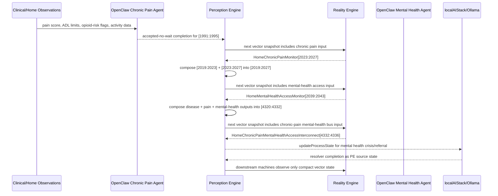

# Home Chronic Pain Mental Health Interconnect Narrative

This narrative applies the fall-detection interconnect pattern to the Personal
Health machine `HomeChronicPainMonitor`.

The governing rule remains:

```text
OpenClaw agent transforms observations into that machine's native CES input vector.
PE accepts and places the vector as source state.
RE evaluates the CES deterministically.
PE composes downstream interconnect inputs from deterministic machine outputs.
```

For this workflow, `HomeChronicPainMonitor` is not an isolated endpoint. It is
one leg of a chronic-illness mental-health integration path. Chronic pain output
occupies `[2023:2027]`, immediately adjacent to chronic disease output
`[2019:2023]`; together those regions are the native input lane for
`HomeMentalHealthAccessMonitor[2019:2027]`.

## Corpus Participants

- `HomeChronicPainMonitor.json`
  - input: `[1991:1995]`
  - output: `[2023:2027]`
  - role: evaluates pain intensity, functional impairment, opioid-risk
    indicators, and physical activity for adults managing chronic pain at home.

- `HomeChronicDiseaseMonitor.json`
  - input: `[1987:1991]`
  - output: `[2019:2023]`
  - role: evaluates chronic disease burden and provides the companion disease
    context consumed by the mental-health integration machine.

- `HomeMentalHealthAccessMonitor.json`
  - input: `[2019:2027]`
  - output: `[2039:2043]`
  - role: integrates chronic disease output and chronic pain output into
    mental-health access status.

- `HomeChronicPainMentalHealthAccessInterconnect.json`
  - input: `[4320:4332]`
  - output: `[4332:4336]`
  - role: publishes the `health-personal` chronic-pain mental-health access bus
    for downstream behavioral-health integration, opioid safety review, and
    managed monitoring consumers.

- Candidate downstream consumers:
  - `HSPH141_behavioral-health-integration-signal-monitor.json`
  - `HSPH142_behavioral-health-integration-resource-router.json`
  - `HSPH147_behavioral-health-integration-agent-dispatcher.json`
  - `HSPH148_behavioral-health-integration-governance-escalator.json`
  - `CSX021_behavioral-health-and-crisis-988-warm-handoff-router.json`
  - `CSX024_behavioral-health-and-crisis-mental-health-shelter-referral.json`
  - `CSX029_behavioral-health-and-crisis-behavioral-health-data-sharing.json`
  - `LBL035_movement-and-physical-health-mobility-pain-constraint.json`

These downstream machines are candidate fan-out targets. The corpus now
publishes a compact chronic-pain mental-health access bus, while the final
consumer-specific fan-out mappings remain a PE configuration concern.

## OpenClaw Native Input Projection

The OpenClaw input analyst for `HomeChronicPainMonitor` writes the native 4D
normalized input vector:

```text
HomeChronicPainMonitor[1991:1995]
= [
  pain_scale_norm,
  functional_impairment_norm,
  opioid_risk_norm,
  physical_activity_norm
]
```

The axis meanings are:

```text
pain_scale_norm:
  0.0 = pain 9-10/10 constant, unable to function
  0.5 = pain 4-6/10 manageable with medication
  1.0 = pain 0-2/10 minimal or absent

functional_impairment_norm:
  0.0 = bedbound or homebound due to pain
  0.5 = significantly limited but managing key activities with help
  1.0 = fully functional with minimal pain interference

opioid_risk_norm:
  0.0 = multiple opioid risk flags
  0.5 = one risk factor present
  1.0 = no opioid risk indicators

physical_activity_norm:
  0.0 = zero physical activity or complete deconditioning
  0.5 = ADL-level activity only
  1.0 = regular therapeutic activity or PT adherence
```

For a pain crisis episode, the OpenClaw chronic-pain input analyst writes:

```text
sourceMapping: acp-homechronicpainmonitor-input-assessment
region: [1991:1995]
value: [0.11, 0.14, 0.44, 0.09]
```

RE evaluates `HomeChronicPainMonitor` and emits:

```text
HomeChronicPainMonitor[2023:2027] = [1, 0, 0, 0]
```

That output means:

```text
PAIN_CRISIS
```

For an opioid-risk episode, the OpenClaw chronic-pain input analyst writes:

```text
sourceMapping: acp-homechronicpainmonitor-input-assessment
region: [1991:1995]
value: [0.37, 0.34, 0.34, 0.29]
```

RE evaluates `HomeChronicPainMonitor` and emits:

```text
HomeChronicPainMonitor[2023:2027] = [0, 1, 0, 0]
```

That output means:

```text
OPIOID_RISK_ELEVATED
```

For sustained functional impairment, RE emits:

```text
HomeChronicPainMonitor[2023:2027] = [0, 0, 1, 0]
```

For stabilized pain management, RE emits:

```text
HomeChronicPainMonitor[2023:2027] = [0, 0, 0, 1]
```

## PE Composition Into Mental Health Access

`HomeMentalHealthAccessMonitor` consumes the adjacent 8D input lane:

```text
HomeMentalHealthAccessMonitor[2019:2027]
= [
  chronic disease output bits [2019:2023],
  chronic pain output bits [2023:2027]
]
```

The eight positions mean:

```text
[0] disease exacerbation bit from HomeChronicDiseaseMonitor[2019]
[1] disease poor control bit from HomeChronicDiseaseMonitor[2020]
[2] disease borderline control bit from HomeChronicDiseaseMonitor[2021]
[3] disease controlled bit from HomeChronicDiseaseMonitor[2022]
[4] pain crisis bit from HomeChronicPainMonitor[2023]
[5] opioid risk elevated bit from HomeChronicPainMonitor[2024]
[6] functional impairment bit from HomeChronicPainMonitor[2025]
[7] pain managed bit from HomeChronicPainMonitor[2026]
```

Because these regions are contiguous, PE can compose the downstream input
directly from deterministic machine outputs:

```text
HomeChronicDiseaseMonitor[2019:2023] + HomeChronicPainMonitor[2023:2027]
-> HomeMentalHealthAccessMonitor[2019:2027]
```

This is structurally similar to the fall-detection example. The corpus now also
declares explicit `interconnections` metadata from `HomeChronicDiseaseMonitor`,
`HomeChronicPainMonitor`, and `HomeMentalHealthAccessMonitor` into the published
bus:

```text
health-personal.chronic-pain-mental-health-access
published-bus-health-personal-chronic-pain-mental-health-access
```

## Example Workflow

The authored chronic-pain sequence is:

```text
MANAGED -> MANAGED -> WORSENING -> SEVERE -> OPIOID_RISK -> PAIN_MANAGED
```

That sequence represents:

```text
prior-auth denial + winter pain flare
-> uncontrolled pain crisis
-> early short-acting medication use / opioid-risk signal
-> pain management review and stabilization
```

For the mental-health interconnect, use the following deterministic upstream
outputs:

```text
HomeChronicDiseaseMonitor[2019:2023] = [1, 0, 0, 0]
HomeChronicPainMonitor[2023:2027] = [1, 0, 0, 0]
```

PE composes those outputs into:

```text
HomeMentalHealthAccessMonitor[2019:2027]
= [1, 0, 0, 0, 1, 0, 0, 0]
```

RE evaluates `HomeMentalHealthAccessMonitor` and emits:

```text
HomeMentalHealthAccessMonitor[2039:2043] = [1, 0, 0, 0]
```

That output means:

```text
MENTAL_HEALTH_CRISIS
```

PE also composes the published bus input:

```text
HomeChronicPainMentalHealthAccessInterconnect[4320:4332]
= [1, 0, 0, 0, 1, 0, 0, 0, 1, 0, 0, 0]
```

RE emits:

```text
HomeChronicPainMentalHealthAccessInterconnect[4332:4336] = [1, 0, 0, 0]
```

That output means:

```text
URGENT_BEHAVIORAL_HEALTH_RESPONSE
```

A less acute referral workflow uses:

```text
HomeChronicDiseaseMonitor[2019:2023] = [1, 0, 0, 0]
HomeChronicPainMonitor[2023:2027] = [0, 0, 1, 0]
```

PE composes:

```text
HomeMentalHealthAccessMonitor[2019:2027]
= [1, 0, 0, 0, 0, 0, 1, 0]
```

RE emits:

```text
HomeMentalHealthAccessMonitor[2039:2043] = [0, 1, 0, 0]
```

That output means:

```text
MH_REFERRAL_NEEDED
```

The corresponding published-bus input and output are:

```text
HomeChronicPainMentalHealthAccessInterconnect[4320:4332]
= [1, 0, 0, 0, 0, 0, 1, 0, 0, 1, 0, 0]

HomeChronicPainMentalHealthAccessInterconnect[4332:4336] = [0, 1, 0, 0]
```

The stable recovery workflow uses:

```text
HomeChronicDiseaseMonitor[2019:2023] = [0, 0, 0, 1]
HomeChronicPainMonitor[2023:2027] = [0, 0, 0, 1]
HomeMentalHealthAccessMonitor[2019:2027] = [0, 0, 0, 1, 0, 0, 0, 1]
HomeMentalHealthAccessMonitor[2039:2043] = [0, 0, 0, 1]
```

That output means:

```text
MH_ACCESS_ADEQUATE
```

The corresponding published-bus input and output are:

```text
HomeChronicPainMentalHealthAccessInterconnect[4320:4332]
= [0, 0, 0, 1, 0, 0, 0, 1, 0, 0, 0, 1]

HomeChronicPainMentalHealthAccessInterconnect[4332:4336] = [0, 0, 0, 1]
```

## Message Flow



The mental-health OpenClaw agent is optional in the deterministic path. If the
upstream machine outputs are present, PE can compose the mental-health input lane
without an additional agent. If external observations must be projected directly
into `HomeMentalHealthAccessMonitor`, then the OpenClaw mental-health agent must
perform the same machine-native binary projection as described above.

## Problems And Extensions

1. The chronic-pain path now has explicit interconnection metadata.

   `HomeChronicDiseaseMonitor`, `HomeChronicPainMonitor`, and
   `HomeMentalHealthAccessMonitor` now declare published-bus producer
   interconnections with roles, target input elements, bus id, bus tag, purpose,
   privacy boundary, and PE composition requirement.

2. The published domain bus has been added.

   The new bus is:

   ```text
   health-personal.chronic-pain-mental-health-access
   published-bus-health-personal-chronic-pain-mental-health-access
   ```

   It publishes:

   ```text
   HomeChronicPainMentalHealthAccessInterconnect[4332:4336]
   = [
     urgent_behavioral_health_response,
     integrated_behavioral_health_referral,
     opioid_safety_review,
     managed_monitoring
   ]
   ```

3. `HomeMentalHealthAccessMonitor` now emits its declared comorbidity lane.

   The output space declares:

   ```text
   [0,0,1,0] = COMORBIDITY_RISK
   ```

   The corpus now includes `mh-comorbidity-risk` and its trigger rule, so the
   declared output space and implemented sequence set are aligned.

4. Machine-native OpenClaw projection metadata has been added.

   `HomeChronicDiseaseMonitor`, `HomeChronicPainMonitor`, and
   `HomeMentalHealthAccessMonitor` now expose `metadata.openClawProjection` with
   concrete machine-native input axes, write-back regions, normalization style,
   and accepted-no-wait dispatch semantics. The mental-health projection uses the
   actual upstream bit names:

   ```text
   disease-exacerbation-bit
   disease-poor-control-bit
   disease-borderline-control-bit
   disease-controlled-bit
   pain-crisis-bit
   opioid-risk-elevated-bit
   functional-impairment-bit
   pain-managed-bit
   ```

   The normal PE path still composes these inputs deterministically from
   upstream chronic disease and chronic pain outputs. OpenClaw is reserved for
   machine-native projection from external observations that bypass that normal
   deterministic path.

5. Stable trigger severity labels were corrected.

   `PAIN_MANAGED` and `MH_ACCESS_ADEQUATE` now use GREEN/info metadata.

6. The localAIStack/Ollama resolver contract is now represented in the bus.

   `HomeChronicPainMentalHealthAccessInterconnect` includes
   `publishedDomainBus.localAIResolver`, which defines the localAI/Ollama
   resolver id, accepted-no-wait dispatch, compact input region, and PE completion
   write-back contract. It intentionally does not create `metadata.agentBinding`,
   because this bridge is not an `agent-dispatcher`; PE consumes this metadata at
   startup while RE continues to evaluate only ordinary vector state.

   ```text
   OpenClaw chronic-pain completion -> PE [1991:1995]
   RE chronic-pain output -> PE [2023:2027]
   PE composed mental-health input -> RE [2019:2027]
   RE mental-health output -> localAIStack/Ollama resolver
   resolver completion -> PE source region [4332:4336]
   ```

7. Fan-out destinations are lane-scoped.

   `publishedDomainBus.downstreamConsumers` now declares input regions, lanes,
   and `outputMatchesAny` vectors for each downstream consumer. PE dispatches
   only the consumers whose lane policy matches the RE output, so urgent crisis,
   referral, opioid-safety review, and stable monitoring do not fan out to the
   same set of machines.

## Recommended Extension

`HomeChronicPainMentalHealthAccessInterconnect` has been added after the same
pattern as `PatientSafetyTransportInterconnect`.

Input lane:

```text
[0] disease exacerbation bit
[1] disease poor control bit
[2] disease borderline control bit
[3] disease controlled bit
[4] pain crisis bit
[5] opioid risk elevated bit
[6] functional impairment bit
[7] pain managed bit
[8] mental health crisis bit
[9] mental health referral needed bit
[10] comorbidity risk bit
[11] mental health access adequate bit
```

Output lane:

```text
[0] urgent behavioral health response
[1] integrated behavioral health referral needed
[2] opioid safety review needed
[3] managed monitoring
```

The normal scaling rule should match the fall workflow:

```text
OpenClaw performs machine-native observation-to-input projection.
PE owns source mapping, TTL, provenance, and bus composition.
RE evaluates deterministic CES and remains unaware of bridge internals.
localAIStack/Ollama receives only compact status and returns completion through PE.
```

## Privacy Boundary

The universal Reality Event carries compact normalized state only. Pain diaries,
PHQ-9 responses, medication histories, PDMP details, clinician notes, and other
PHI-bearing records should remain in upstream source systems or source ledgers.
The PE-visible workflow should carry only the vector elements required for
deterministic CES evaluation and downstream interconnection.
