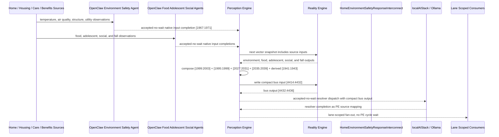

# Home Environment Safety Response Interconnect Narrative

This narrative applies the PE-owned published-bus pattern to the Personal Health
`HomeEnvironmentSafetyMonitor` workflow. It follows the same style as the fall
detection, chronic pain, daily activity, hydration, food-security, chronic
disease, and caregiver-support examples: source machines remain ordinary
deterministic RE machines, OpenClaw agents perform native input projection where
observations are not already machine-ready, and PE owns composition,
asynchronous dispatch, fan-out, and completion ingestion.

The workflow starts from home environment safety. The key extension is that
housing and utility risk should not fan out as one generic social-determinants
event. PE should separate urgent housing safety response, utility/housing
resource support, health-hazard behavioral follow-up, and stable monitoring.

RE continues to evaluate ordinary machine vector state. PE owns source
composition, startup configuration, asynchronous dispatch, fan-out selection, and
completion ingestion.

## Machines Involved

- `HomeEnvironmentSafetyMonitor.json`
  - role: evaluates temperature stability, indoor air quality, structural hazard,
    and utility continuity.
  - input: `[1967:1971]`
  - output: `[1999:2003]`

- `HomeFoodSecurityMonitor.json`
  - role: adds food access context when unsafe housing and food insecurity
    compound household health risk.
  - input: `[1963:1967]`
  - output: `[1995:1999]`

- `AdolescentMentalHealthMonitor.json`
  - role: adds adolescent behavioral-health status derived from food and home
    environment adversity.
  - input: `[1995:2003]`
  - output: `[2027:2031]`

- `HomeSocialIsolationMonitor.json`
  - role: adds social isolation and support context when housing problems reduce
    social contact, care access, or self-care.
  - input: `[2011:2019]`
  - output: `[2035:2039]`

- `FallDetection.json`
  - role: adds fall severity and confidence context when home hazards may create
    immediate patient-safety risk.
  - input: `[3813:3815]`
  - output: `[1941:1943]`

- `HomeEnvironmentSafetyResponseInterconnect.json`
  - role: publishes the `health-personal` environment safety response bus.
  - input: `[4414:4432]`
  - output: `[4432:4436]`

## OpenClaw Native Input Projection

OpenClaw agents are input analysts for source machines. They do not decide final
workflow state. They map observations into each machine's native input space,
write back through PE, and RE evaluates the CES deterministically.

`HomeEnvironmentSafetyMonitor` projection:

```text
temperature_stability_norm
indoor_air_quality_norm
structural_hazard_norm
utility_continuity_norm
```

`HomeFoodSecurityMonitor` projection:

```text
meal_frequency_norm
food_quality_norm
pantry_days_norm
food_assistance_norm
```

`AdolescentMentalHealthMonitor` projection:

```text
food-crisis-bit
food-insecure-bit
food-assistance-needed-bit
food-secure-bit
unsafe-housing-bit
utility-failure-bit
health-hazard-risk-bit
environment-safe-bit
```

`HomeSocialIsolationMonitor` projection:

```text
medication-adherence-crisis-bit
medication-cost-barrier-active-bit
medication-access-risk-bit
medication-managed-bit
transport-critical-access-failure-bit
transport-appointment-barrier-bit
transport-dependent-risk-bit
transportation-adequate-bit
```

`FallDetection` is normally fed by the existing fall sensor pre-aggregation path.
For this bus, PE derives compact fall-safety bits from the fall output ordinal:

```text
fall unsafe tier bit derived from FallDetection output[0] >= 3
fall high-confidence bit derived from FallDetection output[1] >= 3
```

The normal path is deterministic PE composition from source outputs. OpenClaw is
reserved for machine-native projection from external observations that bypass a
normal upstream source. This keeps ordinal mapping in agent template behavior and
keeps the corpus machines as stable vector contracts.

## Published Bus

The published domain bus is:

```text
health-personal.environment-safety-response
published-bus-health-personal-environment-safety-response
```

Input lane:

```text
[0] unsafe housing bit
[1] utility failure bit
[2] health hazard risk bit
[3] environment safe bit
[4] food crisis bit
[5] food insecure bit
[6] food assistance needed bit
[7] food secure bit
[8] adolescent crisis risk bit
[9] adolescent behavioral concern bit
[10] adolescent elevated stress bit
[11] adolescent mental health ok bit
[12] severe isolation bit
[13] social withdrawal bit
[14] isolation risk bit
[15] socially connected bit
[16] fall unsafe tier bit
[17] fall high confidence bit
```

Output lane:

```text
[0] urgent housing safety response
[1] utility housing resource support
[2] health hazard behavioral follow-up
[3] environment stable monitoring
```

The bridge machine is a normal RE machine. It receives the compact PE-composed
input vector at `[4414:4432]` and emits `[4432:4436]`.

## Fan-Out Analysis

The main fan-out opportunities are intentionally separated by lane.

`urgent_housing_safety_response` should fan out to:

```text
HSPH131 care coordination signal monitor
HSPH132 care coordination resource router
HSPH137 care coordination agent dispatcher
HSPH138 care coordination governance escalator
HSPH141 behavioral health integration signal monitor
HSPH147 behavioral health integration agent dispatcher
HSPH148 behavioral health integration governance escalator
HSPH151 maternal child family health signal monitor
HSPH152 maternal child family health resource router
HSPH157 maternal child family health agent dispatcher
HSPH158 maternal child family health governance escalator
CSX001 resident intake triage
CSX002 case routing coordinator
CSX005 family stabilization intake
CSX009 crisis benefit intake
CSX015 utility assistance queue
CSX016 rental assistance triage
BSX025 humidity mold risk
BSX028 air quality incident response
BSX038 water quality incident response
LBL069 adolescent safety signal
```

This path is for unsafe housing with behavioral, family, social, or fall co-risk.
It keeps PE dispatch asynchronous and routes housing safety, family support,
behavioral health, benefits, and built-space incident consumers without blocking
PE cycles.

`utility_housing_resource_support` should fan out to:

```text
HSPH131 care coordination signal monitor
HSPH132 care coordination resource router
HSPH135 care coordination referral optimizer
HSPH137 care coordination agent dispatcher
HSPH151 maternal child family health signal monitor
HSPH152 maternal child family health resource router
HSPH153 maternal child family health equity guardrail
HSPH157 maternal child family health agent dispatcher
CSX001 resident intake triage
CSX002 case routing coordinator
CSX005 family stabilization intake
CSX015 utility assistance queue
CSX016 rental assistance triage
CSX017 document readiness monitor
CSX019 enrollment completion monitor
BSX039 hydration access monitor
LBL062 family routine alignment
LBL066 parent coaching plan
```

This path is for utility shutoff, rent/habitability, or housing resource gaps
before they become an unsafe-housing crisis.

`health_hazard_behavioral_followup` should fan out to:

```text
HSPH131 care coordination signal monitor
HSPH132 care coordination resource router
HSPH135 care coordination referral optimizer
HSPH141 behavioral health integration signal monitor
HSPH142 behavioral health integration resource router
HSPH147 behavioral health integration agent dispatcher
HSPH151 maternal child family health signal monitor
HSPH152 maternal child family health resource router
HSPH153 maternal child family health equity guardrail
HSPH159 maternal child family health learning loop
BSX023 VOC particulate monitoring
BSX025 humidity mold risk
BSX028 air quality incident response
BSX038 water quality incident response
BSX039 hydration access monitor
LBL061 school function monitor
LBL062 family routine alignment
LBL066 parent coaching plan
LBL069 adolescent safety signal
```

This path is for mold, lead, particulates, heat/cold exposure, water risk, or
structural hazard that is affecting behavior, school, family, or health status
without yet being an emergency housing event.

`environment_stable_monitoring` should fan out only to lightweight monitoring
consumers:

```text
HSPH159 maternal child family health learning loop
BSX029 indoor air quality evidence archive
BSX037 water quality record retention
BSX039 hydration access monitor
LBL062 family routine alignment
```

Stable environment safety should not create benefits, crisis, or care
coordination work.

## Example Workflow

A high-risk day begins when unsafe housing, food crisis, adolescent crisis,
severe isolation, and fall co-risk are all active. PE composes:

```text
HomeEnvironmentSafetyResponseInterconnect[4414:4432]
= [1, 0, 0, 0, 1, 0, 0, 0, 1, 0, 0, 0, 1, 0, 0, 0, 1, 1]
```

RE evaluates the interconnect and emits:

```text
HomeEnvironmentSafetyResponseInterconnect[4432:4436]
= [1, 0, 0, 0]
```

That output is `URGENT_HOUSING_SAFETY_RESPONSE`.

PE then performs lane-scoped fan-out without waiting inside a PE cycle. The
agent/localAI work is accepted-no-wait; completions return later as PE source
mappings.

## Utility Resource Support Example

If utility failure is active, food assistance is needed, adolescent behavioral
concern and social withdrawal are present, but there is no acute unsafe-housing
or fall-safety signal, PE composes:

```text
HomeEnvironmentSafetyResponseInterconnect[4414:4432]
= [0, 1, 0, 0, 0, 0, 1, 0, 0, 1, 0, 0, 0, 1, 0, 0, 0, 0]
```

RE emits:

```text
HomeEnvironmentSafetyResponseInterconnect[4432:4436]
= [0, 1, 0, 0]
```

That output is `UTILITY_HOUSING_RESOURCE_SUPPORT`, so PE routes to utility
assistance, rental/habitability triage, case routing, family support, and care
coordination consumers rather than a generic housing crisis.

## Health Hazard Follow-Up Example

If health hazard risk is active, food insecurity and adolescent elevated stress
are present, social isolation risk is rising, and fall hazard is possible, PE
composes:

```text
HomeEnvironmentSafetyResponseInterconnect[4414:4432]
= [0, 0, 1, 0, 0, 1, 0, 0, 0, 0, 1, 0, 0, 0, 1, 0, 1, 0]
```

RE emits:

```text
HomeEnvironmentSafetyResponseInterconnect[4432:4436]
= [0, 0, 1, 0]
```

That output is `HEALTH_HAZARD_BEHAVIORAL_FOLLOWUP`, so PE routes to air/water
quality, adolescent behavioral, maternal-child, care-coordination, and family
routine consumers before unsafe-housing escalation.

## Message Flow



## Problems and Extensions Identified

1. `HomeEnvironmentSafetyMonitor.json` declared a `HEALTH_HAZARD_RISK` output
   lane but did not expose a matching trigger and input sequence. This pass adds
   the missing sequence so the bus can distinguish unsafe housing, utility
   failure, health hazard risk, and stable environment monitoring.

2. `HomeEnvironmentSafetyMonitor.json` and `AdolescentMentalHealthMonitor.json`
   had generic input semantics and no OpenClaw native input projection metadata.
   This pass adds explicit projection contracts so PE can ingest agent-resolved
   native inputs without exposing raw bridge activity to RE.

3. Several adjacent source machines still declare output lanes that need fuller
   authored sequence coverage, including food `FOOD_INSECURE`, adolescent
   `ELEVATED_STRESS`, and social `SOCIAL_WITHDRAWAL`. The bus consumes those
   lanes as valid vector contract bits, but future passes should add the missing
   native sequences where they are not already addressed by adjacent workflow
   branches.

4. Some stable source lanes are currently marked as warning-level trigger states
   in adjacent native machines. The new bus emits `ENVIRONMENT_STABLE_MONITORING`
   as green/info, but source machines should be normalized in a follow-up so
   stable trigger traffic does not look like operational warning traffic.

5. `HomeSocialIsolationMonitor.json` contained duplicate `interconnections` keys
   on `origin/main`; JSON parsers retained only the later value. This pass merges
   those declarations while adding the environment-safety bus producer so existing
   patient-safety and daily-activity declarations remain visible.

6. The interconnect intentionally stores the localAI resolver as bus metadata,
   not as a machine-level `agentBinding`. This preserves the established
   boundary: RE evaluates the vector; PE decides whether to dispatch localAI and
   how to ingest completion outputs.

7. Future work can add consumer-specific downstream input transforms for care
   coordination, behavioral health, maternal-child family health, benefits,
   built-space air/water quality, and Life Balance consumers. The current bus
   publishes the source-of-truth response lanes and expected fan-out set;
   downstream machines can later declare exact lane-to-input adapters where their
   CES inputs require richer local mapping.
