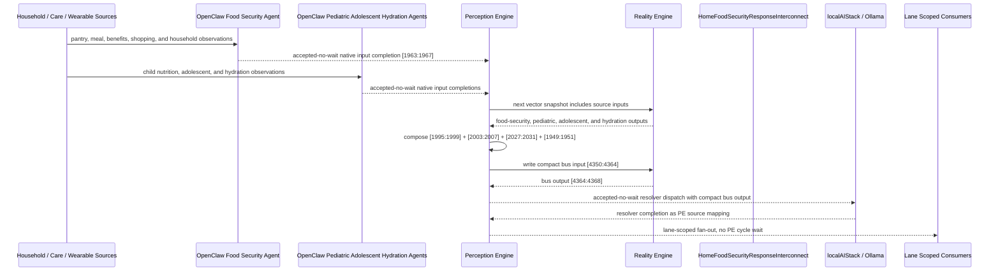

# Home Food Security Response Interconnect Narrative

This narrative applies the PE-owned published-bus pattern to the Personal Health
`HomeFoodSecurityMonitor` workflow. It follows the same style as the fall
detection, chronic pain, daily activity, and hydration examples: source machines
remain ordinary deterministic RE machines, OpenClaw agents perform native input
projection where observations are not already machine-ready, and PE owns the
composition, asynchronous dispatch, fan-out, and completion ingestion.

The workflow starts from household food access rather than from a clinical event.
The central question is not only whether a household is food secure, but which
adjacent machines should be activated when food access stress creates pediatric,
adolescent, hydration, care-coordination, or benefits-routing risk.

RE continues to evaluate ordinary machine vector state. PE owns source
composition, startup configuration, asynchronous dispatch, fan-out selection, and
completion ingestion.

## Machines Involved

- `HomeFoodSecurityMonitor.json`
  - role: evaluates household meal frequency, food quality, pantry depth, and
    assistance access.
  - input: `[1963:1967]`
  - output: `[1995:1999]`

- `PediatricNutritionMonitor.json`
  - role: adds child nutrition risk, growth-risk, and WIC/pediatric follow-up
    context.
  - input: `[1971:1975]`
  - output: `[2003:2007]`

- `AdolescentMentalHealthMonitor.json`
  - role: adds adolescent crisis, behavioral concern, elevated-stress, and
    stable-context output derived from food-security and home-environment inputs.
  - input: `[1995:2003]`
  - output: `[2027:2031]`

- `HydrationMonitor.json`
  - role: adds low or critical hydration context when food insecurity may also
    reflect fluid access, heat exposure, or routine disruption.
  - input: `[1947:1949]`
  - output: `[1949:1951]`

- `HomeFoodSecurityResponseInterconnect.json`
  - role: publishes the `health-personal` food security response bus.
  - input: `[4350:4364]`
  - output: `[4364:4368]`

## OpenClaw Native Input Projection

OpenClaw agents are input analysts for the source machines. They do not decide
final workflow state. They map observations into each machine's native input
space, write back through PE, and RE evaluates the CES deterministically.

`HomeFoodSecurityMonitor` projection:

```text
meal_frequency_norm
food_quality_norm
pantry_days_norm
food_assistance_norm
```

`PediatricNutritionMonitor` projection:

```text
pediatric_meal_consistency_norm
pediatric_growth_concern_norm
pediatric_food_access_norm
pediatric_followup_access_norm
```

`AdolescentMentalHealthMonitor` projection:

```text
food-crisis-bit
food-insecure-bit
food-assistance-needed-bit
food-secure-bit
unsafe-housing-bit
housing-instability-bit
health-hazard-risk-bit
environment-safe-bit
```

`HydrationMonitor` projection:

```text
below_half_daily_intake_target_bit
below_quarter_daily_intake_target_bit
```

The normal path is deterministic PE composition from source outputs. OpenClaw is
reserved for machine-native projection from external observations that bypass a
normal upstream source. This keeps ordinal mapping in agent template behavior and
keeps the corpus machines as stable vector contracts.

## Published Bus

The published domain bus is:

```text
health-personal.food-security-response
published-bus-health-personal-food-security-response
```

Input lane:

```text
[0] home food crisis bit
[1] home food insecure bit
[2] home assistance needed bit
[3] home food secure bit
[4] pediatric urgent nutrition bit
[5] pediatric nutrition at risk bit
[6] pediatric follow-up needed bit
[7] pediatric stable bit
[8] adolescent crisis bit
[9] adolescent behavioral risk bit
[10] adolescent elevated stress bit
[11] adolescent stable bit
[12] low hydration bit
[13] critical hydration bit
```

Output lane:

```text
[0] urgent food response
[1] benefits food access
[2] nutrition behavioral follow-up
[3] food secure monitoring
```

The bridge machine is a normal RE machine. It receives the compact PE-composed
input vector at `[4350:4364]` and emits `[4364:4368]`.

## Fan-Out Analysis

The main fan-out opportunities are intentionally separated by lane.

`urgent_food_response` should fan out to:

```text
CSX009 health and human services intake crisis benefit intake
CSX014 benefits and eligibility WIC referral coordinator
CSX057 homelessness outreach meal outreach routing
HSPH131 care coordination signal monitor
HSPH132 care coordination resource router
HSPH137 care coordination agent dispatcher
HSPH138 care coordination governance escalator
HSPH151 maternal child family health signal monitor
LBL015 nutrition and metabolic health hydration electrolyte monitor
CSX005 health and human services intake family stabilization intake
```

This path is for food crisis with pediatric, adolescent, or hydration
co-risk. It should produce fast care-coordination visibility and community
service routing, while preserving PE asynchronous dispatch semantics.

`benefits_food_access` should fan out to:

```text
CSX009 health and human services intake crisis benefit intake
CSX012 benefits and eligibility SNAP eligibility monitor
CSX014 benefits and eligibility WIC referral coordinator
CSX057 homelessness outreach meal outreach routing
HSPH131 care coordination signal monitor
HSPH132 care coordination resource router
HSPH152 maternal child family health resource router
LBL011 nutrition and metabolic health meal pattern stability
CSX005 health and human services intake family stabilization intake
```

This path is for household food insecurity or assistance need without immediate
crisis. It emphasizes benefits screening, WIC/SNAP eligibility, meal routing,
and care-resource navigation rather than clinical escalation.

`nutrition_behavioral_followup` should fan out to:

```text
CSX014 benefits and eligibility WIC referral coordinator
HSPH131 care coordination signal monitor
HSPH132 care coordination resource router
HSPH137 care coordination agent dispatcher
HSPH151 maternal child family health signal monitor
HSPH152 maternal child family health resource router
LBL011 nutrition and metabolic health meal pattern stability
LBL015 nutrition and metabolic health hydration electrolyte monitor
LBL017 nutrition and metabolic health micronutrient risk screen
LBL061 adolescent family and school school function monitor
```

This path is for food insecurity that presents primarily as pediatric nutrition,
adolescent behavioral-health, school-function, or hydration-follow-up risk. It is
not a crisis lane unless the upstream home, pediatric, adolescent, or hydration
outputs activate the urgent lane.

`food_secure_monitoring` should fan out only to lightweight monitoring consumers:

```text
LBL011 nutrition and metabolic health meal pattern stability
LBL015 nutrition and metabolic health hydration electrolyte monitor
LBL017 nutrition and metabolic health micronutrient risk screen
```

Stable food security should not create benefits, crisis, or care-coordination
work.

## Example Workflow

A high-risk day begins when a household reports acute food crisis, pediatric
nutrition is urgent, adolescent context is in crisis, and hydration is critically
low. PE composes the upstream outputs into:

```text
HomeFoodSecurityResponseInterconnect[4350:4364]
= [1, 0, 0, 0, 1, 0, 0, 0, 1, 0, 0, 0, 1, 1]
```

RE evaluates the interconnect and emits:

```text
HomeFoodSecurityResponseInterconnect[4364:4368]
= [1, 0, 0, 0]
```

That output is `URGENT_FOOD_RESPONSE`.

PE then performs lane-scoped fan-out without waiting inside a PE cycle. The
agent/localAI work is accepted-no-wait; completions return later as PE source
mappings.

## Benefits Access Example

If the household is not in acute crisis, but food assistance is needed and the
pediatric lane is stable, PE composes:

```text
HomeFoodSecurityResponseInterconnect[4350:4364]
= [0, 0, 1, 0, 0, 0, 0, 1, 0, 0, 0, 1, 0, 0]
```

RE emits:

```text
HomeFoodSecurityResponseInterconnect[4364:4368]
= [0, 1, 0, 0]
```

That output is `BENEFITS_FOOD_ACCESS`, so PE routes to SNAP, WIC, meal outreach,
family stabilization, and care-resource consumers rather than a generic clinical
escalation.

## Nutrition Behavioral Follow-Up Example

If the household is food insecure, pediatric nutrition needs follow-up,
adolescent stress is elevated from the food and home-environment inputs, and
hydration is low but not critical, PE composes:

```text
HomeFoodSecurityResponseInterconnect[4350:4364]
= [0, 1, 0, 0, 0, 0, 1, 0, 0, 0, 1, 0, 1, 0]
```

RE emits:

```text
HomeFoodSecurityResponseInterconnect[4364:4368]
= [0, 0, 1, 0]
```

That output is `NUTRITION_BEHAVIORAL_FOLLOWUP`, so PE routes to nutrition,
hydration, adolescent school-function, and maternal-child family consumers.

## Message Flow



## Problems and Extensions Identified

1. `HomeFoodSecurityMonitor.json` declared a `FOOD_INSECURE` output lane but did
   not expose a matching trigger and input sequence. This pass adds the missing
   sequence so the bus can distinguish crisis, insecurity, assistance need, and
   stable monitoring.

2. `home-food-secure` was marked as an amber warning despite emitting the stable
   `FOOD_SECURE` lane. This pass changes the stable lane to green/info so
   downstream consumers do not mistake ordinary monitoring for a warning.

3. The source machines needed explicit interconnection metadata to the new
   published bus. This pass adds PE-owned source-to-bus declarations and
   OpenClaw projection metadata for food security, pediatric nutrition,
   adolescent mental health, and hydration.

4. The interconnect intentionally stores the localAI resolver as bus metadata,
   not as a machine-level `agentBinding`. This preserves the established
   boundary: RE evaluates the vector; PE decides whether to dispatch localAI and
   how to ingest completion outputs.

5. Future work can add consumer-specific downstream input transforms for the
   benefits, care-coordination, maternal-child, and Life Balance consumers. The
   current bus publishes the source-of-truth response lanes and expected fan-out
   set; downstream machines can later declare exact lane-to-input adapters where
   their CES inputs require richer local mapping.
