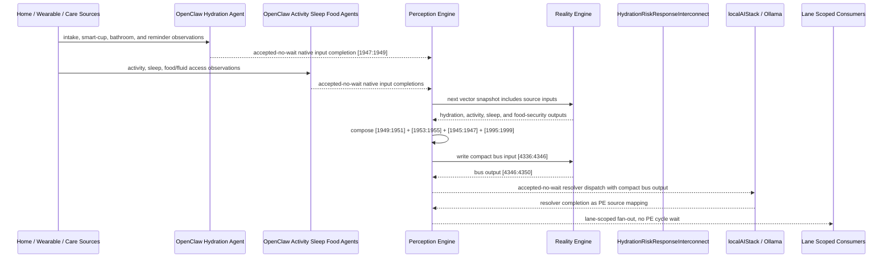

# Hydration Risk Response Interconnect Narrative

This narrative applies the PE-owned published-bus pattern to the Personal Health
`HydrationMonitor` workflow. The focus is fan-out: hydration risk should not
produce one generic wellness event. The downstream path changes depending on
whether the risk is urgent clinical dehydration, electrolyte/recovery stress,
food or water access failure, or stable routine monitoring.

RE continues to evaluate ordinary machine vector state. PE owns source
composition, startup configuration, asynchronous dispatch, fan-out selection, and
completion ingestion.

## Machines Involved

- `HydrationMonitor.json`
  - role: evaluates adequate, low, or critical hydration from in-home intake
    proxies.
  - input: `[1947:1949]`
  - output: `[1949:1951]`

- `DailyActivityMonitor.json`
  - role: adds activity tolerance and sedentary-streak context.
  - input: `[1951:1953]`
  - output: `[1953:1955]`

- `SleepQualityMonitor.json`
  - role: adds recovery context when dehydration coincides with poor or
    fragmented sleep.
  - input: `[1943:1945]`
  - output: `[1945:1947]`

- `HomeFoodSecurityMonitor.json`
  - role: adds food/fluid access context when hydration risk may be driven by
    pantry, benefits, shopping, or household-resource constraints.
  - input: `[1963:1967]`
  - output: `[1995:1999]`

- `HydrationRiskResponseInterconnect.json`
  - role: publishes the `health-personal` hydration risk response bus.
  - input: `[4336:4346]`
  - output: `[4346:4350]`

## OpenClaw Native Input Projection

OpenClaw agents are input analysts for the source machines. They do not decide
final workflow state. They map observations into each machine's native input
space, write back through PE, and RE evaluates the CES deterministically.

`HydrationMonitor` projection:

```text
below_half_daily_intake_target_bit
below_quarter_daily_intake_target_bit
```

`DailyActivityMonitor` projection:

```text
below_baseline_today_bit
sedentary_streak_active_bit
```

`SleepQualityMonitor` projection:

```text
adequate_sleep_duration_bit
fragmented_sleep_bit
```

`HomeFoodSecurityMonitor` projection:

```text
meal_frequency_norm
food_quality_norm
pantry_days_norm
food_assistance_norm
```

The normal path is deterministic PE composition from source outputs. OpenClaw is
reserved for machine-native projection from external observations that bypass a
normal upstream source.

## Published Bus

The published domain bus is:

```text
health-personal.hydration-risk-response
published-bus-health-personal-hydration-risk-response
```

Input lane:

```text
[0] below half hydration target bit
[1] below quarter hydration target bit
[2] below baseline today bit
[3] sedentary streak active bit
[4] short or poor sleep bit
[5] disturbed or fragmented sleep bit
[6] food crisis bit
[7] food insecure bit
[8] assistance needed bit
[9] food secure bit
```

Output lane:

```text
[0] urgent hydration check
[1] electrolyte review
[2] access support
[3] hydration stable
```

The bridge machine is a normal RE machine. It receives the compact PE-composed
input vector at `[4336:4346]` and emits `[4346:4350]`.

## Fan-Out Analysis

The main fan-out opportunities are intentionally separated by lane.

`urgent_hydration_check` should fan out to:

```text
HSPH131 care coordination signal monitor
HSPH132 care coordination resource router
HSPH137 care coordination agent dispatcher
HSPH138 care coordination governance escalator
LBL015 hydration electrolyte monitor
CSX055 heat smoke outreach
LBL076 wearable sleep activity intake feedback loop
```

This path is for critical hydration plus functional or access deterioration. It
requires fast care-coordination visibility and may need heat/smoke outreach if
environmental exposure or lack of cooling is contributing.

`electrolyte_review` should fan out to:

```text
HSPH131 care coordination signal monitor
HSPH132 care coordination resource router
LBL015 hydration electrolyte monitor
LBL030 sleep executive stabilizer
LBL031 movement baseline
LBL076 wearable sleep activity intake feedback loop
```

This path keeps the response clinical and recovery-focused. It does not dispatch
community access services unless the access lane is active.

`access_support` should fan out to:

```text
HSPH131 care coordination signal monitor
HSPH132 care coordination resource router
HSPH137 care coordination agent dispatcher
CSX055 heat smoke outreach
CSX057 meal outreach routing
BSX039 water quality hydration access monitor
LBL076 wearable sleep activity intake feedback loop
```

This path is for food/fluid access barriers, built-space water availability, or
heat/smoke exposure. It is deliberately broader than electrolyte review because
hydration risk may be caused by the environment rather than physiology alone.

`hydration_stable` should fan out only to lightweight monitoring consumers:

```text
LBL015 hydration electrolyte monitor
LBL030 sleep executive stabilizer
LBL031 movement baseline
LBL076 wearable sleep activity intake feedback loop
```

Stable hydration should not create care-coordination or community-service work.

## Example Workflow

A high-risk day begins when hydration is critical, daily activity has dropped
into a sedentary streak, sleep is poor, and food/fluid access is in crisis.

PE composes the upstream outputs into:

```text
HydrationRiskResponseInterconnect[4336:4346]
= [1, 1, 1, 1, 1, 1, 1, 0, 0, 0]
```

RE evaluates the interconnect and emits:

```text
HydrationRiskResponseInterconnect[4346:4350]
= [1, 0, 0, 0]
```

That output is `URGENT_HYDRATION_CHECK`.

PE then performs lane-scoped fan-out without waiting inside a PE cycle. The
agent/localAI work is accepted-no-wait; completions return later as PE source
mappings.

## Access-Support Example

If hydration is low but not critical, activity and sleep remain stable, and the
food/fluid access lane reports assistance needed, PE composes:

```text
HydrationRiskResponseInterconnect[4336:4346]
= [1, 0, 0, 0, 0, 0, 0, 0, 1, 0]
```

RE emits:

```text
HydrationRiskResponseInterconnect[4346:4350]
= [0, 0, 1, 0]
```

That output is `ACCESS_SUPPORT`, so PE routes to food/fluid access, heat/smoke,
water-access verification, and care-coordination consumers rather than a generic
clinical escalation.

## Message Flow



## Development Notes

1. Source machines now expose concrete `metadata.openClawProjection` contracts.

2. Source machines now declare `metadata.interconnections` for the published bus,
   including target file, input lane, output lane, PE ownership, and privacy
   boundary.

3. `HydrationRiskResponseInterconnect` defines lane-scoped downstream fan-out and
   a `publishedDomainBus.localAIResolver` contract for localAIStack/Ollama.

4. The resolver metadata intentionally does not create `metadata.agentBinding`.
   The bridge is not an `agent-dispatcher`; PE consumes the resolver contract at
   startup while RE sees only vector state.

5. Test sequences for urgent hydration fan-out and access-support fan-out are
   embedded in the bridge machine's `inputSequences`.

## Safety Boundary

The PE-visible workflow carries normalized status bits only. Raw hydration
telemetry, room/activity traces, sleep records, food-security records, benefits
records, and clinical notes stay in upstream source ledgers or provider systems.
The final localAIStack/Ollama handoff returns completion through PE as a
configured source mapping.
