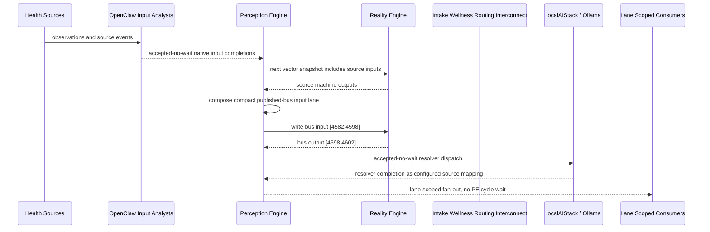

# Intake Wellness Routing Interconnect Narrative

This narrative completes the PE-owned published-bus pattern for `NewPatientInflow, WellnessAnalytics, and CareTransitionWorkflow`.
OpenClaw and localAIStack/Ollama remain PE-side translators and resolvers. RE
evaluates only ordinary vector state.

## Published Bus

```text
health-personal.intake-wellness-routing
published-bus-health-personal-intake-wellness-routing
```

Input lane: `[4582:4598]`

```text
[0] new patient accepted bit
[1] new patient provisional reject bit
[2] wellness inflow evaluation bit
[3] wellness inflow urgent bit
[4] wellness transition review bit
[5] wellness transition escalation bit
[6] wellness transition urgent bit
[7] wellness improving bit
[8] hospital transfer bit
[9] rehab transfer bit
[10] alf transfer bit
[11] transfer blocked bit
[12] emergency escalation bit
[13] patient wellness alert bit
[14] patient wellness critical bit
[15] facilities immediate welfare check bit
```

Output lane: `[4598:4602]`

```text
[0] urgent intake transition bit
[1] placement readiness bit
[2] barrier resolution bit
[3] stable routed care bit
```

## OpenClaw Pattern

OpenClaw templates perform ordinal, scalar, or binary mapping into each source
machine's native input lane. PE accepts those completions without waiting inside
a PE cycle. Resolver handoffs are accepted-no-wait and return through configured
PE source mappings.

## Example Workflow: Urgent intake transition routing

PE composes:

```text
Intake Wellness Routing Interconnect[4582:4598]
= [0, 0, 0, 1, 0, 1, 1, 0, 1, 0, 0, 0, 1, 0, 1, 1]
```

RE emits:

```text
Intake Wellness Routing Interconnect[4598:4602]
= [1, 0, 0, 0]
```

That output activates `URGENT_INTAKE_TRANSITION`.

## Example Workflow: Placement readiness

PE composes:

```text
Intake Wellness Routing Interconnect[4582:4598]
= [1, 0, 1, 0, 1, 0, 0, 0, 0, 1, 1, 0, 0, 1, 0, 0]
```

RE emits:

```text
Intake Wellness Routing Interconnect[4598:4602]
= [0, 1, 0, 0]
```

That output activates `PLACEMENT_READINESS`.

## Example Workflow: Barrier resolution

PE composes:

```text
Intake Wellness Routing Interconnect[4582:4598]
= [0, 1, 1, 0, 1, 0, 0, 0, 0, 0, 0, 1, 0, 1, 0, 0]
```

RE emits:

```text
Intake Wellness Routing Interconnect[4598:4602]
= [0, 0, 1, 0]
```

That output activates `BARRIER_RESOLUTION`.

## Message Flow



## Problems And Extensions

1. This pass records explicit published-bus contracts for source machines that
   previously participated only through local or implicit integration notes.

2. RE visibility remains limited to compact vector lanes; PE owns source
   provenance, transformation, resolver dispatch, and completion ingestion.

3. Future provider completions should enter through PE startup source mappings
   and preserve the asynchronous no-wait behavior.

## Safety Boundary

The PE-visible workflow carries normalized status bits only. Raw PHI and
provider-specific records stay upstream. Resolver completions return through PE
as configured source mappings.
