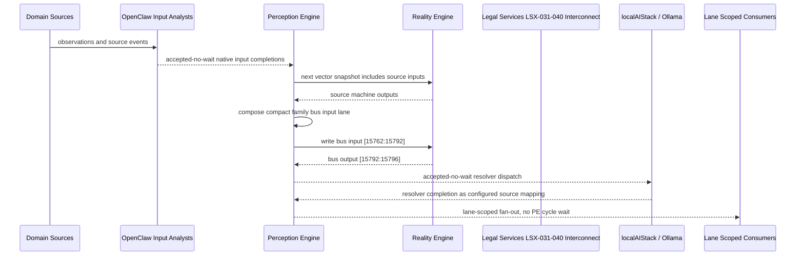

# Legal Services LSX-031-040 Interconnect Narrative

This narrative applies the PE-owned published-bus pattern to `Legal Services LSX-031-040` in the
`legal-services` domain. OpenClaw and localAIStack/Ollama remain PE-side translators
and resolvers. RE evaluates only ordinary vector state.

Focus: Legal Services LSX-031-040.

## Published Bus

```text
legal-services.lsx-031-040
published-bus-legal-services-lsx-031-040
```

Input lane: `[15762:15792]`

```text
[0] Legal Services Productization IP Governance Product IP Map active output[0] bit
[1] Legal Services Productization IP Governance Product IP Map active output[1] bit
[2] Legal Services Productization IP Governance Product IP Map active output[2] bit
[3] Legal Services Productization IP Governance Launch Clearance Gate active output[0] bit
[4] Legal Services Productization IP Governance Launch Clearance Gate active output[1] bit
[5] Legal Services Productization IP Governance Launch Clearance Gate active output[2] bit
[6] Legal Services Productization IP Governance Contractor Contributor Controls active output[0] bit
[7] Legal Services Productization IP Governance Contractor Contributor Controls active output[1] bit
[8] Legal Services Productization IP Governance Contractor Contributor Controls active output[2] bit
[9] Legal Services Productization IP Governance Open Source Compliance active output[0] bit
[10] Legal Services Productization IP Governance Open Source Compliance active output[1] bit
[11] Legal Services Productization IP Governance Open Source Compliance active output[2] bit
[12] Legal Services Productization IP Governance Trade Secret Boundary active output[0] bit
[13] Legal Services Productization IP Governance Trade Secret Boundary active output[1] bit
[14] Legal Services Productization IP Governance Trade Secret Boundary active output[2] bit
[15] Legal Services Productization IP Governance Patent Marking Readiness active output[0] bit
[16] Legal Services Productization IP Governance Patent Marking Readiness active output[1] bit
[17] Legal Services Productization IP Governance Patent Marking Readiness active output[2] bit
[18] Legal Services Productization IP Governance Brand Usage Governance active output[0] bit
[19] Legal Services Productization IP Governance Brand Usage Governance active output[1] bit
[20] Legal Services Productization IP Governance Brand Usage Governance active output[2] bit
[21] Legal Services Productization IP Governance Marketing Claims Review active output[0] bit
[22] Legal Services Productization IP Governance Marketing Claims Review active output[1] bit
[23] Legal Services Productization IP Governance Marketing Claims Review active output[2] bit
[24] Legal Services Productization IP Governance Licensing Monetization Intake active output[0] bit
[25] Legal Services Productization IP Governance Licensing Monetization Intake active output[1] bit
[26] Legal Services Productization IP Governance Licensing Monetization Intake active output[2] bit
[27] Legal Services Productization IP Governance Enforcement Watchlist active output[0] bit
[28] Legal Services Productization IP Governance Enforcement Watchlist active output[1] bit
[29] Legal Services Productization IP Governance Enforcement Watchlist active output[2] bit
```

Output lane: `[15792:15796]`

```text
[0] domain family review bit
[1] domain family optimization bit
[2] domain family monitoring bit
[3] domain family stable bit
```

Source machines publish active output lanes into this family bus. Stable source
states remain represented by no active PE-composed bits.

## Example Workflow: Legal Services LSX-031-040 domain family review

PE composes:

```text
Legal Services LSX-031-040 Interconnect[15762:15792]
= [1, 0, 0, 0, 0, 0, 0, 0, 0, 1, 0, 0, 0, 0, 0, 0, 0, 0, 1, 0, 0, 0, 0, 0, 0, 0, 0, 0, 0, 0]
```

RE emits:

```text
Legal Services LSX-031-040 Interconnect[15792:15796]
= [1, 0, 0, 0]
```

## Example Workflow: Legal Services LSX-031-040 domain family optimization

PE composes:

```text
Legal Services LSX-031-040 Interconnect[15762:15792]
= [0, 1, 0, 0, 0, 0, 0, 0, 0, 0, 1, 0, 0, 0, 0, 0, 0, 0, 0, 1, 0, 0, 0, 0, 0, 0, 0, 0, 0, 0]
```

RE emits:

```text
Legal Services LSX-031-040 Interconnect[15792:15796]
= [0, 1, 0, 0]
```

## Example Workflow: Legal Services LSX-031-040 domain family monitoring

PE composes:

```text
Legal Services LSX-031-040 Interconnect[15762:15792]
= [0, 0, 1, 0, 0, 0, 0, 0, 0, 0, 0, 1, 0, 0, 0, 0, 0, 0, 0, 0, 1, 0, 0, 0, 0, 0, 0, 0, 0, 0]
```

RE emits:

```text
Legal Services LSX-031-040 Interconnect[15792:15796]
= [0, 0, 1, 0]
```

## Message Flow



## Problems And Extensions

1. This pass records an explicit family-level published-bus contract for every
   source machine in this remaining-domain family.

2. RE visibility remains limited to compact vector lanes. PE owns source
   provenance, transformation, resolver dispatch, and completion ingestion.

3. Future growth can add domain super-buses that consume family bridge outputs
   rather than reading every source machine directly.

## Safety Boundary

The PE-visible workflow carries normalized status bits only. Raw regulated data
and provider-specific records stay upstream. Resolver completions return through
PE as configured source mappings.
