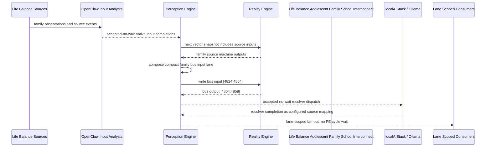

# Life Balance Adolescent Family School Interconnect Narrative

This narrative applies the PE-owned published-bus pattern to the Life Balance
`Adolescent Family School` family. OpenClaw and localAIStack/Ollama remain PE-side
translators and resolvers. RE evaluates only ordinary vector state.

Focus: school function, family routine, device boundaries, peer connection, accommodations, and adolescent safety.

## Published Bus

```text
life-balance.adolescent-family-school
published-bus-life-balance-adolescent-family-school
```

Input lane: `[4824:4854]`

```text
[0] Life Balance Adolescent Family And School School Function Monitor care team review bit
[1] Life Balance Adolescent Family And School School Function Monitor lifestyle plan adjust bit
[2] Life Balance Adolescent Family And School School Function Monitor monitoring task bit
[3] Life Balance Adolescent Family And School Family Routine Alignment care team review bit
[4] Life Balance Adolescent Family And School Family Routine Alignment lifestyle plan adjust bit
[5] Life Balance Adolescent Family And School Family Routine Alignment monitoring task bit
[6] Life Balance Adolescent Family And School Device Use Boundary care team review bit
[7] Life Balance Adolescent Family And School Device Use Boundary lifestyle plan adjust bit
[8] Life Balance Adolescent Family And School Device Use Boundary monitoring task bit
[9] Life Balance Adolescent Family And School Peer Connection Monitor care team review bit
[10] Life Balance Adolescent Family And School Peer Connection Monitor lifestyle plan adjust bit
[11] Life Balance Adolescent Family And School Peer Connection Monitor monitoring task bit
[12] Life Balance Adolescent Family And School Growth Development Watch care team review bit
[13] Life Balance Adolescent Family And School Growth Development Watch lifestyle plan adjust bit
[14] Life Balance Adolescent Family And School Growth Development Watch monitoring task bit
[15] Life Balance Adolescent Family And School Parent Coaching Plan care team review bit
[16] Life Balance Adolescent Family And School Parent Coaching Plan lifestyle plan adjust bit
[17] Life Balance Adolescent Family And School Parent Coaching Plan monitoring task bit
[18] Life Balance Adolescent Family And School School Accommodation Tracker care team review bit
[19] Life Balance Adolescent Family And School School Accommodation Tracker lifestyle plan adjust bit
[20] Life Balance Adolescent Family And School School Accommodation Tracker monitoring task bit
[21] Life Balance Adolescent Family And School Sports Performance Balance care team review bit
[22] Life Balance Adolescent Family And School Sports Performance Balance lifestyle plan adjust bit
[23] Life Balance Adolescent Family And School Sports Performance Balance monitoring task bit
[24] Life Balance Adolescent Family And School Adolescent Safety Signal care team review bit
[25] Life Balance Adolescent Family And School Adolescent Safety Signal lifestyle plan adjust bit
[26] Life Balance Adolescent Family And School Adolescent Safety Signal monitoring task bit
[27] Life Balance Adolescent Family And School Youth Family Executive care team review bit
[28] Life Balance Adolescent Family And School Youth Family Executive lifestyle plan adjust bit
[29] Life Balance Adolescent Family And School Youth Family Executive monitoring task bit
```

Output lane: `[4854:4858]`

```text
[0] family care team review bit
[1] family lifestyle plan adjustment bit
[2] family monitoring task bit
[3] family stable balance bit
```

Each source machine contributes its active response lanes into the family bus:
care-team review, lifestyle-plan adjustment, and monitoring task. Stable source
states remain represented by all three active bits being low.

## Example Workflow: Adolescent Family School care team review

PE composes:

```text
Life Balance Adolescent Family School Interconnect[4824:4854]
= [1, 0, 0, 0, 0, 0, 0, 0, 0, 0, 0, 0, 1, 0, 0, 0, 0, 0, 0, 0, 0, 0, 0, 0, 0, 0, 0, 1, 0, 0]
```

RE emits:

```text
Life Balance Adolescent Family School Interconnect[4854:4858]
= [1, 0, 0, 0]
```

## Example Workflow: Adolescent Family School lifestyle plan adjustment

PE composes:

```text
Life Balance Adolescent Family School Interconnect[4824:4854]
= [0, 0, 0, 0, 1, 0, 0, 0, 0, 0, 0, 0, 0, 0, 0, 0, 1, 0, 0, 0, 0, 0, 0, 0, 0, 1, 0, 0, 0, 0]
```

RE emits:

```text
Life Balance Adolescent Family School Interconnect[4854:4858]
= [0, 1, 0, 0]
```

## Example Workflow: Adolescent Family School monitoring task

PE composes:

```text
Life Balance Adolescent Family School Interconnect[4824:4854]
= [0, 0, 0, 0, 0, 0, 0, 0, 1, 0, 0, 0, 0, 0, 0, 0, 0, 0, 0, 0, 1, 0, 0, 1, 0, 0, 0, 0, 0, 0]
```

RE emits:

```text
Life Balance Adolescent Family School Interconnect[4854:4858]
= [0, 0, 1, 0]
```

## Message Flow



## Problems And Extensions

1. This pass records an explicit family-level published-bus contract for every
   Life Balance source machine in this family.

2. RE visibility remains limited to compact vector lanes. PE owns source
   provenance, transformation, resolver dispatch, and completion ingestion.

3. Future growth can add cross-family Life Balance super-buses that consume
   these family bridge outputs rather than reading every source machine directly.

## Safety Boundary

The PE-visible workflow carries normalized status bits only. Raw PHI and
provider-specific records stay upstream. Resolver completions return through PE
as configured source mappings.
