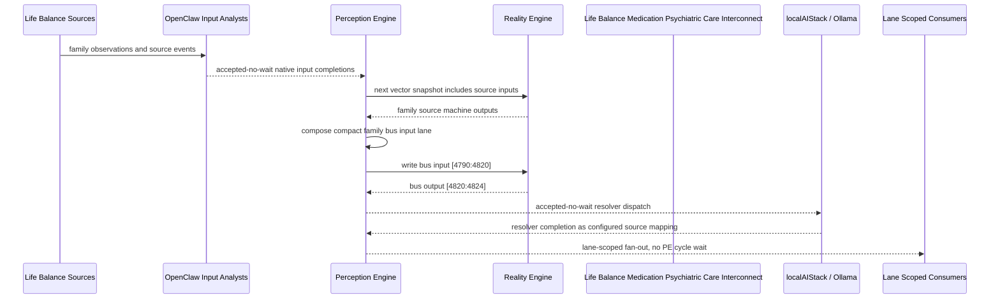

# Life Balance Medication Psychiatric Care Interconnect Narrative

This narrative applies the PE-owned published-bus pattern to the Life Balance
`Medication Psychiatric Care` family. OpenClaw and localAIStack/Ollama remain PE-side
translators and resolvers. RE evaluates only ordinary vector state.

Focus: medication response, adverse effects, psychiatric care, nutrition/sleep interactions, and care visit preparation.

## Published Bus

```text
life-balance.medication-psychiatric-care
published-bus-life-balance-medication-psychiatric-care
```

Input lane: `[4790:4820]`

```text
[0] Life Balance Medication And Psychiatric Care Medication Response Tracker care team review bit
[1] Life Balance Medication And Psychiatric Care Medication Response Tracker lifestyle plan adjust bit
[2] Life Balance Medication And Psychiatric Care Medication Response Tracker monitoring task bit
[3] Life Balance Medication And Psychiatric Care Adverse Effect Watch care team review bit
[4] Life Balance Medication And Psychiatric Care Adverse Effect Watch lifestyle plan adjust bit
[5] Life Balance Medication And Psychiatric Care Adverse Effect Watch monitoring task bit
[6] Life Balance Medication And Psychiatric Care Medication Nutrition Interaction care team review bit
[7] Life Balance Medication And Psychiatric Care Medication Nutrition Interaction lifestyle plan adjust bit
[8] Life Balance Medication And Psychiatric Care Medication Nutrition Interaction monitoring task bit
[9] Life Balance Medication And Psychiatric Care Medication Sleep Interaction care team review bit
[10] Life Balance Medication And Psychiatric Care Medication Sleep Interaction lifestyle plan adjust bit
[11] Life Balance Medication And Psychiatric Care Medication Sleep Interaction monitoring task bit
[12] Life Balance Medication And Psychiatric Care Stimulant Appetite Sleep Balance care team review bit
[13] Life Balance Medication And Psychiatric Care Stimulant Appetite Sleep Balance lifestyle plan adjust bit
[14] Life Balance Medication And Psychiatric Care Stimulant Appetite Sleep Balance monitoring task bit
[15] Life Balance Medication And Psychiatric Care Mood Stabilization Monitor care team review bit
[16] Life Balance Medication And Psychiatric Care Mood Stabilization Monitor lifestyle plan adjust bit
[17] Life Balance Medication And Psychiatric Care Mood Stabilization Monitor monitoring task bit
[18] Life Balance Medication And Psychiatric Care Anxiety Treatment Response care team review bit
[19] Life Balance Medication And Psychiatric Care Anxiety Treatment Response lifestyle plan adjust bit
[20] Life Balance Medication And Psychiatric Care Anxiety Treatment Response monitoring task bit
[21] Life Balance Medication And Psychiatric Care Depression Recovery Response care team review bit
[22] Life Balance Medication And Psychiatric Care Depression Recovery Response lifestyle plan adjust bit
[23] Life Balance Medication And Psychiatric Care Depression Recovery Response monitoring task bit
[24] Life Balance Medication And Psychiatric Care Care Visit Preparation care team review bit
[25] Life Balance Medication And Psychiatric Care Care Visit Preparation lifestyle plan adjust bit
[26] Life Balance Medication And Psychiatric Care Care Visit Preparation monitoring task bit
[27] Life Balance Medication And Psychiatric Care Psychiatric Care Executive care team review bit
[28] Life Balance Medication And Psychiatric Care Psychiatric Care Executive lifestyle plan adjust bit
[29] Life Balance Medication And Psychiatric Care Psychiatric Care Executive monitoring task bit
```

Output lane: `[4820:4824]`

```text
[0] family care team review bit
[1] family lifestyle plan adjustment bit
[2] family monitoring task bit
[3] family stable balance bit
```

Each source machine contributes its active response lanes into the family bus:
care-team review, lifestyle-plan adjustment, and monitoring task. Stable source
states remain represented by all three active bits being low.

## Example Workflow: Medication Psychiatric Care care team review

PE composes:

```text
Life Balance Medication Psychiatric Care Interconnect[4790:4820]
= [1, 0, 0, 0, 0, 0, 0, 0, 0, 0, 0, 0, 1, 0, 0, 0, 0, 0, 0, 0, 0, 0, 0, 0, 0, 0, 0, 1, 0, 0]
```

RE emits:

```text
Life Balance Medication Psychiatric Care Interconnect[4820:4824]
= [1, 0, 0, 0]
```

## Example Workflow: Medication Psychiatric Care lifestyle plan adjustment

PE composes:

```text
Life Balance Medication Psychiatric Care Interconnect[4790:4820]
= [0, 0, 0, 0, 1, 0, 0, 0, 0, 0, 0, 0, 0, 0, 0, 0, 1, 0, 0, 0, 0, 0, 0, 0, 0, 1, 0, 0, 0, 0]
```

RE emits:

```text
Life Balance Medication Psychiatric Care Interconnect[4820:4824]
= [0, 1, 0, 0]
```

## Example Workflow: Medication Psychiatric Care monitoring task

PE composes:

```text
Life Balance Medication Psychiatric Care Interconnect[4790:4820]
= [0, 0, 0, 0, 0, 0, 0, 0, 1, 0, 0, 0, 0, 0, 0, 0, 0, 0, 0, 0, 1, 0, 0, 1, 0, 0, 0, 0, 0, 0]
```

RE emits:

```text
Life Balance Medication Psychiatric Care Interconnect[4820:4824]
= [0, 0, 1, 0]
```

## Message Flow



## Problems And Extensions

1. This pass records an explicit family-level published-bus contract for every
   Life Balance source machine in this family.

2. RE visibility remains limited to compact vector lanes. PE owns source
   provenance, transformation, resolver dispatch, and completion ingestion.

3. Future growth can add cross-family Life Balance super-buses that consume
   these family bridge outputs rather than reading every source machine directly.

## Safety Boundary

The PE-visible workflow carries normalized status bits only. Raw PHI and
provider-specific records stay upstream. Resolver completions return through PE
as configured source mappings.
