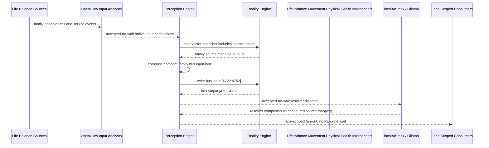

# Life Balance Movement Physical Health Interconnect Narrative

This narrative applies the PE-owned published-bus pattern to the Life Balance
`Movement Physical Health` family. OpenClaw and localAIStack/Ollama remain PE-side
translators and resolvers. RE evaluates only ordinary vector state.

Focus: movement baseline, strength, zone-two activity, outdoor exposure, mobility, and movement adherence.

## Published Bus

```text
life-balance.movement-physical-health
published-bus-life-balance-movement-physical-health
```

Input lane: `[4722:4752]`

```text
[0] Life Balance Movement And Physical Health Movement Baseline care team review bit
[1] Life Balance Movement And Physical Health Movement Baseline lifestyle plan adjust bit
[2] Life Balance Movement And Physical Health Movement Baseline monitoring task bit
[3] Life Balance Movement And Physical Health Strength Training Routine care team review bit
[4] Life Balance Movement And Physical Health Strength Training Routine lifestyle plan adjust bit
[5] Life Balance Movement And Physical Health Strength Training Routine monitoring task bit
[6] Life Balance Movement And Physical Health Zone Two Activity Plan care team review bit
[7] Life Balance Movement And Physical Health Zone Two Activity Plan lifestyle plan adjust bit
[8] Life Balance Movement And Physical Health Zone Two Activity Plan monitoring task bit
[9] Life Balance Movement And Physical Health Outdoor Activity Exposure care team review bit
[10] Life Balance Movement And Physical Health Outdoor Activity Exposure lifestyle plan adjust bit
[11] Life Balance Movement And Physical Health Outdoor Activity Exposure monitoring task bit
[12] Life Balance Movement And Physical Health Mobility Pain Constraint care team review bit
[13] Life Balance Movement And Physical Health Mobility Pain Constraint lifestyle plan adjust bit
[14] Life Balance Movement And Physical Health Mobility Pain Constraint monitoring task bit
[15] Life Balance Movement And Physical Health Adolescent Sports Balance care team review bit
[16] Life Balance Movement And Physical Health Adolescent Sports Balance lifestyle plan adjust bit
[17] Life Balance Movement And Physical Health Adolescent Sports Balance monitoring task bit
[18] Life Balance Movement And Physical Health Medication Movement Effects care team review bit
[19] Life Balance Movement And Physical Health Medication Movement Effects lifestyle plan adjust bit
[20] Life Balance Movement And Physical Health Medication Movement Effects monitoring task bit
[21] Life Balance Movement And Physical Health Exercise Anxiety Depression Response care team review bit
[22] Life Balance Movement And Physical Health Exercise Anxiety Depression Response lifestyle plan adjust bit
[23] Life Balance Movement And Physical Health Exercise Anxiety Depression Response monitoring task bit
[24] Life Balance Movement And Physical Health Movement Habit Adherence care team review bit
[25] Life Balance Movement And Physical Health Movement Habit Adherence lifestyle plan adjust bit
[26] Life Balance Movement And Physical Health Movement Habit Adherence monitoring task bit
[27] Life Balance Movement And Physical Health Movement Executive Optimizer care team review bit
[28] Life Balance Movement And Physical Health Movement Executive Optimizer lifestyle plan adjust bit
[29] Life Balance Movement And Physical Health Movement Executive Optimizer monitoring task bit
```

Output lane: `[4752:4756]`

```text
[0] family care team review bit
[1] family lifestyle plan adjustment bit
[2] family monitoring task bit
[3] family stable balance bit
```

Each source machine contributes its active response lanes into the family bus:
care-team review, lifestyle-plan adjustment, and monitoring task. Stable source
states remain represented by all three active bits being low.

## Example Workflow: Movement Physical Health care team review

PE composes:

```text
Life Balance Movement Physical Health Interconnect[4722:4752]
= [1, 0, 0, 0, 0, 0, 0, 0, 0, 0, 0, 0, 1, 0, 0, 0, 0, 0, 0, 0, 0, 0, 0, 0, 0, 0, 0, 1, 0, 0]
```

RE emits:

```text
Life Balance Movement Physical Health Interconnect[4752:4756]
= [1, 0, 0, 0]
```

## Example Workflow: Movement Physical Health lifestyle plan adjustment

PE composes:

```text
Life Balance Movement Physical Health Interconnect[4722:4752]
= [0, 0, 0, 0, 1, 0, 0, 0, 0, 0, 0, 0, 0, 0, 0, 0, 1, 0, 0, 0, 0, 0, 0, 0, 0, 1, 0, 0, 0, 0]
```

RE emits:

```text
Life Balance Movement Physical Health Interconnect[4752:4756]
= [0, 1, 0, 0]
```

## Example Workflow: Movement Physical Health monitoring task

PE composes:

```text
Life Balance Movement Physical Health Interconnect[4722:4752]
= [0, 0, 0, 0, 0, 0, 0, 0, 1, 0, 0, 0, 0, 0, 0, 0, 0, 0, 0, 0, 1, 0, 0, 1, 0, 0, 0, 0, 0, 0]
```

RE emits:

```text
Life Balance Movement Physical Health Interconnect[4752:4756]
= [0, 0, 1, 0]
```

## Message Flow



## Problems And Extensions

1. This pass records an explicit family-level published-bus contract for every
   Life Balance source machine in this family.

2. RE visibility remains limited to compact vector lanes. PE owns source
   provenance, transformation, resolver dispatch, and completion ingestion.

3. Future growth can add cross-family Life Balance super-buses that consume
   these family bridge outputs rather than reading every source machine directly.

## Safety Boundary

The PE-visible workflow carries normalized status bits only. Raw PHI and
provider-specific records stay upstream. Resolver completions return through PE
as configured source mappings.
