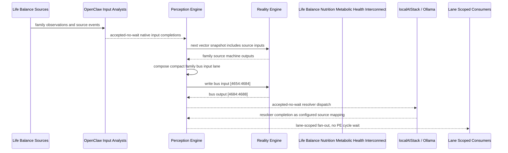

# Life Balance Nutrition Metabolic Health Interconnect Narrative

This narrative applies the PE-owned published-bus pattern to the Life Balance
`Nutrition Metabolic Health` family. OpenClaw and localAIStack/Ollama remain PE-side
translators and resolvers. RE evaluates only ordinary vector state.

Focus: nutrition stability, metabolic risk, hydration, micronutrients, and plan adherence.

## Published Bus

```text
life-balance.nutrition-metabolic-health
published-bus-life-balance-nutrition-metabolic-health
```

Input lane: `[4654:4684]`

```text
[0] Life Balance Nutrition And Metabolic Health Meal Pattern Stability care team review bit
[1] Life Balance Nutrition And Metabolic Health Meal Pattern Stability lifestyle plan adjust bit
[2] Life Balance Nutrition And Metabolic Health Meal Pattern Stability monitoring task bit
[3] Life Balance Nutrition And Metabolic Health Carbohydrate Tolerance Watch care team review bit
[4] Life Balance Nutrition And Metabolic Health Carbohydrate Tolerance Watch lifestyle plan adjust bit
[5] Life Balance Nutrition And Metabolic Health Carbohydrate Tolerance Watch monitoring task bit
[6] Life Balance Nutrition And Metabolic Health Protein Sufficiency Monitor care team review bit
[7] Life Balance Nutrition And Metabolic Health Protein Sufficiency Monitor lifestyle plan adjust bit
[8] Life Balance Nutrition And Metabolic Health Protein Sufficiency Monitor monitoring task bit
[9] Life Balance Nutrition And Metabolic Health Food Mood Journal Review care team review bit
[10] Life Balance Nutrition And Metabolic Health Food Mood Journal Review lifestyle plan adjust bit
[11] Life Balance Nutrition And Metabolic Health Food Mood Journal Review monitoring task bit
[12] Life Balance Nutrition And Metabolic Health Hydration Electrolyte Monitor care team review bit
[13] Life Balance Nutrition And Metabolic Health Hydration Electrolyte Monitor lifestyle plan adjust bit
[14] Life Balance Nutrition And Metabolic Health Hydration Electrolyte Monitor monitoring task bit
[15] Life Balance Nutrition And Metabolic Health Weight Metabolic Trend care team review bit
[16] Life Balance Nutrition And Metabolic Health Weight Metabolic Trend lifestyle plan adjust bit
[17] Life Balance Nutrition And Metabolic Health Weight Metabolic Trend monitoring task bit
[18] Life Balance Nutrition And Metabolic Health Micronutrient Risk Screen care team review bit
[19] Life Balance Nutrition And Metabolic Health Micronutrient Risk Screen lifestyle plan adjust bit
[20] Life Balance Nutrition And Metabolic Health Micronutrient Risk Screen monitoring task bit
[21] Life Balance Nutrition And Metabolic Health Family Food Environment care team review bit
[22] Life Balance Nutrition And Metabolic Health Family Food Environment lifestyle plan adjust bit
[23] Life Balance Nutrition And Metabolic Health Family Food Environment monitoring task bit
[24] Life Balance Nutrition And Metabolic Health Nutrition Plan Adherence care team review bit
[25] Life Balance Nutrition And Metabolic Health Nutrition Plan Adherence lifestyle plan adjust bit
[26] Life Balance Nutrition And Metabolic Health Nutrition Plan Adherence monitoring task bit
[27] Life Balance Nutrition And Metabolic Health Metabolic Nutrition Executive care team review bit
[28] Life Balance Nutrition And Metabolic Health Metabolic Nutrition Executive lifestyle plan adjust bit
[29] Life Balance Nutrition And Metabolic Health Metabolic Nutrition Executive monitoring task bit
```

Output lane: `[4684:4688]`

```text
[0] family care team review bit
[1] family lifestyle plan adjustment bit
[2] family monitoring task bit
[3] family stable balance bit
```

Each source machine contributes its active response lanes into the family bus:
care-team review, lifestyle-plan adjustment, and monitoring task. Stable source
states remain represented by all three active bits being low.

## Example Workflow: Nutrition Metabolic Health care team review

PE composes:

```text
Life Balance Nutrition Metabolic Health Interconnect[4654:4684]
= [1, 0, 0, 0, 0, 0, 0, 0, 0, 0, 0, 0, 1, 0, 0, 0, 0, 0, 0, 0, 0, 0, 0, 0, 0, 0, 0, 1, 0, 0]
```

RE emits:

```text
Life Balance Nutrition Metabolic Health Interconnect[4684:4688]
= [1, 0, 0, 0]
```

## Example Workflow: Nutrition Metabolic Health lifestyle plan adjustment

PE composes:

```text
Life Balance Nutrition Metabolic Health Interconnect[4654:4684]
= [0, 0, 0, 0, 1, 0, 0, 0, 0, 0, 0, 0, 0, 0, 0, 0, 1, 0, 0, 0, 0, 0, 0, 0, 0, 1, 0, 0, 0, 0]
```

RE emits:

```text
Life Balance Nutrition Metabolic Health Interconnect[4684:4688]
= [0, 1, 0, 0]
```

## Example Workflow: Nutrition Metabolic Health monitoring task

PE composes:

```text
Life Balance Nutrition Metabolic Health Interconnect[4654:4684]
= [0, 0, 0, 0, 0, 0, 0, 0, 1, 0, 0, 0, 0, 0, 0, 0, 0, 0, 0, 0, 1, 0, 0, 1, 0, 0, 0, 0, 0, 0]
```

RE emits:

```text
Life Balance Nutrition Metabolic Health Interconnect[4684:4688]
= [0, 0, 1, 0]
```

## Message Flow



## Problems And Extensions

1. This pass records an explicit family-level published-bus contract for every
   Life Balance source machine in this family.

2. RE visibility remains limited to compact vector lanes. PE owns source
   provenance, transformation, resolver dispatch, and completion ingestion.

3. Future growth can add cross-family Life Balance super-buses that consume
   these family bridge outputs rather than reading every source machine directly.

## Safety Boundary

The PE-visible workflow carries normalized status bits only. Raw PHI and
provider-specific records stay upstream. Resolver completions return through PE
as configured source mappings.
