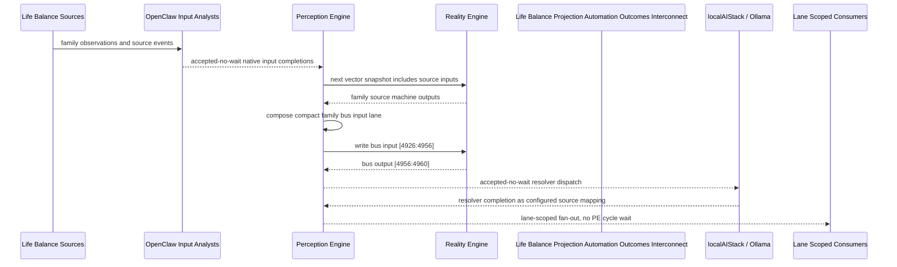

# Life Balance Projection Automation Outcomes Interconnect Narrative

This narrative applies the PE-owned published-bus pattern to the Life Balance
`Projection Automation Outcomes` family. OpenClaw and localAIStack/Ollama remain PE-side
translators and resolvers. RE evaluates only ordinary vector state.

Focus: weekly projection, risk drift, plan adjustment, escalation routing, automation scheduling, E2E scenarios, and command center coordination.

## Published Bus

```text
life-balance.projection-automation-outcomes
published-bus-life-balance-projection-automation-outcomes
```

Input lane: `[4926:4956]`

```text
[0] Life Balance Projection Automation And Outcomes Weekly Balance Projection care team review bit
[1] Life Balance Projection Automation And Outcomes Weekly Balance Projection lifestyle plan adjust bit
[2] Life Balance Projection Automation And Outcomes Weekly Balance Projection monitoring task bit
[3] Life Balance Projection Automation And Outcomes Risk Drift Forecaster care team review bit
[4] Life Balance Projection Automation And Outcomes Risk Drift Forecaster lifestyle plan adjust bit
[5] Life Balance Projection Automation And Outcomes Risk Drift Forecaster monitoring task bit
[6] Life Balance Projection Automation And Outcomes Plan Adjustment Dispatcher care team review bit
[7] Life Balance Projection Automation And Outcomes Plan Adjustment Dispatcher lifestyle plan adjust bit
[8] Life Balance Projection Automation And Outcomes Plan Adjustment Dispatcher monitoring task bit
[9] Life Balance Projection Automation And Outcomes Care Team Escalation Router care team review bit
[10] Life Balance Projection Automation And Outcomes Care Team Escalation Router lifestyle plan adjust bit
[11] Life Balance Projection Automation And Outcomes Care Team Escalation Router monitoring task bit
[12] Life Balance Projection Automation And Outcomes Habit Automation Scheduler care team review bit
[13] Life Balance Projection Automation And Outcomes Habit Automation Scheduler lifestyle plan adjust bit
[14] Life Balance Projection Automation And Outcomes Habit Automation Scheduler monitoring task bit
[15] Life Balance Projection Automation And Outcomes Metabolic Mood Scenario E2E care team review bit
[16] Life Balance Projection Automation And Outcomes Metabolic Mood Scenario E2E lifestyle plan adjust bit
[17] Life Balance Projection Automation And Outcomes Metabolic Mood Scenario E2E monitoring task bit
[18] Life Balance Projection Automation And Outcomes Adolescent Sleep School E2E care team review bit
[19] Life Balance Projection Automation And Outcomes Adolescent Sleep School E2E lifestyle plan adjust bit
[20] Life Balance Projection Automation And Outcomes Adolescent Sleep School E2E monitoring task bit
[21] Life Balance Projection Automation And Outcomes Medication Lifestyle E2E care team review bit
[22] Life Balance Projection Automation And Outcomes Medication Lifestyle E2E lifestyle plan adjust bit
[23] Life Balance Projection Automation And Outcomes Medication Lifestyle E2E monitoring task bit
[24] Life Balance Projection Automation And Outcomes Stress Connection E2E care team review bit
[25] Life Balance Projection Automation And Outcomes Stress Connection E2E lifestyle plan adjust bit
[26] Life Balance Projection Automation And Outcomes Stress Connection E2E monitoring task bit
[27] Life Balance Projection Automation And Outcomes Life Balance Command Center care team review bit
[28] Life Balance Projection Automation And Outcomes Life Balance Command Center lifestyle plan adjust bit
[29] Life Balance Projection Automation And Outcomes Life Balance Command Center monitoring task bit
```

Output lane: `[4956:4960]`

```text
[0] family care team review bit
[1] family lifestyle plan adjustment bit
[2] family monitoring task bit
[3] family stable balance bit
```

Each source machine contributes its active response lanes into the family bus:
care-team review, lifestyle-plan adjustment, and monitoring task. Stable source
states remain represented by all three active bits being low.

## Example Workflow: Projection Automation Outcomes care team review

PE composes:

```text
Life Balance Projection Automation Outcomes Interconnect[4926:4956]
= [1, 0, 0, 0, 0, 0, 0, 0, 0, 0, 0, 0, 1, 0, 0, 0, 0, 0, 0, 0, 0, 0, 0, 0, 0, 0, 0, 1, 0, 0]
```

RE emits:

```text
Life Balance Projection Automation Outcomes Interconnect[4956:4960]
= [1, 0, 0, 0]
```

## Example Workflow: Projection Automation Outcomes lifestyle plan adjustment

PE composes:

```text
Life Balance Projection Automation Outcomes Interconnect[4926:4956]
= [0, 0, 0, 0, 1, 0, 0, 0, 0, 0, 0, 0, 0, 0, 0, 0, 1, 0, 0, 0, 0, 0, 0, 0, 0, 1, 0, 0, 0, 0]
```

RE emits:

```text
Life Balance Projection Automation Outcomes Interconnect[4956:4960]
= [0, 1, 0, 0]
```

## Example Workflow: Projection Automation Outcomes monitoring task

PE composes:

```text
Life Balance Projection Automation Outcomes Interconnect[4926:4956]
= [0, 0, 0, 0, 0, 0, 0, 0, 1, 0, 0, 0, 0, 0, 0, 0, 0, 0, 0, 0, 1, 0, 0, 1, 0, 0, 0, 0, 0, 0]
```

RE emits:

```text
Life Balance Projection Automation Outcomes Interconnect[4956:4960]
= [0, 0, 1, 0]
```

## Message Flow



## Problems And Extensions

1. This pass records an explicit family-level published-bus contract for every
   Life Balance source machine in this family.

2. RE visibility remains limited to compact vector lanes. PE owns source
   provenance, transformation, resolver dispatch, and completion ingestion.

3. Future growth can add cross-family Life Balance super-buses that consume
   these family bridge outputs rather than reading every source machine directly.

## Safety Boundary

The PE-visible workflow carries normalized status bits only. Raw PHI and
provider-specific records stay upstream. Resolver completions return through PE
as configured source mappings.
