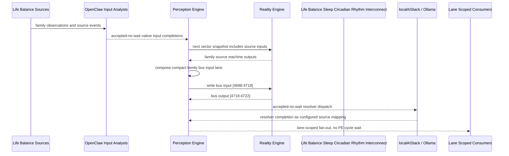

# Life Balance Sleep Circadian Rhythm Interconnect Narrative

This narrative applies the PE-owned published-bus pattern to the Life Balance
`Sleep Circadian Rhythm` family. OpenClaw and localAIStack/Ollama remain PE-side
translators and resolvers. RE evaluates only ordinary vector state.

Focus: sleep timing, insomnia, apnea risk, light exposure, shift work, and sleep adherence.

## Published Bus

```text
life-balance.sleep-circadian-rhythm
published-bus-life-balance-sleep-circadian-rhythm
```

Input lane: `[4688:4718]`

```text
[0] Life Balance Sleep And Circadian Rhythm Sleep Schedule Regularity care team review bit
[1] Life Balance Sleep And Circadian Rhythm Sleep Schedule Regularity lifestyle plan adjust bit
[2] Life Balance Sleep And Circadian Rhythm Sleep Schedule Regularity monitoring task bit
[3] Life Balance Sleep And Circadian Rhythm Insomnia Trigger Review care team review bit
[4] Life Balance Sleep And Circadian Rhythm Insomnia Trigger Review lifestyle plan adjust bit
[5] Life Balance Sleep And Circadian Rhythm Insomnia Trigger Review monitoring task bit
[6] Life Balance Sleep And Circadian Rhythm Restorative Sleep Quality care team review bit
[7] Life Balance Sleep And Circadian Rhythm Restorative Sleep Quality lifestyle plan adjust bit
[8] Life Balance Sleep And Circadian Rhythm Restorative Sleep Quality monitoring task bit
[9] Life Balance Sleep And Circadian Rhythm Sleep Apnea Risk Screen care team review bit
[10] Life Balance Sleep And Circadian Rhythm Sleep Apnea Risk Screen lifestyle plan adjust bit
[11] Life Balance Sleep And Circadian Rhythm Sleep Apnea Risk Screen monitoring task bit
[12] Life Balance Sleep And Circadian Rhythm Light Exposure Timing care team review bit
[13] Life Balance Sleep And Circadian Rhythm Light Exposure Timing lifestyle plan adjust bit
[14] Life Balance Sleep And Circadian Rhythm Light Exposure Timing monitoring task bit
[15] Life Balance Sleep And Circadian Rhythm Caffeine Stimulant Timing care team review bit
[16] Life Balance Sleep And Circadian Rhythm Caffeine Stimulant Timing lifestyle plan adjust bit
[17] Life Balance Sleep And Circadian Rhythm Caffeine Stimulant Timing monitoring task bit
[18] Life Balance Sleep And Circadian Rhythm Adolescent Sleep School Fit care team review bit
[19] Life Balance Sleep And Circadian Rhythm Adolescent Sleep School Fit lifestyle plan adjust bit
[20] Life Balance Sleep And Circadian Rhythm Adolescent Sleep School Fit monitoring task bit
[21] Life Balance Sleep And Circadian Rhythm Shift Work Sleep Protection care team review bit
[22] Life Balance Sleep And Circadian Rhythm Shift Work Sleep Protection lifestyle plan adjust bit
[23] Life Balance Sleep And Circadian Rhythm Shift Work Sleep Protection monitoring task bit
[24] Life Balance Sleep And Circadian Rhythm Sleep Plan Adherence care team review bit
[25] Life Balance Sleep And Circadian Rhythm Sleep Plan Adherence lifestyle plan adjust bit
[26] Life Balance Sleep And Circadian Rhythm Sleep Plan Adherence monitoring task bit
[27] Life Balance Sleep And Circadian Rhythm Sleep Executive Stabilizer care team review bit
[28] Life Balance Sleep And Circadian Rhythm Sleep Executive Stabilizer lifestyle plan adjust bit
[29] Life Balance Sleep And Circadian Rhythm Sleep Executive Stabilizer monitoring task bit
```

Output lane: `[4718:4722]`

```text
[0] family care team review bit
[1] family lifestyle plan adjustment bit
[2] family monitoring task bit
[3] family stable balance bit
```

Each source machine contributes its active response lanes into the family bus:
care-team review, lifestyle-plan adjustment, and monitoring task. Stable source
states remain represented by all three active bits being low.

## Example Workflow: Sleep Circadian Rhythm care team review

PE composes:

```text
Life Balance Sleep Circadian Rhythm Interconnect[4688:4718]
= [1, 0, 0, 0, 0, 0, 0, 0, 0, 0, 0, 0, 1, 0, 0, 0, 0, 0, 0, 0, 0, 0, 0, 0, 0, 0, 0, 1, 0, 0]
```

RE emits:

```text
Life Balance Sleep Circadian Rhythm Interconnect[4718:4722]
= [1, 0, 0, 0]
```

## Example Workflow: Sleep Circadian Rhythm lifestyle plan adjustment

PE composes:

```text
Life Balance Sleep Circadian Rhythm Interconnect[4688:4718]
= [0, 0, 0, 0, 1, 0, 0, 0, 0, 0, 0, 0, 0, 0, 0, 0, 1, 0, 0, 0, 0, 0, 0, 0, 0, 1, 0, 0, 0, 0]
```

RE emits:

```text
Life Balance Sleep Circadian Rhythm Interconnect[4718:4722]
= [0, 1, 0, 0]
```

## Example Workflow: Sleep Circadian Rhythm monitoring task

PE composes:

```text
Life Balance Sleep Circadian Rhythm Interconnect[4688:4718]
= [0, 0, 0, 0, 0, 0, 0, 0, 1, 0, 0, 0, 0, 0, 0, 0, 0, 0, 0, 0, 1, 0, 0, 1, 0, 0, 0, 0, 0, 0]
```

RE emits:

```text
Life Balance Sleep Circadian Rhythm Interconnect[4718:4722]
= [0, 0, 1, 0]
```

## Message Flow



## Problems And Extensions

1. This pass records an explicit family-level published-bus contract for every
   Life Balance source machine in this family.

2. RE visibility remains limited to compact vector lanes. PE owns source
   provenance, transformation, resolver dispatch, and completion ingestion.

3. Future growth can add cross-family Life Balance super-buses that consume
   these family bridge outputs rather than reading every source machine directly.

## Safety Boundary

The PE-visible workflow carries normalized status bits only. Raw PHI and
provider-specific records stay upstream. Resolver completions return through PE
as configured source mappings.
