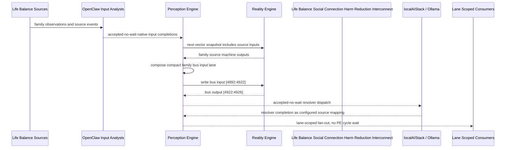

# Life Balance Social Connection Harm Reduction Interconnect Narrative

This narrative applies the PE-owned published-bus pattern to the Life Balance
`Social Connection Harm Reduction` family. OpenClaw and localAIStack/Ollama remain PE-side
translators and resolvers. RE evaluates only ordinary vector state.

Focus: connection baseline, relationship stress, harm reduction, community activity, social rhythm, and relapse prevention.

## Published Bus

```text
life-balance.social-connection-harm-reduction
published-bus-life-balance-social-connection-harm-reduction
```

Input lane: `[4892:4922]`

```text
[0] Life Balance Social Connection And Harm Reduction Connection Baseline care team review bit
[1] Life Balance Social Connection And Harm Reduction Connection Baseline lifestyle plan adjust bit
[2] Life Balance Social Connection And Harm Reduction Connection Baseline monitoring task bit
[3] Life Balance Social Connection And Harm Reduction Relationship Stress Monitor care team review bit
[4] Life Balance Social Connection And Harm Reduction Relationship Stress Monitor lifestyle plan adjust bit
[5] Life Balance Social Connection And Harm Reduction Relationship Stress Monitor monitoring task bit
[6] Life Balance Social Connection And Harm Reduction Substance Exposure Screen care team review bit
[7] Life Balance Social Connection And Harm Reduction Substance Exposure Screen lifestyle plan adjust bit
[8] Life Balance Social Connection And Harm Reduction Substance Exposure Screen monitoring task bit
[9] Life Balance Social Connection And Harm Reduction Harm Reduction Plan care team review bit
[10] Life Balance Social Connection And Harm Reduction Harm Reduction Plan lifestyle plan adjust bit
[11] Life Balance Social Connection And Harm Reduction Harm Reduction Plan monitoring task bit
[12] Life Balance Social Connection And Harm Reduction Community Activity Engagement care team review bit
[13] Life Balance Social Connection And Harm Reduction Community Activity Engagement lifestyle plan adjust bit
[14] Life Balance Social Connection And Harm Reduction Community Activity Engagement monitoring task bit
[15] Life Balance Social Connection And Harm Reduction Digital Social Load care team review bit
[16] Life Balance Social Connection And Harm Reduction Digital Social Load lifestyle plan adjust bit
[17] Life Balance Social Connection And Harm Reduction Digital Social Load monitoring task bit
[18] Life Balance Social Connection And Harm Reduction Care Team Communication care team review bit
[19] Life Balance Social Connection And Harm Reduction Care Team Communication lifestyle plan adjust bit
[20] Life Balance Social Connection And Harm Reduction Care Team Communication monitoring task bit
[21] Life Balance Social Connection And Harm Reduction Social Rhythm Stabilizer care team review bit
[22] Life Balance Social Connection And Harm Reduction Social Rhythm Stabilizer lifestyle plan adjust bit
[23] Life Balance Social Connection And Harm Reduction Social Rhythm Stabilizer monitoring task bit
[24] Life Balance Social Connection And Harm Reduction Relapse Prevention Support care team review bit
[25] Life Balance Social Connection And Harm Reduction Relapse Prevention Support lifestyle plan adjust bit
[26] Life Balance Social Connection And Harm Reduction Relapse Prevention Support monitoring task bit
[27] Life Balance Social Connection And Harm Reduction Connection Executive care team review bit
[28] Life Balance Social Connection And Harm Reduction Connection Executive lifestyle plan adjust bit
[29] Life Balance Social Connection And Harm Reduction Connection Executive monitoring task bit
```

Output lane: `[4922:4926]`

```text
[0] family care team review bit
[1] family lifestyle plan adjustment bit
[2] family monitoring task bit
[3] family stable balance bit
```

Each source machine contributes its active response lanes into the family bus:
care-team review, lifestyle-plan adjustment, and monitoring task. Stable source
states remain represented by all three active bits being low.

## Example Workflow: Social Connection Harm Reduction care team review

PE composes:

```text
Life Balance Social Connection Harm Reduction Interconnect[4892:4922]
= [1, 0, 0, 0, 0, 0, 0, 0, 0, 0, 0, 0, 1, 0, 0, 0, 0, 0, 0, 0, 0, 0, 0, 0, 0, 0, 0, 1, 0, 0]
```

RE emits:

```text
Life Balance Social Connection Harm Reduction Interconnect[4922:4926]
= [1, 0, 0, 0]
```

## Example Workflow: Social Connection Harm Reduction lifestyle plan adjustment

PE composes:

```text
Life Balance Social Connection Harm Reduction Interconnect[4892:4922]
= [0, 0, 0, 0, 1, 0, 0, 0, 0, 0, 0, 0, 0, 0, 0, 0, 1, 0, 0, 0, 0, 0, 0, 0, 0, 1, 0, 0, 0, 0]
```

RE emits:

```text
Life Balance Social Connection Harm Reduction Interconnect[4922:4926]
= [0, 1, 0, 0]
```

## Example Workflow: Social Connection Harm Reduction monitoring task

PE composes:

```text
Life Balance Social Connection Harm Reduction Interconnect[4892:4922]
= [0, 0, 0, 0, 0, 0, 0, 0, 1, 0, 0, 0, 0, 0, 0, 0, 0, 0, 0, 0, 1, 0, 0, 1, 0, 0, 0, 0, 0, 0]
```

RE emits:

```text
Life Balance Social Connection Harm Reduction Interconnect[4922:4926]
= [0, 0, 1, 0]
```

## Message Flow



## Problems And Extensions

1. This pass records an explicit family-level published-bus contract for every
   Life Balance source machine in this family.

2. RE visibility remains limited to compact vector lanes. PE owns source
   provenance, transformation, resolver dispatch, and completion ingestion.

3. Future growth can add cross-family Life Balance super-buses that consume
   these family bridge outputs rather than reading every source machine directly.

## Safety Boundary

The PE-visible workflow carries normalized status bits only. Raw PHI and
provider-specific records stay upstream. Resolver completions return through PE
as configured source mappings.
