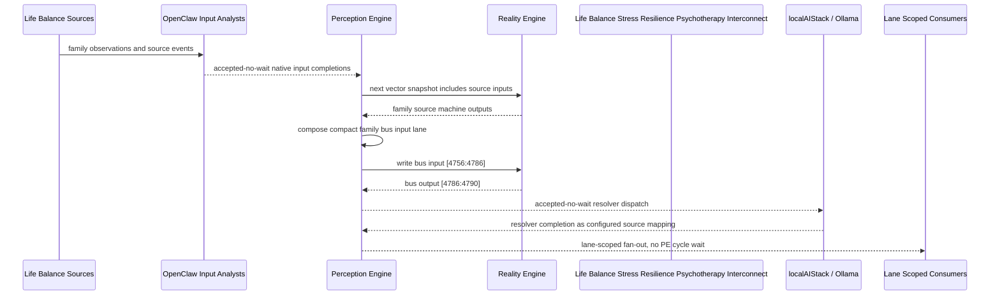

# Life Balance Stress Resilience Psychotherapy Interconnect Narrative

This narrative applies the PE-owned published-bus pattern to the Life Balance
`Stress Resilience Psychotherapy` family. OpenClaw and localAIStack/Ollama remain PE-side
translators and resolvers. RE evaluates only ordinary vector state.

Focus: stress load, regulation skills, therapy homework, pacing, recovery rhythm, and resilience.

## Published Bus

```text
life-balance.stress-resilience-psychotherapy
published-bus-life-balance-stress-resilience-psychotherapy
```

Input lane: `[4756:4786]`

```text
[0] Life Balance Stress Resilience And Psychotherapy Stress Load Inventory care team review bit
[1] Life Balance Stress Resilience And Psychotherapy Stress Load Inventory lifestyle plan adjust bit
[2] Life Balance Stress Resilience And Psychotherapy Stress Load Inventory monitoring task bit
[3] Life Balance Stress Resilience And Psychotherapy Breathing Regulation Practice care team review bit
[4] Life Balance Stress Resilience And Psychotherapy Breathing Regulation Practice lifestyle plan adjust bit
[5] Life Balance Stress Resilience And Psychotherapy Breathing Regulation Practice monitoring task bit
[6] Life Balance Stress Resilience And Psychotherapy Cognitive Pattern Review care team review bit
[7] Life Balance Stress Resilience And Psychotherapy Cognitive Pattern Review lifestyle plan adjust bit
[8] Life Balance Stress Resilience And Psychotherapy Cognitive Pattern Review monitoring task bit
[9] Life Balance Stress Resilience And Psychotherapy Emotion Regulation Skills care team review bit
[10] Life Balance Stress Resilience And Psychotherapy Emotion Regulation Skills lifestyle plan adjust bit
[11] Life Balance Stress Resilience And Psychotherapy Emotion Regulation Skills monitoring task bit
[12] Life Balance Stress Resilience And Psychotherapy Mindfulness Attention Practice care team review bit
[13] Life Balance Stress Resilience And Psychotherapy Mindfulness Attention Practice lifestyle plan adjust bit
[14] Life Balance Stress Resilience And Psychotherapy Mindfulness Attention Practice monitoring task bit
[15] Life Balance Stress Resilience And Psychotherapy Therapy Homework Completion care team review bit
[16] Life Balance Stress Resilience And Psychotherapy Therapy Homework Completion lifestyle plan adjust bit
[17] Life Balance Stress Resilience And Psychotherapy Therapy Homework Completion monitoring task bit
[18] Life Balance Stress Resilience And Psychotherapy Resilience Protective Factors care team review bit
[19] Life Balance Stress Resilience And Psychotherapy Resilience Protective Factors lifestyle plan adjust bit
[20] Life Balance Stress Resilience And Psychotherapy Resilience Protective Factors monitoring task bit
[21] Life Balance Stress Resilience And Psychotherapy Trauma Sensitive Pacing care team review bit
[22] Life Balance Stress Resilience And Psychotherapy Trauma Sensitive Pacing lifestyle plan adjust bit
[23] Life Balance Stress Resilience And Psychotherapy Trauma Sensitive Pacing monitoring task bit
[24] Life Balance Stress Resilience And Psychotherapy Stress Recovery Rhythm care team review bit
[25] Life Balance Stress Resilience And Psychotherapy Stress Recovery Rhythm lifestyle plan adjust bit
[26] Life Balance Stress Resilience And Psychotherapy Stress Recovery Rhythm monitoring task bit
[27] Life Balance Stress Resilience And Psychotherapy Resilience Executive Summary care team review bit
[28] Life Balance Stress Resilience And Psychotherapy Resilience Executive Summary lifestyle plan adjust bit
[29] Life Balance Stress Resilience And Psychotherapy Resilience Executive Summary monitoring task bit
```

Output lane: `[4786:4790]`

```text
[0] family care team review bit
[1] family lifestyle plan adjustment bit
[2] family monitoring task bit
[3] family stable balance bit
```

Each source machine contributes its active response lanes into the family bus:
care-team review, lifestyle-plan adjustment, and monitoring task. Stable source
states remain represented by all three active bits being low.

## Example Workflow: Stress Resilience Psychotherapy care team review

PE composes:

```text
Life Balance Stress Resilience Psychotherapy Interconnect[4756:4786]
= [1, 0, 0, 0, 0, 0, 0, 0, 0, 0, 0, 0, 1, 0, 0, 0, 0, 0, 0, 0, 0, 0, 0, 0, 0, 0, 0, 1, 0, 0]
```

RE emits:

```text
Life Balance Stress Resilience Psychotherapy Interconnect[4786:4790]
= [1, 0, 0, 0]
```

## Example Workflow: Stress Resilience Psychotherapy lifestyle plan adjustment

PE composes:

```text
Life Balance Stress Resilience Psychotherapy Interconnect[4756:4786]
= [0, 0, 0, 0, 1, 0, 0, 0, 0, 0, 0, 0, 0, 0, 0, 0, 1, 0, 0, 0, 0, 0, 0, 0, 0, 1, 0, 0, 0, 0]
```

RE emits:

```text
Life Balance Stress Resilience Psychotherapy Interconnect[4786:4790]
= [0, 1, 0, 0]
```

## Example Workflow: Stress Resilience Psychotherapy monitoring task

PE composes:

```text
Life Balance Stress Resilience Psychotherapy Interconnect[4756:4786]
= [0, 0, 0, 0, 0, 0, 0, 0, 1, 0, 0, 0, 0, 0, 0, 0, 0, 0, 0, 0, 1, 0, 0, 1, 0, 0, 0, 0, 0, 0]
```

RE emits:

```text
Life Balance Stress Resilience Psychotherapy Interconnect[4786:4790]
= [0, 0, 1, 0]
```

## Message Flow



## Problems And Extensions

1. This pass records an explicit family-level published-bus contract for every
   Life Balance source machine in this family.

2. RE visibility remains limited to compact vector lanes. PE owns source
   provenance, transformation, resolver dispatch, and completion ingestion.

3. Future growth can add cross-family Life Balance super-buses that consume
   these family bridge outputs rather than reading every source machine directly.

## Safety Boundary

The PE-visible workflow carries normalized status bits only. Raw PHI and
provider-specific records stay upstream. Resolver completions return through PE
as configured source mappings.
