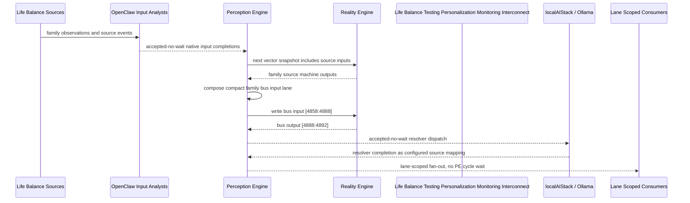

# Life Balance Testing Personalization Monitoring Interconnect Narrative

This narrative applies the PE-owned published-bus pattern to the Life Balance
`Testing Personalization Monitoring` family. OpenClaw and localAIStack/Ollama remain PE-side
translators and resolvers. RE evaluates only ordinary vector state.

Focus: CGM, genetics, temperament, labs, wearable data, patient-reported outcomes, consent, and data quality.

## Published Bus

```text
life-balance.testing-personalization-monitoring
published-bus-life-balance-testing-personalization-monitoring
```

Input lane: `[4858:4888]`

```text
[0] Life Balance Testing Personalization And Monitoring CGM Data Intake care team review bit
[1] Life Balance Testing Personalization And Monitoring CGM Data Intake lifestyle plan adjust bit
[2] Life Balance Testing Personalization And Monitoring CGM Data Intake monitoring task bit
[3] Life Balance Testing Personalization And Monitoring CGM Mood Correlation care team review bit
[4] Life Balance Testing Personalization And Monitoring CGM Mood Correlation lifestyle plan adjust bit
[5] Life Balance Testing Personalization And Monitoring CGM Mood Correlation monitoring task bit
[6] Life Balance Testing Personalization And Monitoring Genetics Result Intake care team review bit
[7] Life Balance Testing Personalization And Monitoring Genetics Result Intake lifestyle plan adjust bit
[8] Life Balance Testing Personalization And Monitoring Genetics Result Intake monitoring task bit
[9] Life Balance Testing Personalization And Monitoring Temperament Profile Review care team review bit
[10] Life Balance Testing Personalization And Monitoring Temperament Profile Review lifestyle plan adjust bit
[11] Life Balance Testing Personalization And Monitoring Temperament Profile Review monitoring task bit
[12] Life Balance Testing Personalization And Monitoring Lab Follow Up Queue care team review bit
[13] Life Balance Testing Personalization And Monitoring Lab Follow Up Queue lifestyle plan adjust bit
[14] Life Balance Testing Personalization And Monitoring Lab Follow Up Queue monitoring task bit
[15] Life Balance Testing Personalization And Monitoring Wearable Sleep Activity Intake care team review bit
[16] Life Balance Testing Personalization And Monitoring Wearable Sleep Activity Intake lifestyle plan adjust bit
[17] Life Balance Testing Personalization And Monitoring Wearable Sleep Activity Intake monitoring task bit
[18] Life Balance Testing Personalization And Monitoring Patient Reported Outcome Scores care team review bit
[19] Life Balance Testing Personalization And Monitoring Patient Reported Outcome Scores lifestyle plan adjust bit
[20] Life Balance Testing Personalization And Monitoring Patient Reported Outcome Scores monitoring task bit
[21] Life Balance Testing Personalization And Monitoring Data Consent Privacy Check care team review bit
[22] Life Balance Testing Personalization And Monitoring Data Consent Privacy Check lifestyle plan adjust bit
[23] Life Balance Testing Personalization And Monitoring Data Consent Privacy Check monitoring task bit
[24] Life Balance Testing Personalization And Monitoring Monitoring Data Quality care team review bit
[25] Life Balance Testing Personalization And Monitoring Monitoring Data Quality lifestyle plan adjust bit
[26] Life Balance Testing Personalization And Monitoring Monitoring Data Quality monitoring task bit
[27] Life Balance Testing Personalization And Monitoring Personalization Executive care team review bit
[28] Life Balance Testing Personalization And Monitoring Personalization Executive lifestyle plan adjust bit
[29] Life Balance Testing Personalization And Monitoring Personalization Executive monitoring task bit
```

Output lane: `[4888:4892]`

```text
[0] family care team review bit
[1] family lifestyle plan adjustment bit
[2] family monitoring task bit
[3] family stable balance bit
```

Each source machine contributes its active response lanes into the family bus:
care-team review, lifestyle-plan adjustment, and monitoring task. Stable source
states remain represented by all three active bits being low.

## Example Workflow: Testing Personalization Monitoring care team review

PE composes:

```text
Life Balance Testing Personalization Monitoring Interconnect[4858:4888]
= [1, 0, 0, 0, 0, 0, 0, 0, 0, 0, 0, 0, 1, 0, 0, 0, 0, 0, 0, 0, 0, 0, 0, 0, 0, 0, 0, 1, 0, 0]
```

RE emits:

```text
Life Balance Testing Personalization Monitoring Interconnect[4888:4892]
= [1, 0, 0, 0]
```

## Example Workflow: Testing Personalization Monitoring lifestyle plan adjustment

PE composes:

```text
Life Balance Testing Personalization Monitoring Interconnect[4858:4888]
= [0, 0, 0, 0, 1, 0, 0, 0, 0, 0, 0, 0, 0, 0, 0, 0, 1, 0, 0, 0, 0, 0, 0, 0, 0, 1, 0, 0, 0, 0]
```

RE emits:

```text
Life Balance Testing Personalization Monitoring Interconnect[4888:4892]
= [0, 1, 0, 0]
```

## Example Workflow: Testing Personalization Monitoring monitoring task

PE composes:

```text
Life Balance Testing Personalization Monitoring Interconnect[4858:4888]
= [0, 0, 0, 0, 0, 0, 0, 0, 1, 0, 0, 0, 0, 0, 0, 0, 0, 0, 0, 0, 1, 0, 0, 1, 0, 0, 0, 0, 0, 0]
```

RE emits:

```text
Life Balance Testing Personalization Monitoring Interconnect[4888:4892]
= [0, 0, 1, 0]
```

## Message Flow



## Problems And Extensions

1. This pass records an explicit family-level published-bus contract for every
   Life Balance source machine in this family.

2. RE visibility remains limited to compact vector lanes. PE owns source
   provenance, transformation, resolver dispatch, and completion ingestion.

3. Future growth can add cross-family Life Balance super-buses that consume
   these family bridge outputs rather than reading every source machine directly.

## Safety Boundary

The PE-visible workflow carries normalized status bits only. Raw PHI and
provider-specific records stay upstream. Resolver completions return through PE
as configured source mappings.
