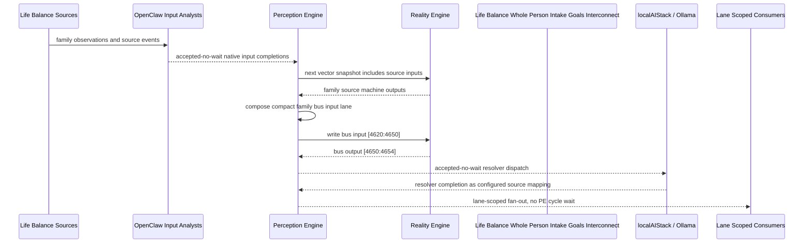

# Life Balance Whole Person Intake Goals Interconnect Narrative

This narrative applies the PE-owned published-bus pattern to the Life Balance
`Whole Person Intake Goals` family. OpenClaw and localAIStack/Ollama remain PE-side
translators and resolvers. RE evaluates only ordinary vector state.

Focus: whole-person intake, care preferences, safety review, and initial goal alignment.

## Published Bus

```text
life-balance.whole-person-intake-goals
published-bus-life-balance-whole-person-intake-goals
```

Input lane: `[4620:4650]`

```text
[0] Life Balance Whole Person Intake And Goals Psychiatric History Intake care team review bit
[1] Life Balance Whole Person Intake And Goals Psychiatric History Intake lifestyle plan adjust bit
[2] Life Balance Whole Person Intake And Goals Psychiatric History Intake monitoring task bit
[3] Life Balance Whole Person Intake And Goals Lifestyle Baseline Interview care team review bit
[4] Life Balance Whole Person Intake And Goals Lifestyle Baseline Interview lifestyle plan adjust bit
[5] Life Balance Whole Person Intake And Goals Lifestyle Baseline Interview monitoring task bit
[6] Life Balance Whole Person Intake And Goals Readiness Motivation Assessment care team review bit
[7] Life Balance Whole Person Intake And Goals Readiness Motivation Assessment lifestyle plan adjust bit
[8] Life Balance Whole Person Intake And Goals Readiness Motivation Assessment monitoring task bit
[9] Life Balance Whole Person Intake And Goals Care Preference Alignment care team review bit
[10] Life Balance Whole Person Intake And Goals Care Preference Alignment lifestyle plan adjust bit
[11] Life Balance Whole Person Intake And Goals Care Preference Alignment monitoring task bit
[12] Life Balance Whole Person Intake And Goals Risk Safety Review care team review bit
[13] Life Balance Whole Person Intake And Goals Risk Safety Review lifestyle plan adjust bit
[14] Life Balance Whole Person Intake And Goals Risk Safety Review monitoring task bit
[15] Life Balance Whole Person Intake And Goals Adolescent Guardian Alignment care team review bit
[16] Life Balance Whole Person Intake And Goals Adolescent Guardian Alignment lifestyle plan adjust bit
[17] Life Balance Whole Person Intake And Goals Adolescent Guardian Alignment monitoring task bit
[18] Life Balance Whole Person Intake And Goals Functional Impairment Map care team review bit
[19] Life Balance Whole Person Intake And Goals Functional Impairment Map lifestyle plan adjust bit
[20] Life Balance Whole Person Intake And Goals Functional Impairment Map monitoring task bit
[21] Life Balance Whole Person Intake And Goals Medication Lifestyle Interaction Intake care team review bit
[22] Life Balance Whole Person Intake And Goals Medication Lifestyle Interaction Intake lifestyle plan adjust bit
[23] Life Balance Whole Person Intake And Goals Medication Lifestyle Interaction Intake monitoring task bit
[24] Life Balance Whole Person Intake And Goals Initial Goal Contract care team review bit
[25] Life Balance Whole Person Intake And Goals Initial Goal Contract lifestyle plan adjust bit
[26] Life Balance Whole Person Intake And Goals Initial Goal Contract monitoring task bit
[27] Life Balance Whole Person Intake And Goals Intake Executive Summary care team review bit
[28] Life Balance Whole Person Intake And Goals Intake Executive Summary lifestyle plan adjust bit
[29] Life Balance Whole Person Intake And Goals Intake Executive Summary monitoring task bit
```

Output lane: `[4650:4654]`

```text
[0] family care team review bit
[1] family lifestyle plan adjustment bit
[2] family monitoring task bit
[3] family stable balance bit
```

Each source machine contributes its active response lanes into the family bus:
care-team review, lifestyle-plan adjustment, and monitoring task. Stable source
states remain represented by all three active bits being low.

## Example Workflow: Whole Person Intake Goals care team review

PE composes:

```text
Life Balance Whole Person Intake Goals Interconnect[4620:4650]
= [1, 0, 0, 0, 0, 0, 0, 0, 0, 0, 0, 0, 1, 0, 0, 0, 0, 0, 0, 0, 0, 0, 0, 0, 0, 0, 0, 1, 0, 0]
```

RE emits:

```text
Life Balance Whole Person Intake Goals Interconnect[4650:4654]
= [1, 0, 0, 0]
```

## Example Workflow: Whole Person Intake Goals lifestyle plan adjustment

PE composes:

```text
Life Balance Whole Person Intake Goals Interconnect[4620:4650]
= [0, 0, 0, 0, 1, 0, 0, 0, 0, 0, 0, 0, 0, 0, 0, 0, 1, 0, 0, 0, 0, 0, 0, 0, 0, 1, 0, 0, 0, 0]
```

RE emits:

```text
Life Balance Whole Person Intake Goals Interconnect[4650:4654]
= [0, 1, 0, 0]
```

## Example Workflow: Whole Person Intake Goals monitoring task

PE composes:

```text
Life Balance Whole Person Intake Goals Interconnect[4620:4650]
= [0, 0, 0, 0, 0, 0, 0, 0, 1, 0, 0, 0, 0, 0, 0, 0, 0, 0, 0, 0, 1, 0, 0, 1, 0, 0, 0, 0, 0, 0]
```

RE emits:

```text
Life Balance Whole Person Intake Goals Interconnect[4650:4654]
= [0, 0, 1, 0]
```

## Message Flow



## Problems And Extensions

1. This pass records an explicit family-level published-bus contract for every
   Life Balance source machine in this family.

2. RE visibility remains limited to compact vector lanes. PE owns source
   provenance, transformation, resolver dispatch, and completion ingestion.

3. Future growth can add cross-family Life Balance super-buses that consume
   these family bridge outputs rather than reading every source machine directly.

## Safety Boundary

The PE-visible workflow carries normalized status bits only. Raw PHI and
provider-specific records stay upstream. Resolver completions return through PE
as configured source mappings.
