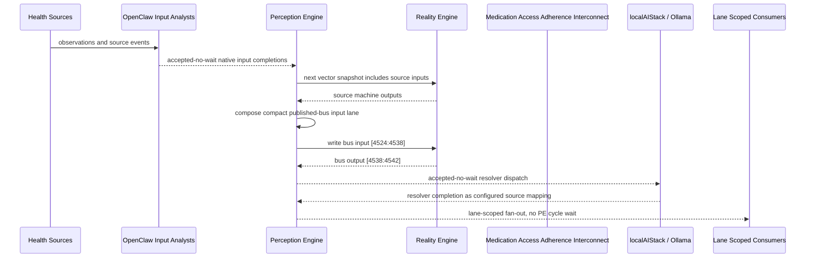

# Medication Access Adherence Interconnect Narrative

This narrative completes the PE-owned published-bus pattern for `Medication Adherence Monitor and Home Medication Cost Barrier Monitor`.
OpenClaw and localAIStack/Ollama remain PE-side translators and resolvers. RE
evaluates only ordinary vector state.

## Published Bus

```text
health-personal.medication-access-adherence
published-bus-health-personal-medication-access-adherence
```

Input lane: `[4524:4538]`

```text
[0] medication delayed bit
[1] medication missed bit
[2] cost adherence crisis bit
[3] cost barrier active bit
[4] partial adherence bit
[5] medication managed bit
[6] daily care medication missed bit
[7] transport critical access failure bit
[8] transport appointment barrier bit
[9] severe social isolation bit
[10] isolation risk bit
[11] wellness inflow urgent bit
[12] wellness transition urgent or escalated bit
[13] hydration critical bit
```

Output lane: `[4538:4542]`

```text
[0] urgent medication recovery bit
[1] affordability navigation bit
[2] caregiver reminder loop bit
[3] stable medication routine bit
```

## OpenClaw Pattern

OpenClaw templates perform ordinal, scalar, or binary mapping into each source
machine's native input lane. PE accepts those completions without waiting inside
a PE cycle. Resolver handoffs are accepted-no-wait and return through configured
PE source mappings.

## Example Workflow: Urgent medication recovery

PE composes:

```text
Medication Access Adherence Interconnect[4524:4538]
= [0, 1, 1, 1, 0, 0, 1, 1, 0, 1, 0, 0, 1, 1]
```

RE emits:

```text
Medication Access Adherence Interconnect[4538:4542]
= [1, 0, 0, 0]
```

That output activates `URGENT_MEDICATION_RECOVERY`.

## Example Workflow: Affordability navigation

PE composes:

```text
Medication Access Adherence Interconnect[4524:4538]
= [1, 0, 0, 1, 1, 0, 0, 0, 1, 0, 1, 0, 0, 0]
```

RE emits:

```text
Medication Access Adherence Interconnect[4538:4542]
= [0, 1, 0, 0]
```

That output activates `AFFORDABILITY_NAVIGATION`.

## Example Workflow: Caregiver reminder

PE composes:

```text
Medication Access Adherence Interconnect[4524:4538]
= [1, 0, 0, 0, 1, 0, 1, 0, 0, 0, 0, 0, 0, 0]
```

RE emits:

```text
Medication Access Adherence Interconnect[4538:4542]
= [0, 0, 1, 0]
```

That output activates `CAREGIVER_REMINDER_LOOP`.

## Message Flow



## Problems And Extensions

1. This pass records explicit published-bus contracts for source machines that
   previously participated only through local or implicit integration notes.

2. RE visibility remains limited to compact vector lanes; PE owns source
   provenance, transformation, resolver dispatch, and completion ingestion.

3. Future provider completions should enter through PE startup source mappings
   and preserve the asynchronous no-wait behavior.

## Safety Boundary

The PE-visible workflow carries normalized status bits only. Raw PHI and
provider-specific records stay upstream. Resolver completions return through PE
as configured source mappings.
