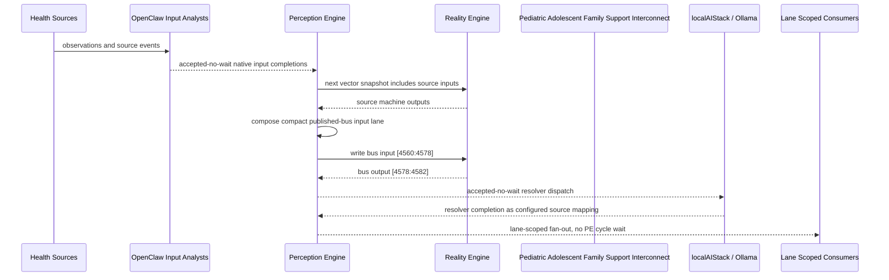

# Pediatric Adolescent Family Support Interconnect Narrative

This narrative completes the PE-owned published-bus pattern for `Pediatric Nutrition Monitor and Adolescent Mental Health Monitor`.
OpenClaw and localAIStack/Ollama remain PE-side translators and resolvers. RE
evaluates only ordinary vector state.

## Published Bus

```text
health-personal.pediatric-adolescent-family-support
published-bus-health-personal-pediatric-adolescent-family-support
```

Input lane: `[4560:4578]`

```text
[0] pediatric growth alert bit
[1] pediatric nutrition deficit bit
[2] pediatric micronutrient concern bit
[3] pediatric nutrition ok bit
[4] child referral needed bit
[5] child social developmental concern bit
[6] child learning concern bit
[7] child development ok bit
[8] adolescent crisis risk bit
[9] adolescent behavioral concern bit
[10] adolescent elevated stress bit
[11] adolescent mental health ok bit
[12] caregiver burnout bit
[13] caregiver high burden bit
[14] caregiver moderate burden bit
[15] food crisis or insecure bit
[16] unsafe environment bit
[17] environment safe bit
```

Output lane: `[4578:4582]`

```text
[0] urgent family support bit
[1] nutrition development referral bit
[2] adolescent behavioral support bit
[3] stable family support bit
```

## OpenClaw Pattern

OpenClaw templates perform ordinal, scalar, or binary mapping into each source
machine's native input lane. PE accepts those completions without waiting inside
a PE cycle. Resolver handoffs are accepted-no-wait and return through configured
PE source mappings.

## Example Workflow: Urgent pediatric family support

PE composes:

```text
Pediatric Adolescent Family Support Interconnect[4560:4578]
= [1, 1, 0, 0, 1, 1, 0, 0, 1, 1, 0, 0, 1, 1, 0, 1, 1, 0]
```

RE emits:

```text
Pediatric Adolescent Family Support Interconnect[4578:4582]
= [1, 0, 0, 0]
```

That output activates `URGENT_FAMILY_SUPPORT`.

## Example Workflow: Nutrition development referral

PE composes:

```text
Pediatric Adolescent Family Support Interconnect[4560:4578]
= [1, 1, 1, 0, 1, 0, 1, 0, 0, 1, 1, 0, 0, 1, 1, 1, 0, 0]
```

RE emits:

```text
Pediatric Adolescent Family Support Interconnect[4578:4582]
= [0, 1, 0, 0]
```

That output activates `NUTRITION_DEVELOPMENT_REFERRAL`.

## Example Workflow: Adolescent behavioral support

PE composes:

```text
Pediatric Adolescent Family Support Interconnect[4560:4578]
= [0, 0, 0, 1, 0, 1, 0, 0, 0, 1, 1, 0, 0, 1, 0, 0, 1, 0]
```

RE emits:

```text
Pediatric Adolescent Family Support Interconnect[4578:4582]
= [0, 0, 1, 0]
```

That output activates `ADOLESCENT_BEHAVIORAL_SUPPORT`.

## Message Flow



## Problems And Extensions

1. This pass records explicit published-bus contracts for source machines that
   previously participated only through local or implicit integration notes.

2. RE visibility remains limited to compact vector lanes; PE owns source
   provenance, transformation, resolver dispatch, and completion ingestion.

3. Future provider completions should enter through PE startup source mappings
   and preserve the asynchronous no-wait behavior.

## Safety Boundary

The PE-visible workflow carries normalized status bits only. Raw PHI and
provider-specific records stay upstream. Resolver completions return through PE
as configured source mappings.
