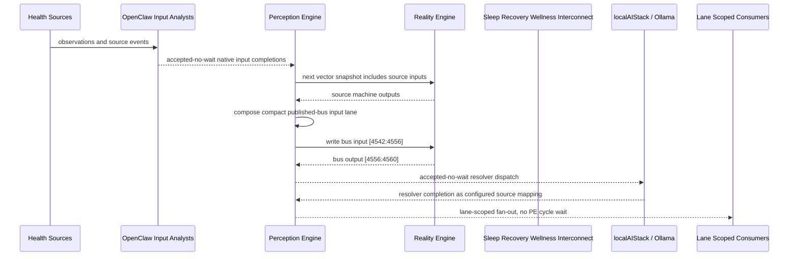

# Sleep Recovery Wellness Interconnect Narrative

This narrative completes the PE-owned published-bus pattern for `Sleep Quality Monitor, PatientWellness, and recovery signals`.
OpenClaw and localAIStack/Ollama remain PE-side translators and resolvers. RE
evaluates only ordinary vector state.

## Published Bus

```text
health-personal.sleep-recovery-wellness
published-bus-health-personal-sleep-recovery-wellness
```

Input lane: `[4542:4556]`

```text
[0] sleep poor bit
[1] sleep disturbed bit
[2] activity below baseline bit
[3] activity prolonged inactivity bit
[4] hydration low bit
[5] hydration critical bit
[6] patient wellness alert bit
[7] patient wellness critical bit
[8] social withdrawal bit
[9] isolation risk bit
[10] severe isolation bit
[11] daily care wandering alert bit
[12] daily routine complete bit
[13] wellness improving bit
```

Output lane: `[4556:4560]`

```text
[0] sleep clinical review bit
[1] recovery routine stabilization bit
[2] monitoring adjustment bit
[3] stable sleep wellness bit
```

## OpenClaw Pattern

OpenClaw templates perform ordinal, scalar, or binary mapping into each source
machine's native input lane. PE accepts those completions without waiting inside
a PE cycle. Resolver handoffs are accepted-no-wait and return through configured
PE source mappings.

## Example Workflow: Sleep clinical review

PE composes:

```text
Sleep Recovery Wellness Interconnect[4542:4556]
= [1, 1, 1, 1, 1, 1, 0, 1, 0, 0, 1, 1, 0, 0]
```

RE emits:

```text
Sleep Recovery Wellness Interconnect[4556:4560]
= [1, 0, 0, 0]
```

That output activates `SLEEP_CLINICAL_REVIEW`.

## Example Workflow: Routine stabilization

PE composes:

```text
Sleep Recovery Wellness Interconnect[4542:4556]
= [0, 1, 1, 0, 1, 0, 1, 0, 1, 1, 0, 0, 0, 0]
```

RE emits:

```text
Sleep Recovery Wellness Interconnect[4556:4560]
= [0, 1, 0, 0]
```

That output activates `RECOVERY_ROUTINE_STABILIZATION`.

## Example Workflow: Monitoring adjustment

PE composes:

```text
Sleep Recovery Wellness Interconnect[4542:4556]
= [0, 0, 0, 0, 0, 0, 0, 0, 0, 0, 0, 0, 1, 1]
```

RE emits:

```text
Sleep Recovery Wellness Interconnect[4556:4560]
= [0, 0, 1, 0]
```

That output activates `MONITORING_ADJUSTMENT`.

## Message Flow



## Problems And Extensions

1. This pass records explicit published-bus contracts for source machines that
   previously participated only through local or implicit integration notes.

2. RE visibility remains limited to compact vector lanes; PE owns source
   provenance, transformation, resolver dispatch, and completion ingestion.

3. Future provider completions should enter through PE startup source mappings
   and preserve the asynchronous no-wait behavior.

## Safety Boundary

The PE-visible workflow carries normalized status bits only. Raw PHI and
provider-specific records stay upstream. Resolver completions return through PE
as configured source mappings.
