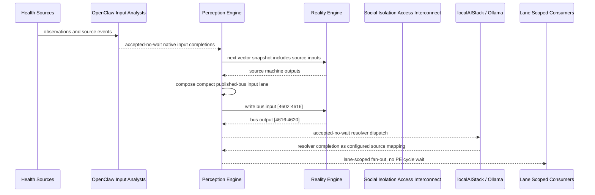

# Social Isolation Access Interconnect Narrative

This narrative completes the PE-owned published-bus pattern for `Home Social Isolation Monitor and access-barrier machines`.
OpenClaw and localAIStack/Ollama remain PE-side translators and resolvers. RE
evaluates only ordinary vector state.

## Published Bus

```text
health-personal.social-isolation-access
published-bus-health-personal-social-isolation-access
```

Input lane: `[4602:4616]`

```text
[0] severe isolation bit
[1] social withdrawal bit
[2] isolation risk bit
[3] socially connected bit
[4] medication adherence crisis bit
[5] cost barrier active bit
[6] partial medication adherence bit
[7] medication managed bit
[8] transport critical access failure bit
[9] transport appointment barrier bit
[10] transport dependent risk bit
[11] transport adequate bit
[12] mental health crisis bit
[13] mental health referral needed bit
```

Output lane: `[4616:4620]`

```text
[0] self neglect outreach bit
[1] access barrier navigation bit
[2] social rhythm support bit
[3] stable connected access bit
```

## OpenClaw Pattern

OpenClaw templates perform ordinal, scalar, or binary mapping into each source
machine's native input lane. PE accepts those completions without waiting inside
a PE cycle. Resolver handoffs are accepted-no-wait and return through configured
PE source mappings.

## Example Workflow: Self-neglect outreach

PE composes:

```text
Social Isolation Access Interconnect[4602:4616]
= [1, 1, 0, 0, 1, 1, 0, 0, 1, 1, 0, 0, 1, 1]
```

RE emits:

```text
Social Isolation Access Interconnect[4616:4620]
= [1, 0, 0, 0]
```

That output activates `SELF_NEGLECT_OUTREACH`.

## Example Workflow: Access barrier navigation

PE composes:

```text
Social Isolation Access Interconnect[4602:4616]
= [0, 1, 1, 0, 0, 1, 1, 0, 0, 1, 1, 0, 0, 1]
```

RE emits:

```text
Social Isolation Access Interconnect[4616:4620]
= [0, 1, 0, 0]
```

That output activates `ACCESS_BARRIER_NAVIGATION`.

## Example Workflow: Social rhythm support

PE composes:

```text
Social Isolation Access Interconnect[4602:4616]
= [0, 1, 1, 0, 0, 0, 1, 0, 0, 0, 1, 0, 0, 0]
```

RE emits:

```text
Social Isolation Access Interconnect[4616:4620]
= [0, 0, 1, 0]
```

That output activates `SOCIAL_RHYTHM_SUPPORT`.

## Message Flow



## Problems And Extensions

1. This pass records explicit published-bus contracts for source machines that
   previously participated only through local or implicit integration notes.

2. RE visibility remains limited to compact vector lanes; PE owns source
   provenance, transformation, resolver dispatch, and completion ingestion.

3. Future provider completions should enter through PE startup source mappings
   and preserve the asynchronous no-wait behavior.

## Safety Boundary

The PE-visible workflow carries normalized status bits only. Raw PHI and
provider-specific records stay upstream. Resolver completions return through PE
as configured source mappings.
