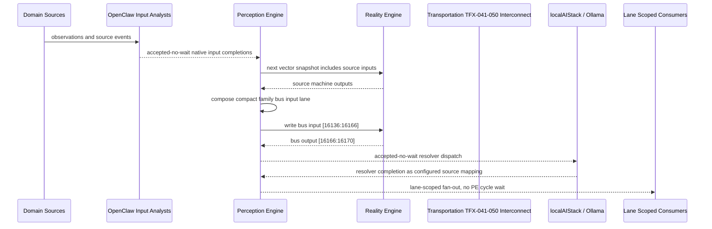

# Transportation TFX-041-050 Interconnect Narrative

This narrative applies the PE-owned published-bus pattern to `Transportation TFX-041-050` in the
`transportation` domain. OpenClaw and localAIStack/Ollama remain PE-side translators
and resolvers. RE evaluates only ordinary vector state.

Focus: Transportation TFX-041-050.

## Published Bus

```text
transportation.tfx-041-050
published-bus-transportation-tfx-041-050
```

Input lane: `[16136:16166]`

```text
[0] Transportation Fleet Security And Safety Onboard Security Alert active output[0] bit
[1] Transportation Fleet Security And Safety Onboard Security Alert active output[1] bit
[2] Transportation Fleet Security And Safety Onboard Security Alert active output[2] bit
[3] Transportation Fleet Security And Safety Camera System Availability active output[0] bit
[4] Transportation Fleet Security And Safety Camera System Availability active output[1] bit
[5] Transportation Fleet Security And Safety Camera System Availability active output[2] bit
[6] Transportation Fleet Security And Safety Fare Evasion Hotspot active output[0] bit
[7] Transportation Fleet Security And Safety Fare Evasion Hotspot active output[1] bit
[8] Transportation Fleet Security And Safety Fare Evasion Hotspot active output[2] bit
[9] Transportation Fleet Security And Safety Stop Security Lighting active output[0] bit
[10] Transportation Fleet Security And Safety Stop Security Lighting active output[1] bit
[11] Transportation Fleet Security And Safety Stop Security Lighting active output[2] bit
[12] Transportation Fleet Security And Safety Operator Assault Risk active output[0] bit
[13] Transportation Fleet Security And Safety Operator Assault Risk active output[1] bit
[14] Transportation Fleet Security And Safety Operator Assault Risk active output[2] bit
[15] Transportation Fleet Security And Safety Suspicious Package Workflow active output[0] bit
[16] Transportation Fleet Security And Safety Suspicious Package Workflow active output[1] bit
[17] Transportation Fleet Security And Safety Suspicious Package Workflow active output[2] bit
[18] Transportation Fleet Security And Safety Emergency Detour Safety active output[0] bit
[19] Transportation Fleet Security And Safety Emergency Detour Safety active output[1] bit
[20] Transportation Fleet Security And Safety Emergency Detour Safety active output[2] bit
[21] Transportation Fleet Security And Safety School Trip Safety Monitor active output[0] bit
[22] Transportation Fleet Security And Safety School Trip Safety Monitor active output[1] bit
[23] Transportation Fleet Security And Safety School Trip Safety Monitor active output[2] bit
[24] Transportation Fleet Security And Safety Weather Hazard Safety active output[0] bit
[25] Transportation Fleet Security And Safety Weather Hazard Safety active output[1] bit
[26] Transportation Fleet Security And Safety Weather Hazard Safety active output[2] bit
[27] Transportation Fleet Security And Safety Incident Evidence Archive active output[0] bit
[28] Transportation Fleet Security And Safety Incident Evidence Archive active output[1] bit
[29] Transportation Fleet Security And Safety Incident Evidence Archive active output[2] bit
```

Output lane: `[16166:16170]`

```text
[0] domain family review bit
[1] domain family optimization bit
[2] domain family monitoring bit
[3] domain family stable bit
```

Source machines publish active output lanes into this family bus. Stable source
states remain represented by no active PE-composed bits.

## Example Workflow: Transportation TFX-041-050 domain family review

PE composes:

```text
Transportation TFX-041-050 Interconnect[16136:16166]
= [1, 0, 0, 0, 0, 0, 0, 0, 0, 1, 0, 0, 0, 0, 0, 0, 0, 0, 1, 0, 0, 0, 0, 0, 0, 0, 0, 0, 0, 0]
```

RE emits:

```text
Transportation TFX-041-050 Interconnect[16166:16170]
= [1, 0, 0, 0]
```

## Example Workflow: Transportation TFX-041-050 domain family optimization

PE composes:

```text
Transportation TFX-041-050 Interconnect[16136:16166]
= [0, 1, 0, 0, 0, 0, 0, 0, 0, 0, 1, 0, 0, 0, 0, 0, 0, 0, 0, 1, 0, 0, 0, 0, 0, 0, 0, 0, 0, 0]
```

RE emits:

```text
Transportation TFX-041-050 Interconnect[16166:16170]
= [0, 1, 0, 0]
```

## Example Workflow: Transportation TFX-041-050 domain family monitoring

PE composes:

```text
Transportation TFX-041-050 Interconnect[16136:16166]
= [0, 0, 1, 0, 0, 0, 0, 0, 0, 0, 0, 1, 0, 0, 0, 0, 0, 0, 0, 0, 1, 0, 0, 0, 0, 0, 0, 0, 0, 0]
```

RE emits:

```text
Transportation TFX-041-050 Interconnect[16166:16170]
= [0, 0, 1, 0]
```

## Message Flow



## Problems And Extensions

1. This pass records an explicit family-level published-bus contract for every
   source machine in this remaining-domain family.

2. RE visibility remains limited to compact vector lanes. PE owns source
   provenance, transformation, resolver dispatch, and completion ingestion.

3. Future growth can add domain super-buses that consume family bridge outputs
   rather than reading every source machine directly.

## Safety Boundary

The PE-visible workflow carries normalized status bits only. Raw regulated data
and provider-specific records stay upstream. Resolver completions return through
PE as configured source mappings.
